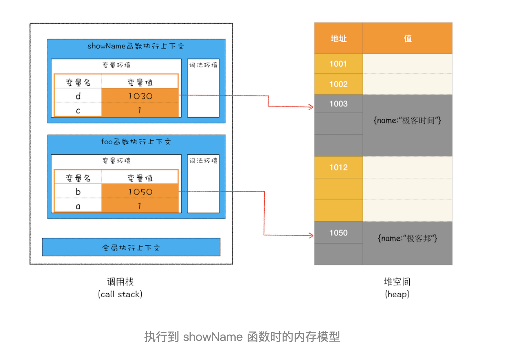
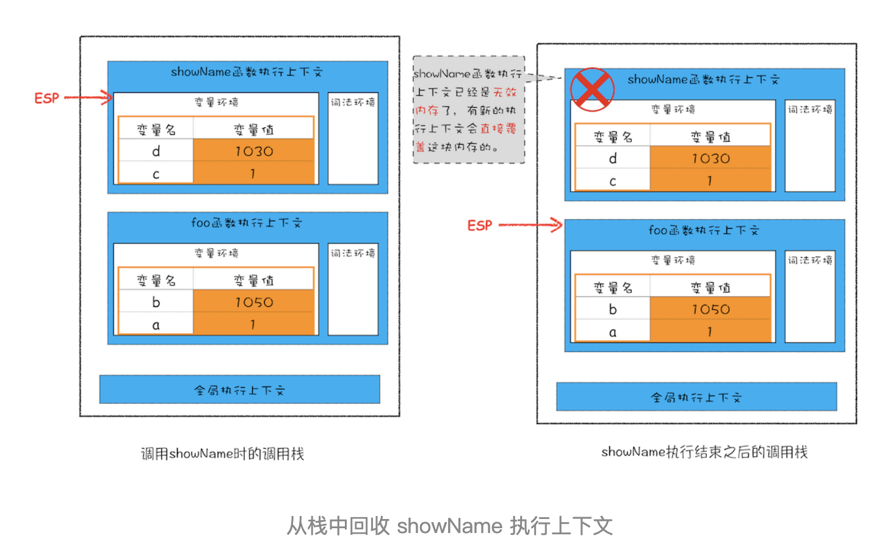

# 垃圾回收：垃圾数据如何自动回收

有些数据被使用之后，可能就不再需要了，我们把这种数据称为垃圾数据。如果这些垃圾数据一直保存在内存中，那么内存会越用越多，所以我们需要对这些垃圾数据进行回收，以释放有限的内存空间。

## 不同语言的垃圾回收策略

通常情况下，垃圾数据回收分为手动回收和自动回收两种策略。

如 C/C++ 就是使用手动回收策略，何时分配内存、何时销毁内存都是由代码控制的，你可以参考下面这段 C 代码：

```c++
// 在堆中分配内存
char* p =  (char*)malloc(2048); // 在堆空间中分配 2048 字节的空间，并将分配后的引用地址保存到 p 中
 
// 使用 p 指向的内存
{
  // ....
}
 
// 使用结束后，销毁这段内存
free(p)；
p = NULL；
```

从上面这段 C 代码可以看出来，要使用堆中的一块空间，我们需要先调用 malloc 函数分配内存，然后再使用；当不再需要这块数据的时候，就要手动调用 free 函数来释放内存。如果这段数据已经不再需要了，但是又没有主动调用 free 函数来销毁，那么这种情况就称为内存泄漏。

另外一种使用的是自动垃圾回收的策略，如 JavaScript、Java、Python 等语言，产生的垃圾数据是由垃圾回收器来释放的，并不需要手动通过代码来释放。

对于 JavaScript 而言，也正是这个“自动”释放资源的特性带来了很多困惑，也让一些 JavaScript 开发者误以为可以不关心内存管理，这是一个很大的误解。

那么在本文，我们将围绕“JavaScript 的数据是如何回收的”这个话题来展开探讨。因为数据是存储在栈和堆两种内存空间中的，所以接下来我们就来分别介绍“栈中的垃圾数据”和“堆中的垃圾数据”是如何回收的。

## 调用栈中的数据是如何回收的

首先是调用栈中的数据，我们还是通过一段示例代码的执行流程来分析其回收机制，具体如下：

```js
function foo() {
  var a = 1
  var b = { name: '极客邦' }
  function showName() {
    var c = '极客时间'
    var d = { name: '极客时间' }
  }
  showName()
}
foo()
```

当执行到第 6 行代码时，其调用栈和堆空间状态图如下所示：



从图中可以看出，原始类型的数据被分配到栈中，引用类型的数据会被分配到堆中。当 foo 函数执行结束之后，foo 函数的执行上下文会从堆中被销毁掉，那么它是怎么被销毁的呢？下面我们就来分析一下。

在上篇文章中，我们简单介绍过了，如果执行到 showName 函数时，那么 JavaScript 引擎会创建 showName 函数的执行上下文，并将 showName 函数的执行上下文压入到调用栈中，最终执行到 showName 函数时，其调用栈就如上图所示。与此同时，还有一个记录当前执行状态的指针（称为ESP），指向调用栈中 showName 函数的执行上下文，表现当前正在执行 showName 函数。

接着，当 showName 函数执行完成之后，函数执行流程就进入了 foo 函数，那这时就需要销毁 showName 函数的执行上下文了。ESP 这时候就帮上忙了，JavaScript 会将 ESP 下移到 foo 函数的执行上下文，这个下移操作就是销毁 showName 函数执行上下文的过程。

你可能会有点懵，ESP 指针向下移动怎么就能把 showName 的执行上下文销毁了呢？具体你可以看下面这张移动 ESP 前后的对比图：



从图中可以看出，当 showName 函数执行结束之后，ESP 向下移动到 foo 函数的执行上下文中，上面 showName 的执行上下文虽然保存在栈内存中，但是已经是无效内存了。比如当 foo 函数再次调用另外一个函数时，这块内容会被直接覆盖掉，用来存放另外一个函数的执行上下文。

所以说，当一个函数执行结束之后，JavaScript 引擎会通过向下移动 ESP 来销毁该函数保存在栈中的执行上下文。
