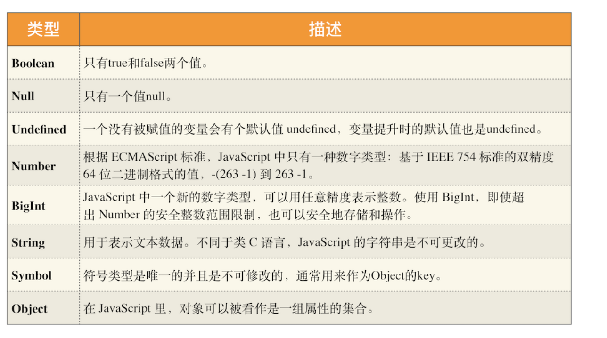

# 栈空间和堆空间：数据是如何存储的

对于前端开发者来说，JavaScript 的内存机制是一个不被经常提及的概念，因此很容易被忽视。特别是一些非计算机专业的同学，对内存机制可能没有非常清晰地认识，甚至有些同学根本就不知道 JavaScript 的内存机制是什么。

但是如果你想成为行业专家，并打造高性能前端应用，那么你就必须要搞清楚 JavaScript 的内存机制了。

其实，要搞清楚 JavaScript 的内存机制并不是一件很困难的事，在接下来的三篇文章（数据在内存中的存放、JavaScript 处理垃圾回收以及 V8 执行代码）中，我们将通过内存机制的介绍，循序渐进带你走进 JavaScript 内存的世界。

今天我们讲述第一部分的内容——JavaScript 中的数据是如何存储在内存中的。虽然 JavaScript 并不需要直接去管理内存，但是在实际项目中为了能避开一些不必要的坑，你还是需要了解数据在内存中的存储方式的。

## 让人疑惑的代码

首先，我们先看下面这两段代码：

```js
function foo() {
  var a = 1
  var b = a
  a = 2
  console.log(a)
  console.log(b)
}
foo()
```

```js
function foo() {
  var a = { name: '极客时间' }
  var b = a
  a.name = '极客邦'
  console.log(a)
  console.log(b)
}
foo()
```

若执行上述这两段代码，你知道它们输出的结果是什么吗？下面我们就来一个一个分析下。

执行第一段代码，打印出来 a 的值是2，b 的值是1，这没什么难以理解的。

接着，再执行第二段代码，你会发现，仅仅改变了 a 中 name 的属性值，但是最终 a 和 b 打印出来的值都是 { name: '极客邦' }。这就和我们预期的不一致了，因为我们想改变的仅仅是 a 的内容，但 b 的内容也同时被改变了。

要彻底弄清楚这个问题，我们就得先从“JavaScript 是什么类型的语言”讲起。

## JavaScript是什么类型的语言

每种编程语言都具有内建的数据类型，但它们的数据类型常有不同之处，使用方式也很不一样，比如 C 语言在定义变量之前，就需要确定变量的类型，你可以看下面这段 C 代码：

```c++
int main()
{
  int a = 1;
  char* b = '极客时间';
  bool c = true;
  return 0;
}
```

上述代码声明变量的特点是：在声明变量之前需要先定义变量类型。我们把这种在使用之前就需要确认其变量数据类型的称为静态语言。

相反地，我们把在运行过程中需要检查数据类型的语言称为动态语言。比如我们所讲的 JavaScript 就是动态语言，因为在声明变量之前并不需要确认其数据类型。

虽然 C 语言是静态，但是在 C 语言中，我们可以把其他类型数据赋予给一个声明好的变量，如：

```js
c = a
```

前面代码中，我们把 int 型的变量 a 赋值给了 bool 型的变量 c，这段代码也是可以编译的，因为在赋值过程中，C 编译器会把 int 型的变量悄悄转换为 bool 型的变量，我们通常把这种偷偷转换的操作称为隐式类型装换。而支持隐式类型转换的语言称为弱类型语言，不支持隐式类型装换的语言称为强类型语言。在这点上，C 和 JavaScript 都是弱类型语言。

对于各种语言的类型，你可以参考下图：


## JavaScript的数据类型

现在我们知道了，JavaScript 是一种弱类型的、动态的语言。那这些特点意味着什么呢？

- **弱类型**，意味着你不需要告诉 JavaScript 引擎这个或那个变量是什么数据类型，JavaScript 引擎在运行代码的时候自己会计算出来。

- **动态**，意味着你可以使用同一个变量保存不同类型的数据。

那么接下来，我们再来看看 JavaScript 的数据类型，你可以看下面这段代码：

```js
var bar
bar = 12 
bar = '极客时间'
bar = true
bar = null
bar = { name: '极客时间' }
```

从上述代码中你可以看出，我们声明了一个 bar 变量，然后可以使用各种类型的数据值赋予给该变量。

在 JavaScript 中，如果你想要查看一个变量到底是什么类型，可以使用 `typeof` 运算符。具体使用方式如下所示：

```js
var bar
console.log(typeof bar) // undefined
bar = 12 
console.log(typeof bar) // number
bar = '极客时间'
console.log(typeof bar) // string
bar = true
console.log(typeof bar) // boolean
bar = null
console.log(typeof bar) // object
bar = { name: '极客时间' }
console.log(typeof bar) // object
```

执行这段代码，你可以看到打印出来了不同的数据类型，有 undefined、number、boolean、object 等。那么接下来我们就来谈谈 JavaScript 到底有多少种数据类型。

其实 JavaScript 中的数据类型一共有 8 种，它们分别是：



了解这些类型之后，还有三点需要你注意一下。

- 第一点，使用 typeof 检测 Null 类型时，返回的是 Object。这是当初 JavaScript 语言的一个 Bug，一直保留至今，之所以一直没修改过来，主要是为了兼容老的代码。

- 第二点，Object 类型比较特殊，它是由上述 7 种类型组成的一个包含了 key-value 对的数据类型。如下所示：

```js
let myObj = {
  name: '极客时间',
  update: function() {....}
}
```

从中你可以看出来，Object 是由 key-value 组成的，其中的 value 可以是任何类型，包括函数，这也就意味着你可以通过 Object 来存储数据，Object 中的函数有称为方法，比如上述代码中的 update 方法。

- 第三点，我们把前面的 7 种数据类型称为原始类型，把最后一个对象类型称为引用类型，之所以把它们区分为两种不同的类型，是因为它们在内存中存放的位置不一样。到底怎么个不一样法呢？接下来，我们就来讲解一下 JavaScript 的原始类型和引用类型到底是怎么储存的。
