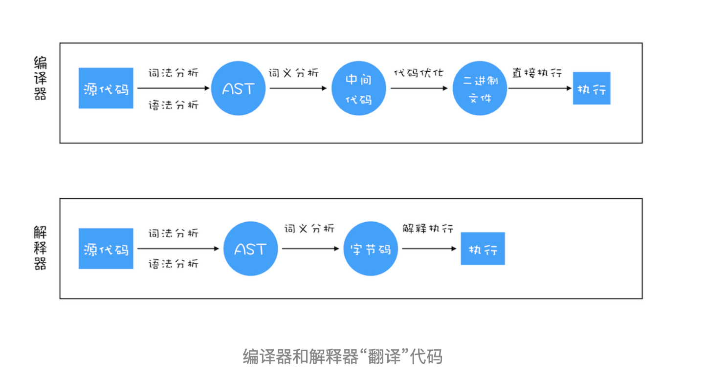

# 编译器和解析器：V8是如何执行一段JavaScript代码的

前面我们已经花了很多篇幅来介绍 JavaScript 是如何工作的，了解这些内容能帮助你从底层理解 JavaScript 的工作机制，从而能帮助你更好地理解和应用 JavaScript。

今天这篇文章我们就继续“向下”分析，站在 JavaScript 引擎 V8 的视角，来分析 JavaScript 代码是如何被执行的。

前端工具和框架的自身更新速度非常快，而且还不断有新的出现。要想追赶上前端工具和框架的更新速度，你就需要抓住那些本质的知识，然后才能更加轻松地理解这些上层应用。比如我们接下来要介绍的 V8 执行机制，能帮助你从底层了解 JavaScript，也能帮助你深入理解语言转换器 Babel、语法检查工具 ESLint、前端框架 Vue 和 React 的一些底层实现机制。因此，了解 V8 的编译流程能让你对语言以及相关工具有更加充分的认识。

要深入理解 V8 的工作原理，你需要搞清楚一些概念和原理，比如接下来我们要详细讲解的编译器（Compiler）、解析器（Interpreter）、抽象语法树（AST）、字节码（Bytecode）、即时编译器（JIT）等概念，都是你需要重点关注的。

## 编译器和解释器

之所以存在编译器和解释器，是因为机器不能直接理解我们所写的代码，所以在执行程序之前，需要将我们所写的代码“翻译”成机器能读懂的机器语言。按语言的执行流程，可以把语言划分为编译型语言和解释型语言。

编译型语言在程序执行之前，需要经过编译器的编译过程，并且编译之后会直接保留机器能读懂的二进制文件，这样每次运行程序时，都可以直接运行该二进制文件，而不需要再次重新编译了。比如 C/C++、GO 等都是编译型语言。

而由解释型语言编写的程序，在每次执行时都需要通过解释器对程序进行动态解释和执行。比如 Python、JavaScript 等都属于解释型语言。

那编译器和解释器是如何“翻译”代码的呢？具体流程你可以参考下图：

从图中你可以看出这二者的执行流程，大致可阐述为如下：

1. 在编译型语言的编译过程中，编译器首先会依次对源代码进行词法分析、语法分析，生成抽象语法树（AST），然后是优化代码，最后再生成处理器能够理解的机器码。如果编译成功，将会生成一个可执行的文件。但如果编译过程发生了语法或者其他的错误，那么编译器就会抛出异常，最后的二进制文件也不会生成成功。

2. 在解释型语言的解释过程中，同样解释器也会对源代码进行词法分析、语法分析，并生成抽象语法树（AST），不过它会再基于抽象语法树生成字节码，最后再根据字节码来执行程序、输出结果。
