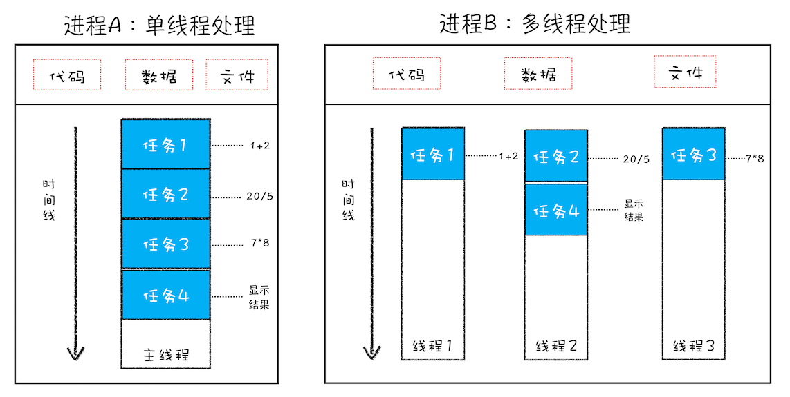
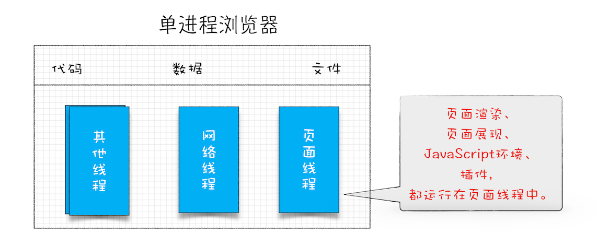

# Chrome架构：仅仅打开1个页面，为什么有4个进程

在开始之前，我们一起看下，Chrome打开一个页面需要启动多少进程？你可以点击Chrome浏览器右上角的“选项”菜单，选择“更多工具”子菜单，点击“任务管理器”，这将打开Chrome的任务管理器的窗口，如下图：


和Window任务管理器一样，Chrome任务管理器也是用来展示运行中Chrome使用的进程信息的。从图中可以看到，Chrome启动了4个进程，你也许会好奇，只是打开了1个页面，为什么要启动这么多进程呢？

在解答这个问题之前，我们需要了解一下进程的概念，不过由于好多人容易把进程和线程的概念混淆，从而影响后续其他概念的理解，所以这里我就将这两个概念以及他们之间的关系一并为你讲解下。

## 进程和线程

不过，在介绍进程和线程之前，我们需要先讲解下什么是并行处理，因为如果你理解了并行处理的概念，那么再理解进程和线程之间的关系就会变得轻松许多。

### 什么是并行处理

计算机中的并行处理就是同一时刻处理多个任务，比如我们要计算下面这三个表达式的值，并显示出结果。

```js
A = 1 + 2
B = 20 / 5
C = 7 * 8
```

在编写代码的时候，我们可以把这个过程拆分为四个任务：

- 任务1：计算A = 1 + 2。
- 任务2：计算B = 20 / 5。
- 任务3：计算C = 7 * 8。
- 任务4：显示最后计算的结果。

正常情况下程序可以使用单线程来处理，也就是分四步按照顺序分别执行者四个任务。

如果采用多线程，会怎么样呢？我们只需分“两步走”：

- 第一步：使用三个线程同时执行前三个任务。
- 第二步：再执行第四个显示任务。

通过对比分析，你会发现用单线程执行需要四步，而使用多线程只需要两步。因此，使用并行处理能大大提升性能。

### 线程 VS 进程

多线程可以并行处理任务，但是线程是不能单独存在的，它是由进程来启动和管理的。那什么又是进程呢？

一个进程就是一个程序的运行实例。详细解释就是，启动一个程序的时候，操作系统会为该程序创建一块内存，用来存放代码、运行中的数据和一个执行任务的主线程，我们把这样的一个运行环境叫进程。

为了让你更好地理解上述计算过程，我画了下面这张对比图。



从图中可以看到，线程是依附于进程的，而进程中使用多线程并行处理能提升运算效率。

总结来说，进程和线程之间的关系有以下4个特点。

#### 1.进程中的任意一线程执行出错，都会导致整个进程的崩溃。

我们可以模拟以下场景：

```js
A = 1 + 2
B = 20 / 0
C = 7 * 8
```

我把上述三个表达式稍作修改，在计算B的值的时候，我把表达式的分母改成0，当线程执行到 `B = 20 / 0` 时，由于分母为0，线程会执行出错，这样就会导致整个进程崩溃，当然另外两个线程执行的结果也没有了。

#### 2.线程之间共享进程中的数据。

如下图所示，线程之间可以对进程的公共数据进行读写操作。


从上图可以看出，线程1，线程2，线程3分别把执行的结果写入A、B、C中，然后线程2继续从A、B、C中读取数据，用来显示执行结果。

#### 3.当一个进程关闭之后，操作系统会回收进程所占用的内存。

当一个进程退出时，操作系统会回收该进程所申请的所有资源；即使其中任意线程因为操作不当导致内存泄漏，当进程退出时，这些内存也会被正确回收。

比如之前的IE浏览器，支持很多插件，而这些插件很容易导致内存泄漏，这意味着只要浏览器开着，内存占用就有可能会越来越多，但是当关闭浏览器进程时，这些内存就都会被系统回收掉。

#### 4.进程之间的内容相互隔离。

进程隔离是为了保护操作系统中进程互不干扰的技术，每一个进程只能访问自己占有的数据，也就避免出现进程A写入数据到进程B的情况。正是因为进程之间的数据是严格隔离的，所以一个进程如果崩溃了，或者挂起了，是不会影响到其他进程的。如果进程之间需要进行数据的通信，这时候就需要使用用于进程间通信（IPC）的机制了。

## 单进程浏览器时代

在了解了进程和线程之后，我们再来一起看下单进程浏览器的架构。顾名思义，单进程浏览器是指浏览器的所有功能模块都是运行在同一个进程里，这些模块包含了网络、插件、JavaScript运行环境、渲染引擎和页面等。其实早在2007年之前，市面上浏览器都是单进程的。单进程浏览器的架构如下图所示：



如此多的功能模块运行在一个进程里，是导致单进程浏览器不稳定、不流畅和不安全的一个主要因素。下面我就来一一分析下出现这些问题的原因。

### 问题1：不稳定

早期浏览器需要借助于插件来实现诸如Web视频、Web游戏等各种强大的功能，但是插件是最容易出问题的模块，并且还运行在浏览器进程之中，所以一个插件的意外崩溃会引起整个浏览器的崩溃。

除了插件之外，渲染引擎模块也是不稳定的，通常一些复杂的JavaScript代码就有可能引起渲染引擎模块的崩溃。和插件一样，渲染引擎的崩溃也会导致整个浏览器的崩溃。

### 问题2：不流畅

从上面的“单进程浏览器架构示意图”可以看出，所有页面的渲染模块、JavaScript执行环境以及插件都是运行在同一个线程中的，这就意味着同一时刻只能有一个模块可以执行。

比如，下面这个无限循环的脚步：

```js
function freeze() {
  while (1) {
    console.log('freeze')
  }
}
freeze()
```

如果让这个脚本运行在一个单进程浏览器的页面里，你感觉会发生什么？

因为这个脚本是无限循环的，所以当其执行时，它会独占整个线程，这样导致其他运行在该线程中的模块就没有机会被执行。因为浏览器中所有的页面都运行在该线程中，所以这些页面都没有机会去执行任务，这样就会导致整个浏览器失去响应，变卡顿。这块内容要继续往深的地方讲就到页面的事件循环系统了，具体相关内容我会在后面的模块中为你深入讲解。

除了上述脚本或者插件会让单进程浏览器变卡顿外，页面的内存泄漏也是单进程变慢的一个重要原因。通常浏览器的内核都是非常复杂，运行一个复杂点的页面再关闭页面，会存在内存不能完全回收的情况，这样导致的问题是使用时间越长，内存占用越高，浏览器会变得越慢。

### 问题3：不安全

这里依然可以从插件和页面脚本两个方面来解释该原因。

插件可以使用C/C++等代码编写，通过插件可以获取到操作系统的任意资源，当你在页面运行一个插件也就意味着这个插件能完全控制你的电脑。如果是个恶意插件，那么它就可以释放病毒、窃取你的账号密码，引发安全性问题。

至于页面脚本，它可以通过浏览器的漏洞来获取系统权限，这些脚本获取系统权限之后也可以对你的电脑做一些恶意的事情，同样也会引发安全问题。

以上这些就是当时浏览器的特点，不稳定，不流畅，而且不安全。这是一段不堪回首的过去，也许你没有经历过，不过你可以想象一下这样的场景：当你正在用浏览器打开多个页面时，突然某个页面崩溃了或者失去响应，随之而来的是整个浏览器的崩溃或者无响应，然后你发现你给老板写的邮件页面也随之消失了，这时你的心情会不会和页面一样崩溃呢？
