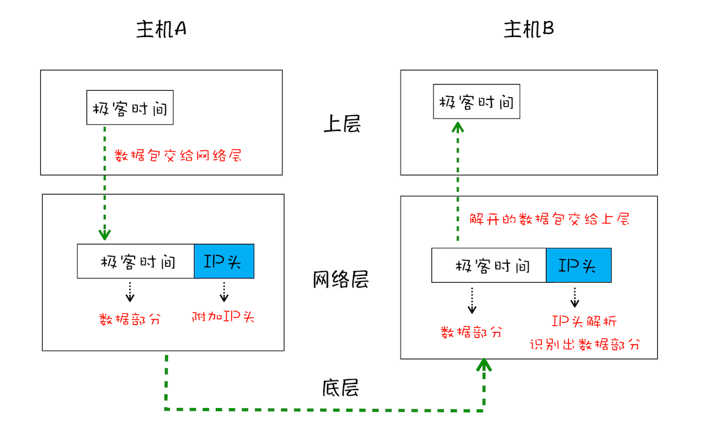

# TCP协议：如何保证页面文件能被完整送达浏览器

在衡量Web页面性能的时候有一个重要的指标叫“FP（First Paint）”，是指从页面加载到首次开始绘制的时长。这个指标直接影响了用户的跳出率，更快的页面响应意味着更多的PV、更高的参与度，以及更高的转化率。那什么影响FP指标呢？其中一个重要的因素是网络加载速度。

要想优化Web页面的加载速度，你需要对网络有充分的了解。而理解网络的关键是要对网络协议有深刻的认识，不管你是使用HTTP，还是使用WebSocket，它们都是基于TCP/IP的，如果你对这些原理有足够了解，也就清楚如何去优化Web性能，或者能更轻松地定位Web问题了。此外，TCP/IP的设计思想还有助于拓宽你的知识边界，从而在整体上提升你对项目的理解和解决问题的能力。

好，接下来我们回到正题，开始今天的内容。在网络中，一个文件通常会被拆分为很多数据包来进行传输，而数据包在传输过程中又有很大概率丢失或者出错。那么如何保证页面文件能被完整地送达浏览器呢？

这篇文章将站在数据包的视角，给出问题答案。

## 一个数据包的“旅程”

下面我将分别从“数据包如何送达主机”、“主机如何将数据包转交给应用”和“数据是如何被完整地送达应用程序”这三个角度来为你讲述数据的传输过程。

`互联网，实际上是一套理念和协议组成的体系架构`。其中，协议是一套众所周知的规则和标准，如果各方都同意使用，那么它们之间的通信将变得毫无障碍。

互联网中的数据是通过数据包来传输的。如果发送的数据很大，那么该数据就会被拆分为很多小数据包来传输。比如你现在听的音频数据，是拆分成一个个小的数据包来传输的，并不是一个大的文件一次传输过来的。

### IP：把数据包送达目的主机

数据包要在互联网上进行传输，就要符合国际协议（Internet Protocol，简称IP）标准。互联网上不同的在线设备都有唯一的地址，地址只是一个数字，这和大部分家庭收件地址类似，你只需要知道一个家庭的具体地址，就可以往这个地址发送包裹，这样物流系统就能把物品送到目的地。

`计算机的地址就称为IP地址，访问任何网站实际上只是你的计算机向另外一台计算机请求信息。`

如果要想把一个数据包从主机A发送给主机B，那么在传输之前，数据包上会被附加上主机B的IP地址信息，这样在传输过程中才能正确寻址。额外地，数据包上还会附加上主机A本身的IP地址，有了这些信息主机B才可以回复信息给主机A。这些附加的信息会被装进一个叫IP头的数据结构里。IP头是IP数据包开头的信息，包含IP版本、源IP地址、目标IP地址、生存时间等信息。

为了方便理解，我先把网络简单分为三层结构，如下图。

> 下面我们一起来看下一个数据包从主机A到主机B的旅程：

- 上层将含有“极客时间”的数据包交给网络层。

- 网络层再将IP头附加到数据包上，组成新的IP数据包，并交给底层。

- 底层通过物理网络将数据包传输给主机B。

- 数据包被传输到主机B的网络层，在这里主机B拆开数据包的IP头信息，并将拆开来的数据包交给上层。

- 最终，含有“极客时间”信息的数据包就到达了主机B的上层了。
