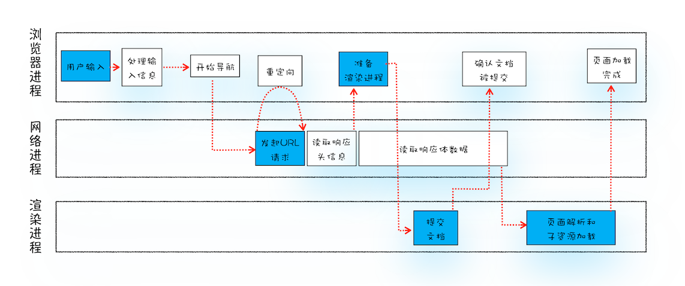

# 导航流程：从输入URL到页面展示这中间发生了什么

“在浏览器里，从输入URL到页面展示，这中间发生了什么？”，这是一道经典的面试题，能比较全面地考察应聘者知识的掌握程度，其中涉及到了网络、操作系统、Web等一系列的知识。所以我在面试应聘者时也必问这道题，但遗憾的是大多数人只能回答其中部分零散的知识点，并不能将这些知识点串联成线，无法系统而又全面地回答这个问题。

那么今天我们就一起来探索下这个流程，下图是我梳理出的“从输入URL到页面展示完整流程示意图”：

从图中可以看出，整个过程需要各个进程之间的配合，所以在开始正式流程之前，我们还是先来快速回顾下浏览器进程、渲染进程和网络进程的主要职责。

- 浏览器进程主要负责用户交互、子进程管理和文件储存等功能。

- 网络进程是面向渲染进程和浏览器进程等提供网络下载功能。

- 渲染进程的主要职责是把从网络下载的HTML、JavaScript、CSS、图片等资源解析为可以显示和交互的页面。因为渲染进程所有的内容都是通过网络获取的，会存在一些恶意代码利用浏览器漏洞对系统进行攻击，所以运行在渲染进程里面的代码是不被信任的。这也是为什么 Chrome 会让渲染进程运行在安全沙箱里，就是为了保证系统的安全。

回顾了浏览器的进程架构后，我们再结合上图来看下这个完整的流程，可以看出，整个流程包含了许多步骤，我把其中几个核心的节点用蓝色背景标记出来了。这个过程可以大致描述为如下：

- 首先，用户从浏览器进程里输入请求信息。

- 然后，网络进程发起URL请求。

- 服务器响应URL请求之后，浏览器进程就又要开始准备渲染进程了。

- 渲染进程准备好之后，需要先向渲染进程提交页面数据，我们称之为提交文档阶段。

- 渲染进程接收完文档信息之后，便开始解析页面和加载子资源，完成页面的渲染。

这其中，用户发出URL请求到页面开始解析的这个过程，就叫做导航。下面我们来详细分析下这些步骤，同时也就解答了开头所说的那道经典的面试题。
