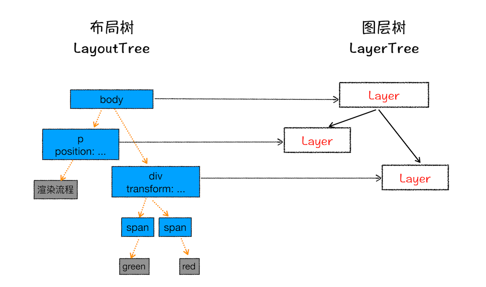
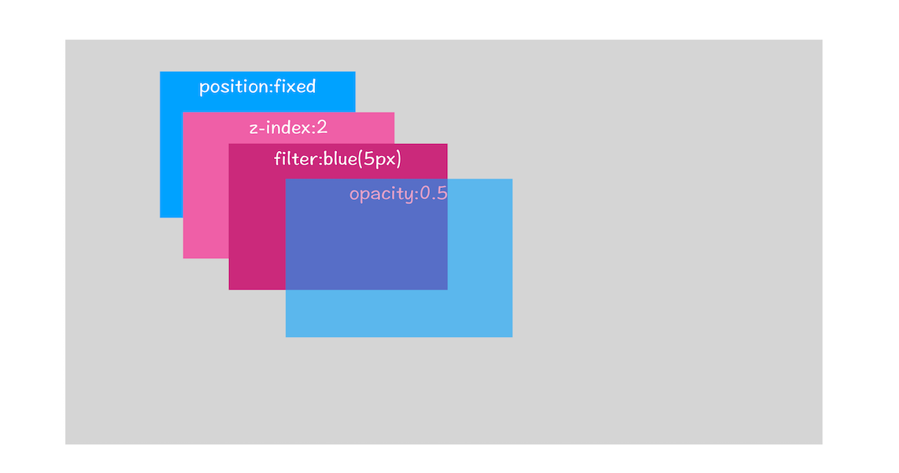
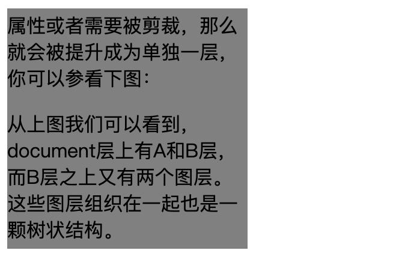
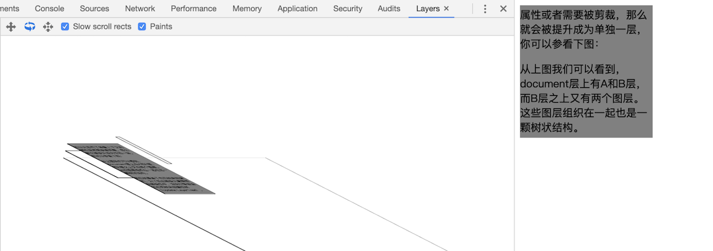
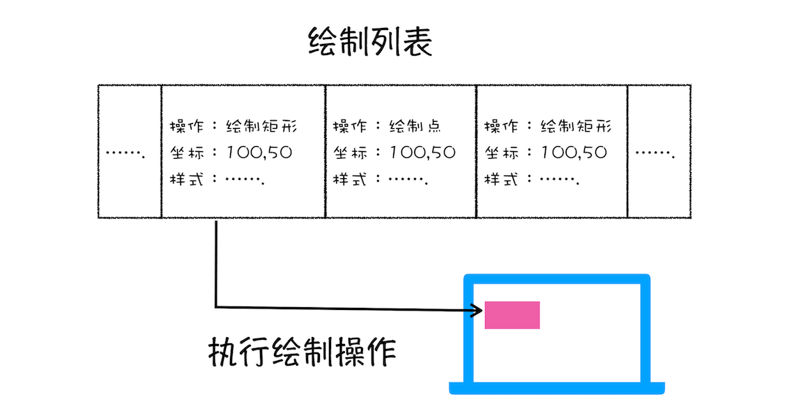
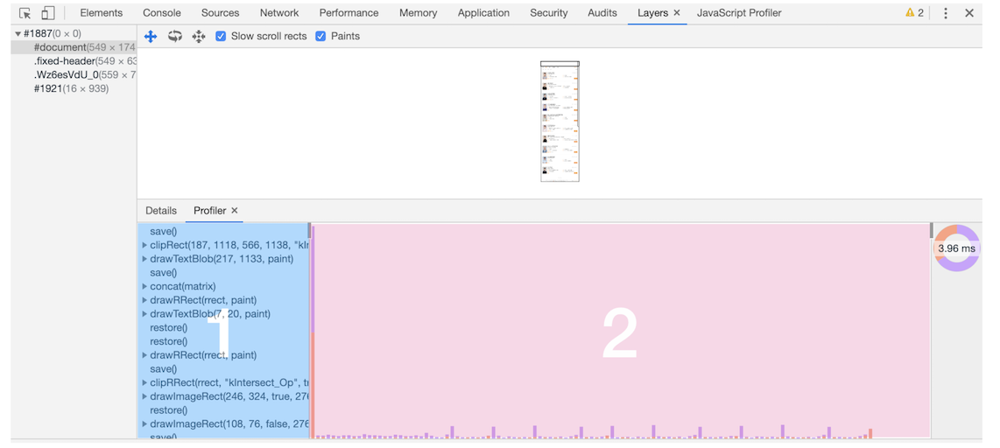

# 渲染流程（下）：HTML、CSS和JavaScript是如何变成页面的

在上篇文章中，我们介绍了渲染流水线中的 DOM 生成、样式计算和布局三个阶段，那今天我们接着讲解渲染流水线后面的阶段。

这里还是先简单回顾下上节前三个阶段的主要内容：

- 在 HTML 页面内容被提交给渲染引擎之后，渲染引擎首先将 HTML 解析为浏览器可以理解的 DOM。

- 然后根据 CSS 样式表，计算出 DOM 树所有节点的样式。

- 接着又计算每个元素的几何坐标位置，并将这些信息保存在布局树中。

## 分层

现在我们有了布局树，而且每个元素的具体位置信息都计算出来了，那么接下来是不是就要开始着手绘制页面了？

答案依然是否定的。

因为页面中有很多复杂的效果，如一些复杂的3D变换、页面滚动，或者使用 z-index 做 z 轴排序等，为了更加方便地实现这些效果，渲染引擎还需要为特定的节点生成专用的图层，并生成一棵对应的图层树（LayerTree）。如果你熟悉 PS，相信你会很容易理解图层的概念，正是这些图层叠加在一起构成了最终的页面图像。

要想直观地理解什么是图层，你可以打开 Chrome 的“开发者工具”，选择“Layers”标签，就可以可视化页面的分层情况，如下图所示：


从上图可以看出，渲染引擎给页面分了很多图层，这些图层按照一定顺序叠加在一起，就形成了最终的页面，你可以参考下图：


现在你知道了浏览器的页面实际上被分成了很多图层，这些图层叠加后合成了最终的页面。下面我们再来看看这些图层和布局树节点之间的关系，如文中图所示：



通常情况下，并不是布局树的每个节点都包含一个图层，如果一个节点没有对应的图层，那么这个节点就从属于父节点的图层。如上图的 span 标签没有专属的图层，那么它们就从属于它们的父节点图层。但不管怎样，最终每一个节点都会直接或者间接地从属于一个层。

那么满足什么条件，渲染引擎才会为特定的节点创建新的层呢？通常满足下面两点中任意一点的元素就可以被提升为单独的一个图层。

### 第一点，拥有层叠上下文属性的元素会被提升为单独的一层

页面是个二维平面，但是层叠上下文能够让 HTML 元素具有三维概念，这些 HTML 元素按照自身属性的优先级分布在垂直于这个二维平面的 z 轴上。你可以结合下图来直观感受下：



从图中可以看出，明确定位属性的元素、定义透明属性的元素、使用 CSS 滤镜的元素等，都拥有层叠上下文属性。

### 第二点，需要剪裁（clip）的地方也会被创建为图层

不过首先你需要了解什么是剪裁，结合下面的 HTML 代码：

```html
<style>
  div {
    width: 200;
    height: 200;
    overflow:auto;
    background: gray;
  } 
</style>
<body>
  <div >
    <p>所以元素有了层叠上下文的属性或者需要被剪裁，那么就会被提升成为单独一层，你可以参看下图：</p>
    <p>从上图我们可以看到，document层上有A和B层，而B层之上又有两个图层。这些图层组织在一起也是一颗树状结构。</p>
    <p>图层树是基于布局树来创建的，为了找出哪些元素需要在哪些层中，渲染引擎会遍历布局树来创建层树（Update LayerTree）。</p> 
  </div>
</body>
```

在这里我们把 div 的大小限定为 200 * 200 像素，而 div 里面的文字内容比较多，文字所显示的区域肯定会超过 200 *200 的面积，这时候就产生了剪裁，渲染引擎会把裁剪文字内容的一部分用于显示在 div 区域，下图是运行时的执行结果。



出现这种裁剪情况的时候，渲染引擎会为文字部分单独创建一个层，如果出现滚动条，滚动条也会被提升为单独的层。你可以参考下图：



所以说，元素有了层叠上下文的属性或者需要被剪裁，满足这任意一点，就会被提升成为单独一层。

## 图层绘制

在完成图层树的构建之后，渲染引擎会对图层树中的每个图层进行绘制，那么接下来我们看看渲染引擎是怎么实现图层绘制的？

试想一下，如果给你一张纸，让你先把纸的背景涂成蓝色，然后在中间位置画一个红色的圆，最后再在圆上画个绿色三角形。你会怎么操作呢？

**通常，你会把你的绘制操作分解为三步：**

- 制蓝色背景。

- 在中间绘制一个红色的圆。

- 再在圆上绘制绿色三角形。

渲染引擎实现图层的绘制与之类似，会把一个图层的绘制拆分成很多小的绘制指令，然后再把这些指令按照顺序组成一个待绘制列表，如下图所示：



从图中可以看出，绘制列表中的指令其实非常简单，就是让其执行一个简单的绘制操作，比如绘制粉色矩形或者黑色的线等。而绘制一个元素通常需要好几条绘制指令，因为每个元素的背景、前景、边框都需要单独的指令去绘制。所以在图层绘制阶段，输出的内容就是这些待绘制列表。

你也可以打开“开发者工具”的“Layers”标签，选择“document”层，来实际体验下绘制列表，如下图所示：



在该图中，区域1就是 document 的绘制列表，拖动区域2中的进度条可以重现列表的绘制过程。
