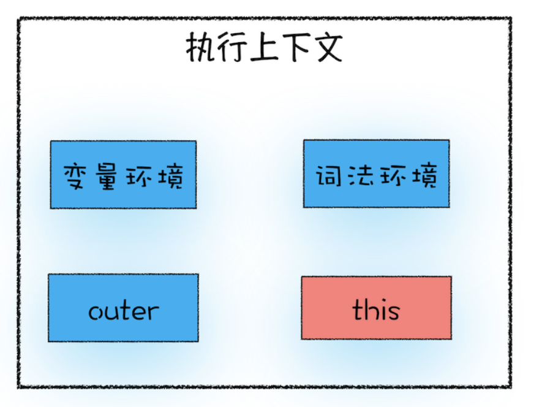

# this：从JavaScript执行上下文视角讲this

在上篇文章中，我们讲了词法作用域、作用域链以及闭包，并在最后思考题留了下面这样一段代码：

```js
var bar = {
  myName: 'time.geekbang.com',
  printName: function() {
    console.log(myName)
  }
}
function foo() {
  let myName = '极客时间'
  return bar.printName
}
let myName = '极客邦'
let _printName = foo()
_printName()
bar.printName()
```

相信你已经知道了，在 printName 函数里面使用的变量 myName 是属于全局作用域下面的，所以最终打印出来的值都是“极客邦”。这是因为 JavaScript 语言的作用域链是由词法作用域决定的，而词法作用域是由代码结构来确定的。

不过按照常理来说，调用 bar.printName 方法时，该方法内部的变量 myName 应该使用 bar 对象中的，因为它们是一个整体，大多数面向对象语言都是这样设计的，比如我用 C++ 改写了上面那段代码，如下所示：

```c++
#include <iostream>
using namespace std;
class Bar{
  public:
  char* myName;
  Bar() {
    myName = 'time.geekbang.com';
  }
  void printName() {
    cout<< myName <<endl;
  }  
} bar;
 
char* myName = '极客邦';
int main() {
	bar.printName();
	return 0;
}
```

在这段 C++ 代码中，我同样调用了 bar 对象中的 printName 方法，最后打印出来的值就是 bar 对象内部变量 myName 值——"time.geekbang.com"，而并不是最外面定义变量 myName 的值——"极客邦"，所以在对象内部的方法中使用对象内部的属性是一个非常普遍的需求。但是 JavaScript 的作用域机制并不支持这一点，基于这个需求，JavaScript 又搞出另外一套 this 机制。

所以，在 JavaScript 中可以使用 this 实现在 printName 函数中访问到 bar 对象的 myName 属性了。具体该怎么操作呢？你可以调整 printName 的代码，如下所示：

```js
printName: function() {
  console.log(this.myName)
}
```

接下来咱们就展开来介绍 this，不过在讲解之前，希望你能区分清楚作用域链和 this 是两套不同的系统，它们之间基本没太多联系。在前期明确这点，可以避免你在学习 this 的过程中，和作用域产生一些不必要的关联。

## JavaScript中的this是什么

关于 this，我们还得先从执行上下文说起。在前面几篇文章中，我们提到执行上下文中包含了变量环境、词法环境、外部环境，但其实还有一个 this 没有提及，具体你可以参考下图：



从图中可以看出，this 是和执行上下文绑定的，也就是说每个执行上下文中都有一个 this。前面《08 | 调用栈：为什么JavaScript代码会出现栈溢出？》中我们提到过，执行上下文主要分为三种——全局执行上下文、函数执行上下文和 eval 执行上下文，所以对应的 this 也只有这三种——全局执行上下文中的 this、函数中的 this 和 eval 中的 this。

那么接下来我们就重点讲解下全局执行上下文中的 this 和函数执行上下文中的 this。

## 全局执行上下文中的this

首先我们来看看全局执行上下文中的 this 是什么。

你可以在控制台中输入 console.log(this) 来打印出来全局执行上下文中的 this，最终输出的是 window 对象。所以你可以得出这样一个结论：在全局执行上下文中的 this 是指向 window 对象的。这也是 this 和作用域链的唯一交点，作用域链的最低端包含了 window 对象，全局执行上下文中的 this 也是指向 window 对象。

## 函数执行上下文中的this

现在你已经知道全局对象中的 this 是指向 window 对象了，那么接下来，我们就来重点分析函数执行上下文中的 this。还是先看下面这段代码：

```js
function foo() {
  console.log(this)
}
foo()
```

> 我们在 foo 函数内部打印出来 this 值，执行这段代码，打印出来的也是 window 对象，这说明在默认情况下调用一个函数，其执行上下文中的 this 也是执行 window 对象性的。估计你会好奇，那能不能设置执行上下文中的 this 来指向其他对象呢？答案是肯定的。通常情况下，有下面三种方式来设置函数执行上下文中的 this 值。

### 1.通过函数的call方法设置

你可以通过函数的 call 方法来设置函数执行上下文的 this 指向，比如下面这段代码，我们就并没有直接调用 foo 函数，而是调用了 foo 的 call 方法，并将 bar 对象作为 call 方法的参数：

```js
let bar = {
  myName: '极客邦',
  test1: 1
}
function foo() {
  this.myName = '极客时间'
}
foo.call(bar)
console.log(bar)
console.log(myName)
```

执行这段代码，然后观察输出结果，你就能发现 foo 函数内部的 this 已经指向 bar 对象，因为通过打印 bar 对象，可以看出 bar 的 myName 属性已经由"极客邦"变为"极客时间"了，同时在全局执行上下文中打印 myName，JavaScript 引擎提示该变量未定义。

其实除了 call 方法，你还可以使用 bind 和 apply 方法来设置函数执行上下文中的 this，它们在使用上还是有一些区别的，如果感兴趣你可以自行搜索和学习它们的使用方法，这里我就不再赘述了。

### 2.通过对象调用方法设置

要改变函数执行上下文中的 this 指向，除了通过函数的 call 方法来实现外，还可以通过对象调用的方式，比如下面这段代码：

```js
var myObj = {
  name: '极客时间', 
  showThis: function() {
    console.log(this)
  }
}
myObj.showThis()
```

在这段代码中，我们定义了一个 myObj 对象，该对象是由一个 name 属性和一个 showThis 方法组成的，然后再通过 myObj 对象来调用 showThis 方法。执行这段代码，你可以看到，最终输出的 this 值是指向 myObj 的。

所以，你可以得出这样的结论：使用对象来调用其内部的一个方法，该方法的 this 是指向对象本身的。

其实，你也可以认为 JavaScript 引擎在执行 myObj.showThis() 时，将其转化为了：

```js
myObj.showThis.call(myObj)
```

接下来我们稍微改变下调用方式，把 showThis 赋给一个全局对象，然后再调用该对象，代码如下所示：

```js
var myObj = {
  name: '极客时间',
  showThis: function() {
    this.name = '极客邦'
    console.log(this)
  }
}
var foo = myObj.showThis
foo()
```

执行这段代码，你会发现 this 又指向了全局 window 对象。

所以通过以上两个例子的对比，你可以得出下面这样两个结论：

- 在全局环境中调用一个函数，函数内部的 this 指向的是全局变量 window。

- 通过一个对象来调用其内部的一个方法，该方法的执行上下文中的 this 指向对象本身。

### 3.通过构造函数中设置

你可以像这样设置构造函数中的 this，如下面的示例代码：

```js
function CreateObj(){
  this.name = '极客时间'
}
var myObj = new CreateObj()
```

在这段代码中，我们使用 new 创建了对象 myObj，那你知道此时的构造函数 CreateObj 中的 this 到底指向了谁吗？

其实，当执行 new CreateObj() 的时候，JavaScript 引擎做了如下四件事：

- 首先创建了一个空对象 tempObj。

- 接着调用 CreateObj.call 方法，并将 tempObj 作为 call 方法的参数，这样当 CreateObj 的执行上下文创建时，它的 this 就指向了 tempObj 对象。

- 然后执行 CreateObj 函数，此时的 CreateObj 函数执行上下文中的 this 指向了 tempObj 对象。

- 最后返回 tempObj 对象。

为了直观理解，我们可以用代码来演示下：

```js
var tempObj = {}
CreateObj.call(tempObj)
return tempObj
```

这样，我们就通过 new 关键字构建好了一个新对象，并且构造函数中的 this 其实就是新对象本身。
