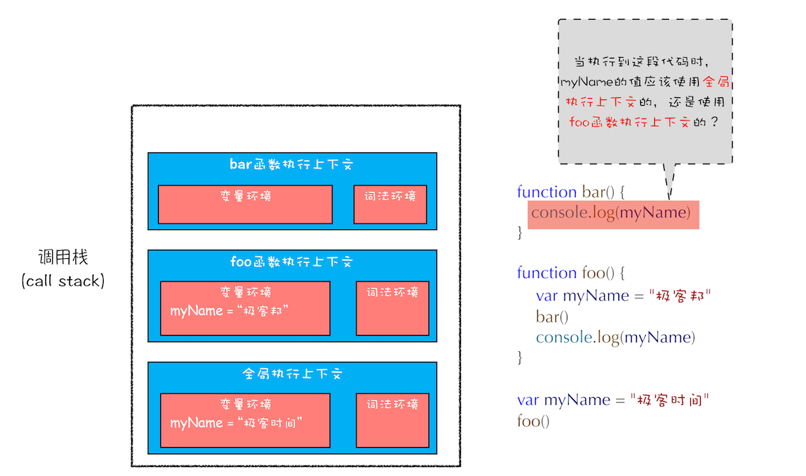

# 作用域链和闭包：代码中出现相同的变量，JavaScript引擎如何选择

理解作用域链是理解闭包的基础，而闭包在 JavaScript 中几乎无处不在，同时作用域和作用域链还是所有编程语言的基础。所以，如果你想学透一门语言，作用域和作用域链一定是绕不开的。

那今天我们就来聊聊什么是作用域链，并通过作用域链再来讲讲什么是闭包。

首先我们来看下面这段代码：

```js
function bar() {
  console.log(myName)
}
function foo() {
  var myName = '极客邦'
  bar()
}
var myName = '极客时间'
foo()
```

你觉得这段代码中的 bar 函数和 foo 函数打印出来的内容是什么？这就要分析下这两段代码的执行流程。

通过前面几篇文章的学习，想必你已经知道了如何通过执行上下文分析代码的执行流程了。那么当这段代码执行到 bar 函数内部时，其调用栈的状态图如下所示：



从图中可以看出，全局执行上下文和 foo 函数的执行上下文中都包含变量 myName，那 bar 函数里面 myName 的值到底该选择哪个呢？

也许你的第一反应是按照调用栈的顺序来查找变量，查找方式如下：

1. 先查找栈顶是否存在 myName 变量，但是这里没有，所以接着往下查找 foo 函数中的变量。

2. 在 foo 函数中查找到了 myName 变量，这时候就使用 foo 函数中的 myName。

如果按照这种方式来查找变量，那么最终执行 bar 函数打印出来的结果就应该是“极客邦”。但实际情况并非如此，如果你试着执行上述代码，你会发现打印出来的结果是“极客时间”。为什么会是这种情况呢？要解释清楚这个问题，那么你就需要先搞清楚作用域链了。

## 作用域链

关于作用域链，很多人会感觉费解，但如果你理解了调用栈、执行上下文、词法环境、变量环境等概念，那么你理解起来作用域链也会很容易。所以很是建议你结合前几篇文章将上面那几个概念学习透彻。

其实在每个执行上下文的变量环境中，都包含了一个外部引用，用来指向外部的执行上下文，我们把这个外部引用称为 `outer`。

当一段代码使用了一个变量时，JavaScript 引擎首先会在“当前的执行上下文”中查找该变量，比如上面那段代码在查找 myName 变量时，如果在当前的变量环境中没有查找到，那么 JavaScript 引擎会继续在 outer 所指向的执行上下文中查找。为了直观理解，你可以看下面这张图：


从图中可以看出，bar 函数和 foo 函数的 outer 都是指向全局上下文的，这也就意味着如果在 bar 函数或者 foo 函数中使用了外部变量，那么 JavaScript 引擎会去全局执行上下文中查找。我们把这个查找的链条就称为作用域链。

现在你知道变量是通过作用域链来查找的了，不过还有一个疑问没有解开，foo 函数调用了 bar 函数，那为什么 bar 函数的外部引用是全局执行上下文，而不是 foo 函数的执行上下文？

要回答这个问题，你还需要知道什么是词法作用域。这是因为在 JavaScript 执行过程中，其作用域链是由词法作用域决定的。

## 词法作用域

> 词法作用域就是指作用域是由代码中函数声明的位置来决定的，所以词法作用域是静态的作用域，通过它就能够预测代码在执行过程中如何查找标识符。

这么讲可能不太好理解，你可以看下面这张图：


从图中可以看出，词法作用域就是根据代码的位置来决定的，其中 main 函数包含了 bar 函数，bar 函数中包含了 foo 函数，因为 JavaScript 作用域链是由词法作用域决定的，所以整个词法作用域链的顺序是：foo 函数作用域 --> bar 函数作用域 --> main 函数作用域 --> 全局作用域。

了解了词法作用域以及 JavaScript 中的作用域链，我们再回过头来看看上面的那个问题：在开头那段代码中，foo 函数调用了 bar 函数，那为什么 bar 函数的外部引用是全局执行上下文，而不是 foo 函数的执行上下文？

这是因为根据词法作用域，foo 和 bar 的上级作用域都是全局作用域，所以如果 foo 或者 bar 函数使用了一个它们没有定义的变量，那么它们会到全局作用域去查找。也就是说，词法作用域是代码阶段就决定好的，和函数是怎么调用的没有关系。

## 块级作用域中的变量查找

前面我们通过全局作用域和函数作用域来分析了作用域链，那接下来我们再来看看块级作用域中变量是如何查找的？在编写代码的时候，如果你使用了一个在当前作用域中不存在的变量，这时 JavaScript 引擎就需要按照作用域链在其他作用域中查找该变量，如果你不了解该过程，那就会有很大概率写出不稳定的代码。

我们还是先看下面这段代码：

```js
function bar() {
  var myName = '极客世界'
  let test1 = 100
  if(1) {
    let myName = 'Chrome 浏览器'
    console.log(test)
  }
}
function foo() {
  var myName = '极客邦'
  let test = 2
  {
    let test = 3
    bar()
  }
}
var myName = '极客时间'
let myAge = 10
let test = 1
foo()
```

你可以自己先分析下这段代码的执行流程，看看能否分析出来执行结果。

要想得出其执行结果，那接下来我们就得站在作用域链和词法环境的角度来分析下其执行过程。

在上篇文章中我们已经介绍过了，ES6 是支持块级作用域的，当执行到代码块时，如果代码块中有 let 或者 const 声明的变量，那么变量就会存放到该函数的词法环境中。对于上面这段代码，当执行到 bar 函数内部的 if 语句块时，其调用栈的情况如下图所示：


现在是执行到 bar 函数的 if 语块之内，需要打印出来变量 test，那么就需要查找到 test 变量的值，其查找过程我已经在上图中使用序号 1、2、3、4、5 标记出来了。

下面我就来解释下这个过程。首先是在 bar 函数的执行上下文中查找，但因为 bar 函数的执行上下文中没有定义 test 变量，所以根据词法作用域的规则，下一步就在 bar 函数的外部作用域中查找，也就是全局作用域。

至于单个执行上下文中如何查找变量，我在上一篇文章中已经做了介绍，这里就不重复了。

## 闭包

了解了作用域链，接着我们就可以来聊聊闭包了。关于闭包，理解起来可能会是一道坎，特别是在你不熟悉 JavaScript 这门语言的时候，接触闭包很可能会让你产生一些挫败感，因为你很难通过理解背后的原理来彻底理解闭包，从而导致学习过程中似乎总是似懂非懂。最要命的是，JavaScript 代码中还总是充斥着大量的闭包代码。

但理解了变量环境、词法环境和作用域链等概念，那接下来你再理解什么是 JavaScript 中的闭包就容易多了。这里你可以结合下面这段代码来理解什么是闭包：

```js
function foo() {
  var myName = '极客时间'
  let test1 = 1
  const test2 = 2
  var innerBar = {
    getName: function() {
      console.log(test1)
      return myName
    },
    setName: function(newName) {
      myName = newName
    }
  }
  return innerBar
}
var bar = foo()
bar.setName('极客邦')
bar.getName()
console.log(bar.getName())
```

首先我们看看当执行到 foo 函数内部的 return innerBar 这行代码时调用栈的情况，你可以参考下图：


从上面的代码可以看出，innerBar 是一个对象，包含了 getName 和 setName 的两个方法（通常我们把对象内部的函数称为方法）。你可以看到，这两个方法都是在 foo 函数内部定义的，并且这两个方法内部都使用了 myName 和 test1 两个变量。

根据词法作用域的规则，内部函数 getName 和 setName 总是可以访问它们的外部函数 foo 中的变量，所以当 innerBar 对象返回给全局变量 bar 时，虽然 foo 函数已经执行结束，但是 getName 和 setName 函数依然可以使用 foo 函数中的变量 myName 和 test1。所以当 foo 函数执行完成之后，其整个调用栈的状态如下图所示：


从上图可以看出，foo 函数执行完成之后，其执行上下文从栈顶弹出了，但是由于返回的 setName 和 getName 方法中使用了 foo 函数内部的变量 myName 和 test1，所以这两个变量依然保存在内存中。这像极了 setName 和 getName 方法背的一个专属背包，无论在哪里调用了 setName 和 getName 方法，它们都会背着这个 foo 函数的的专属背包。

之所以是专属背包，是因为除了 setName 个 getName 函数之外，其他任何地方都是无法访问该背包的，我们就可以把这个背包称为 foo 函数的闭包。

好了，现在我们终于可以给闭包一个正式的定义了。在 JavaScript 中，根据词法作用域的规则，内部函数总是可以访问其外部函数中声明的变量，当通过调用一个外部函数返回一个内部函数后，即使该外部函数已经执行结束了，但是内部函数引用外部函数的变量依然保存在内存中，我们就把这些变量的集合称为闭包。比如外部函数是 foo，那么这些变量的集合就称为 foo 函数的闭包。

那这些闭包是如何使用的呢？当执行到 bar.setName 方法中的 `myName = '极客邦'` 这句代码时，JavaScript 引擎会沿着“当前执行上下文 --> foo 函数闭包 --> 全局执行上下文”的顺序来查找 myName 变量，你可以参考下面的调用栈状态图：


从图中可以看出，setName 的执行上下文没有 myName 变量，foo 函数的闭包中包含了变量 myName，所以调用 setName 时，会修改 foo 闭包中的 myName 变量的值。

同样的流程，当调用 bar.getName 的时候，所访问的变量 myName 也是位于 foo 函数闭包中的。

你也可以通过“开发者工具”来看看闭包的情况，打开 Chrome 的“开发者工具”，在 bar 函数任意地方打上断点，然后刷新页面，可以看到如下内容：


从图中可以看出来，当调用 bar.getName 的时候，右边 Scope 项就体现出了作用域链的情况：Local 就是当前的 getName 函数的作用域，Closure(foo) 是指 foo 函数的闭包，最下面的 Global 就是指全局作用域，从“Local --> Closure(foo) --> Global”就是一个完整的作用域链。

所以说，你以后也可以通过 Scope 来查看实际代码作用域链的情况，这样调试代码也会比较方便。

## 闭包是怎么回收的

理解什么是闭包之后，接下来我们再来聊聊闭包什么时候销毁的。因为如果闭包使用不正确，会很容易造成内存泄漏的，关注闭包是如何回收的能让你正确地使用闭包。

通常，如果引用闭包的函数是一个全局变量，那么闭包会一直存在直到页面关闭；但如果这个闭包以后不再使用的话，就会造成内存泄漏。

如果引用闭包的函数是个局部变量，等函数销毁后，在下次 JavaScript 引擎执行垃圾回收时，判断闭包这块内容如果已经不再被使用了，那么 JavaScript 引擎的垃圾回收器就会回收这块内存。

所以在使用闭包的时候，你要尽量注意一个原则：如果该闭包会一直使用，那么它可以作为全局变量而存在；但如果使用频率不高，而且占用内存又比较大的话，那就尽量让它成为一个局部变量。

关于闭包回收的问题本文只是做了个简单的介绍，其实闭包是如何回收的还牵涉到了 JavaScript 的垃圾回收机制，而关于垃圾回收，后续章节我会再为你做详细介绍的。

## 总结

好了，今天的内容就讲到这里，下面我们来回顾下今天的内容：

首先，介绍了什么是作用域链，我们把通过作用域链查找变量的链条称为作用域链；作用域链是通过词法作用域来确定的，而词法作用域反映了代码的结构。其次，介绍了在块级作用域中是如何通过作用域链来查找变量的。最后，又基于作用域链和词法环境介绍了到底什么是闭包。通过展开词法作用域，我们介绍了 JavaScript 中的作用域链和闭包；通过词法作用域，我们分析了在 JavaScript 的执行过程中，作用域链是已经注定好了，比如即使在 foo 函数中调用了 bar 函数，你也无法在 bar 函数中直接使用 foo 函数中的变量信息。 

因此理解词法作用域对于你理解 JavaScript 语言本身有着非常大帮助，比如有助于你理解下一篇文章中要介绍的 this。另外，理解词法作用域对于你理解其他语言也有很大的帮助，因为它们的逻辑都是一样的。

## 思考时间

今天留给你的思考题是关于词法作用域和闭包，我修改了上面那段产生闭包的代码，如下所示：

```js
var bar = {
  myName: 'time.geekbang.com',
  printName: function() {
    console.log(myName)
  }
}
function foo() {
  let myName = '极客时间'
  return bar.printName
}
let myName = '极客邦'
let _printName = foo()
_printName()
bar.printName()
```

在上面这段代码中有三个地方定义了 myName，分析这段代码，你觉得这段代码在执行过程中会产生闭包吗？最终打印的结果是什么？

> 这道题其实是个障眼法，只需要确定好函数调用栈就可以很轻松的解答，调用了 foo() 后，返回的是 bar.printName，后续就跟 foo 函数没有关系了，所以结果就是调用了两次 bar.printName()，根据词法作用域，结果都是“极客邦”，也不会形成闭包。
