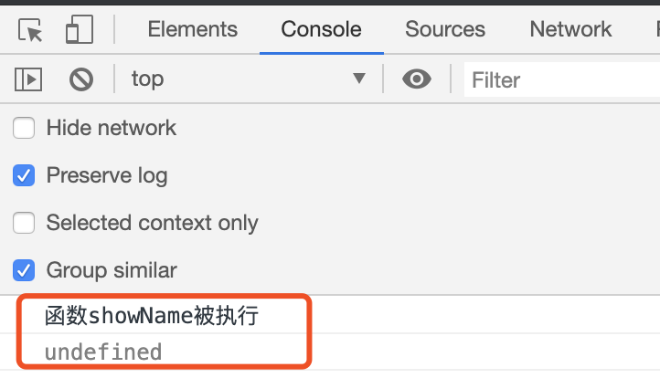
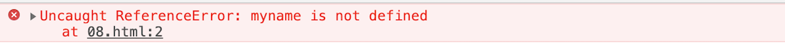

# 变量提升：JavaScript代码是按顺序执行的吗

讲解完宏观视角下的浏览器后，从这篇文章开始，我们就进入下一个新的模块了，这里我会对 JavaScript 执行原理做深入介绍。

今天在该模块的第一篇，我们主要讲解执行上下文相关的内容。那为什么先讲执行上下文呢？它这么重要吗？可以这么说，只有理解了 JavaScript 的执行上下文，你才能更好地理解 JavaScript 语言本身，比如变量提升、作用域和闭包等。不仅如此，理解执行上下文和调用栈的概念还能助你成为一名更合格的前端开发者。

不过由于我们专栏不是专门讲 JavaScript 语言的，所以我并不会对 JavaScript 语法本身做过多介绍。本文主要是从 JavaScript 的顺序执行讲起，然后一步步带你了解 JavaScript 是怎么运行的。

接下来咱们先看段代码，你觉得下面这段代码输出的结果是什么？

```js
showName()
console.log(myname)
var myname = '极客时间'
function showName() {
  console.log('函数showName被执行')
}
```

使用过 JavaScript 开发的程序员应该都知道，JavaScript 是按顺序执行的。若按照这个逻辑来理解的话，那么：

- 当执行到第1行的时候，由于函数 showName 还没有定义，所以执行应该会报错。

- 同样执行第2行的时候，由于变量 myname 也未定义，所以同样也会报错。

然而实际执行结果却并非如此，如下图：



第1行输出“函数showName被执行”，第2行输出“undefined”，这和前面想象中的顺序执行有点不一样啊！

通过上面的执行结果，你应该已经知道了函数或者变量可以在定义之前使用，那如果使用没有定义的变量或者函数，JavaScript 代码还能继续执行吗？为了验证这点，我们可以删除第3行 myname 的定义，如下所示：

```js
showName()
console.log(myname)
function showName() {
  console.log('函数showName被执行')
}
```

然后再次执行这段代码时，JavaScript 引擎就会报错，结果如下：



从上面两段代码的执行结果来看，我们可以得出如下三个结论。

- 执行过程中，若使用了未声明的变量，那么 JavaScript 执行会报错。

- 在一个变量定义之前使用它，不会出错，但是该变量的值会为 undefined，而不是定义时的值。

- 在一个函数定义之前使用它，不会出错，且函数能正确执行。

第一个结论很好理解，因为变量没有定义，这样在执行 JavaScript 代码时，就找不到该变量，所以 JavaScript 会抛出错误。

但是对于第二个和第三个结论，就挺让人费解的：

- 变量和函数为什么能在其定义之前使用？这似乎表明 JavaScript 代码并不是一行一行执行的。

- 同样的方式，变量和函数的处理结果为什么不一样？比如上面的执行结果，提前使用的 showName 函数能打印出来完整结果，但是提前使用的 myname 变量值却是 undefined，而不是定义时使用的“极客时间”这个值。
