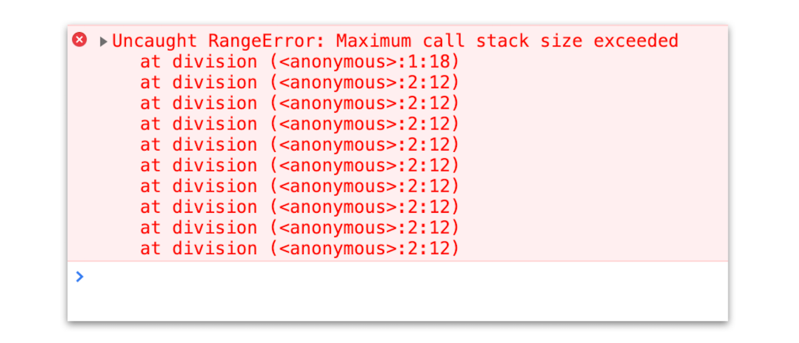

# 调用栈：为什么JavaScript代码会出现栈溢出

在上篇文章中，我们讲到了，当一段代码被执行时，JavaScript 引擎先会对其进行编译，并创建执行上下文。但是并没有明确说明到底什么样的代码才算符合规范。

那么接下来我们就来明确下，哪些情况下代码才算是“一段”代码，才会在执行之前就进行编译并创建执行上下文。一般说来，有这么三种情况。

- 当 JavaScript 执行全局代码的时候，会编译全局代码并创建全局执行上下文，而且在整个页面的生存周期内，全局执行上下文只要一份。

- 当调用一个函数的时候，函数体内的代码会被编译，并创建函数执行上下文，一般情况下，函数执行结束之后，创建的函数执行上下文会被销毁。

- 当使用 eval 函数的时候，eval 的代码也会被编译，并创建执行上下文。

好了，又进一步理解了执行上下文，那本节我们就在这基础之上继续深入，一起聊聊调用栈。学习调用栈至少有以下三点好处：

- 可以帮助你了解 JavaScript 引擎背后的工作原理。

- 让你有调试 JavaScript 代码的能力。

- 帮助你搞定面试，因为面试过程中，调用栈也是出境率非常高的题目。

比如你在写 JavaScript 代码的时候，有时候可能会遇到栈溢出的错误，如下图所示：

那为什么会出现这种错误呢？这就涉及到了调用栈的内容。你应该知道 JavaScript 中有很多函数，经常会出现在一个函数中调用另外一个函数的情况，调用栈就是用来管理函数调用关系的一种数据结构。因此要讲清楚调用栈，你还要先弄明白函数调用和栈结构。
