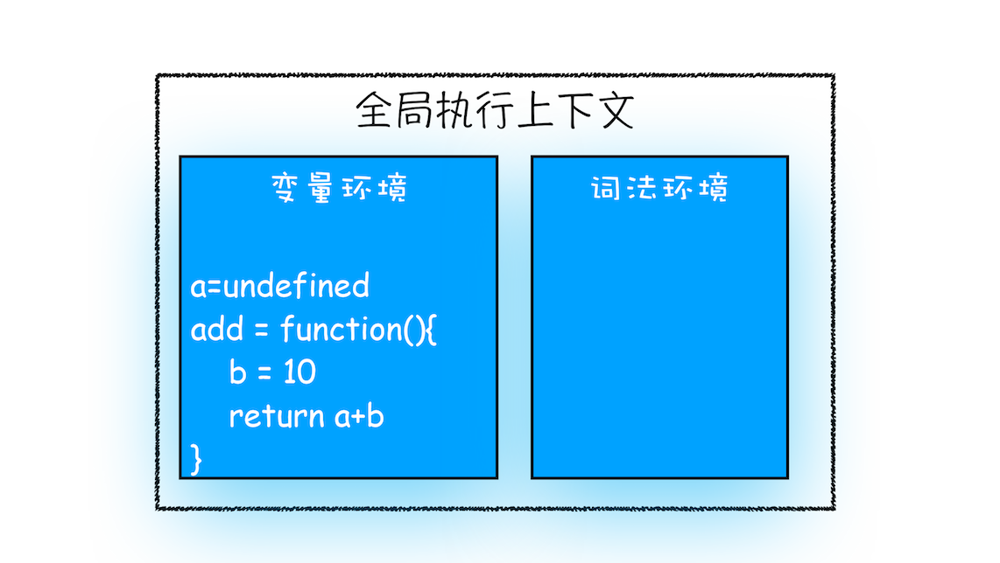
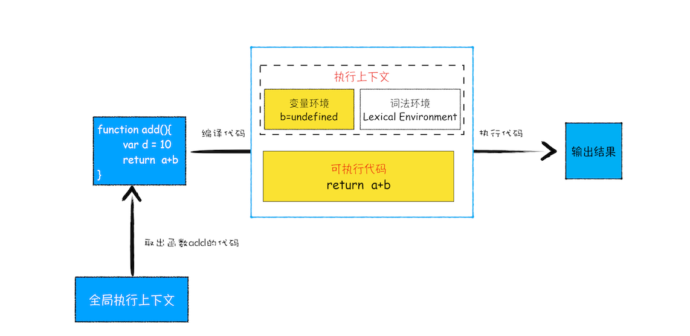
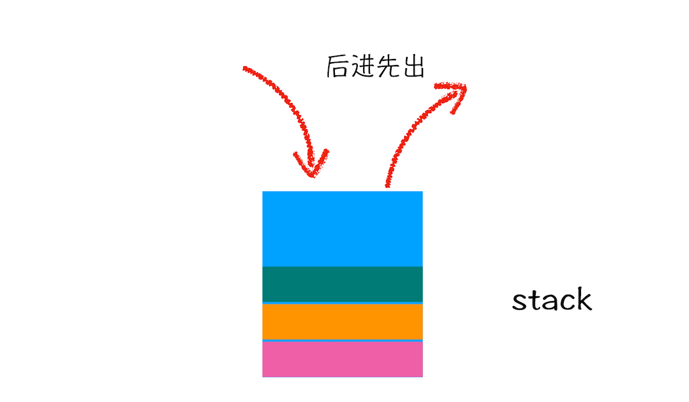

# 调用栈：为什么JavaScript代码会出现栈溢出

在上篇文章中，我们讲到了，当一段代码被执行时，JavaScript 引擎先会对其进行编译，并创建执行上下文。但是并没有明确说明到底什么样的代码才算符合规范。

那么接下来我们就来明确下，哪些情况下代码才算是“一段”代码，才会在执行之前就进行编译并创建执行上下文。一般说来，有这么三种情况。

- 当 JavaScript 执行全局代码的时候，会编译全局代码并创建全局执行上下文，而且在整个页面的生存周期内，全局执行上下文只要一份。

- 当调用一个函数的时候，函数体内的代码会被编译，并创建函数执行上下文，一般情况下，函数执行结束之后，创建的函数执行上下文会被销毁。

- 当使用 eval 函数的时候，eval 的代码也会被编译，并创建执行上下文。

好了，又进一步理解了执行上下文，那本节我们就在这基础之上继续深入，一起聊聊调用栈。学习调用栈至少有以下三点好处：

- 可以帮助你了解 JavaScript 引擎背后的工作原理。

- 让你有调试 JavaScript 代码的能力。

- 帮助你搞定面试，因为面试过程中，调用栈也是出境率非常高的题目。

比如你在写 JavaScript 代码的时候，有时候可能会遇到栈溢出的错误，如下图所示：


那为什么会出现这种错误呢？这就涉及到了调用栈的内容。你应该知道 JavaScript 中有很多函数，经常会出现在一个函数中调用另外一个函数的情况，调用栈就是用来管理函数调用关系的一种数据结构。因此要讲清楚调用栈，你还要先弄明白函数调用和栈结构。

## 什么是函数调用

函数调用就是运行一个函数，具体使用方式是使用函数名称跟着一对小括号。下面我们看个简单的示例代码。

```js
var a = 2
function add() {
  var b = 10
  return a + b
}
add()
```

这段代码很简单，先是创建了一个 add 函数，接着在代码的最下面又调用了该函数。

那么下面我们就利用这段简单的代码来解释下函数调用的过程。

在执行到函数 add() 之前，JavaScript 引擎会为上面这段代码创建全局执行上下文，包含了声明的函数和变量，你可以参考下图：



从图中可以看出，代码中全局变量和函数都保存在全局上下文的变量环境中。

执行上下文准备好之后，便开始执行全局代码，当执行到 add 这儿时，JavaScript 判断这是一个函数调用，那么将执行以下操作：

- 首先，从全局执行上下文中，取出 add 函数代码。

- 其次，对 add 函数的这段代码进行编译，并创建该函数的执行上下文和可执行代码。

- 最后，执行代码，输出结果。

完整流程你可以参考下图：



就这样，当执行到 add 函数的时候，我们就有了两个执行上下文了——全局执行上下文和 add 函数的执行上下文。

也就是说在执行 JavaScript 时，可能会存在多个执行上下文，那么 JavaScript 引擎是如何管理这些执行上下文的呢？

答案是通过一种叫**栈的数据结构来管理的**。那什么是栈呢？它又是如何管理这些执行上下文呢？

## 什么是栈

关于栈，你可以结合这么一个贴切的例子来理解，一条单车道的单行线，一端被堵住了，而另一端入口处没有任何提示信息，堵住之后就只能后进去的车子先出来，这时这个堵住的单行线就可以被看作是一个栈容器，车子开进单行线的操作叫做入栈，车子倒出去的操作叫做出栈。

在车流量较大的场景中，就会发生反复的入栈、栈满、出栈、空栈和再次入栈，一直循环。

所以，栈就是类似于一端被堵住的单行线，车子类似于栈中的元素，栈中的元素满足后进先出的特点。你可以参看下图：


