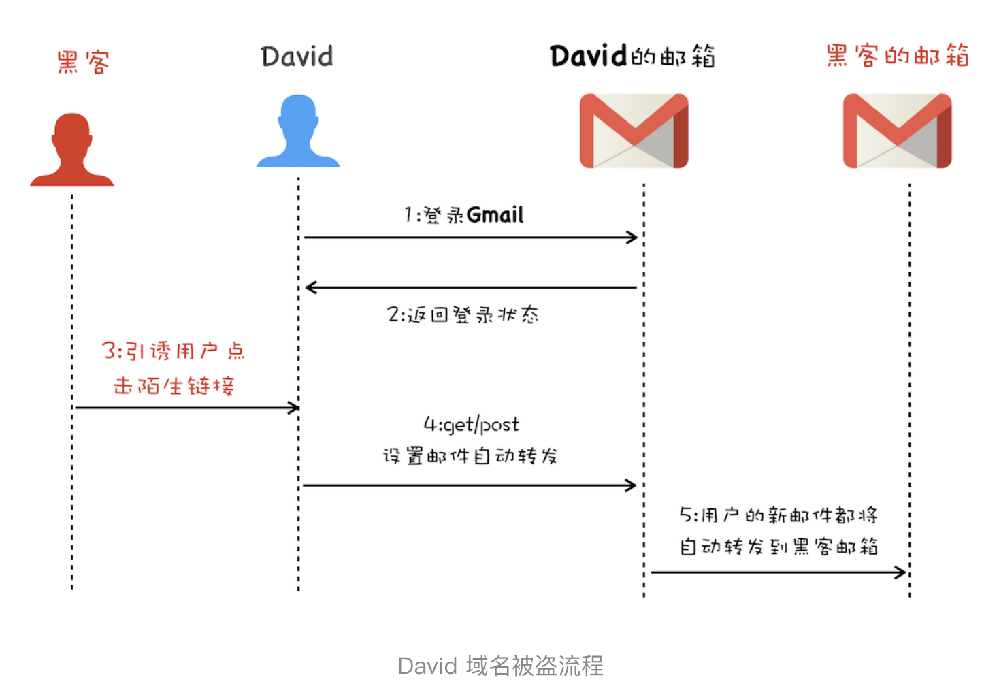

# CSRF攻击：陌生链接不要随便点

上一篇文章中我们讲到了 XSS 攻击，XSS 的攻击方式是黑客往用户的页面中注入恶意脚本，然后再通过恶意脚本将用户页面的数据上传到黑客的服务器上，最后黑客再利用这些数据进行一些恶意操作。XSS 攻击能够带来很大的破坏性，不过另外一种类型的攻击也不容忽视，它就是我们今天要聊的 CSRF 攻击。

相信你经常能听到的一句话：“别点那个链接，小心有病毒！”点击一个链接怎么就能染上病毒了呢？

我们结合一个真实的关于 CSRF 攻击的典型案例来分析下，在 2007 年的某一天，David 无意间打开了 Gmail 邮箱中的一份邮件，并点击了该邮件中的一个链接。过了几天，David 就发现他的域名被盗了。不过几经周折，David 还是要回了他的域名，也弄清楚了他的域名之所以被盗，就是因为无意间点击的那个链接。

那 David 的域名是怎么被盗的呢？

我们结合下图来分析下 David 域名的被盗流程：

- 首先 David 发起登录 Gmail 邮箱请求，然后 Gmail 服务器返回一些登录状态给 David 的浏览器，这些信息包括了 Cookie、Session 等，这样在 David 的浏览器中，Gmail 邮箱就处于登录状态了。

- 接着黑客通过各种手段引诱 David 去打开他的链接，比如 hacker.com，然后在 hacker.com 页面中，黑客编写好了一个邮件过滤器，并通过 Gmail 提供的 HTTP 设置接口设置好了新的邮件过滤功能，该过滤器会将 David 所有的邮件都转发到黑客的邮箱中。

- 最后的事情就很简单了，因为有了 David 的邮件内容，所以黑客就可以去域名服务商那边重置 David 域名账户的密码，重置好密码之后，就可以将其转出到黑客的账号了。

以上就是 David 的域名被盗的完整过程，其中前两步就是我们今天要聊的 CSRF 攻击。David 在要回了他的域名之后，也将整个攻击过程分享到他的站点上了，如果你感兴趣的话，可以参考。
