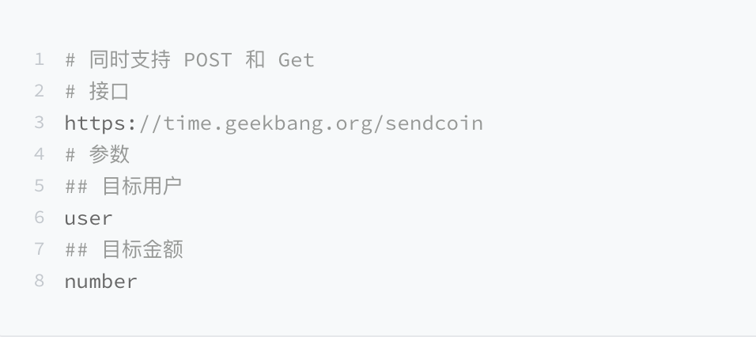
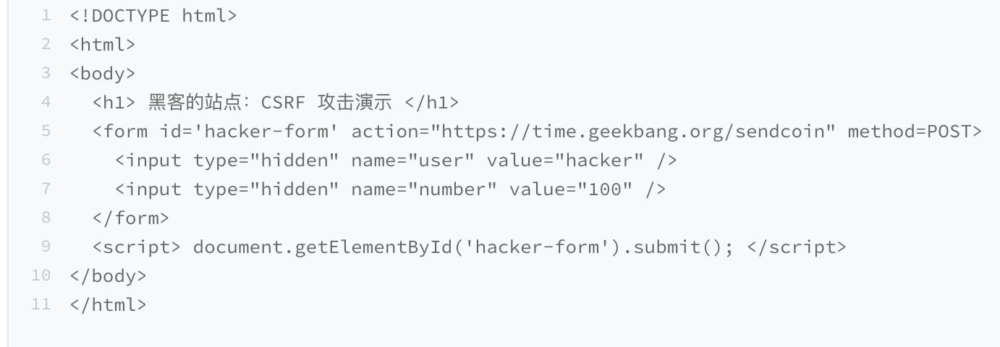
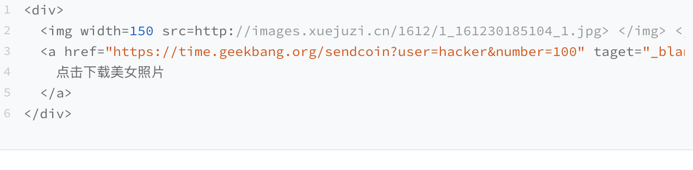

# CSRF攻击：陌生链接不要随便点

上一篇文章中我们讲到了 XSS 攻击，XSS 的攻击方式是黑客往用户的页面中注入恶意脚本，然后再通过恶意脚本将用户页面的数据上传到黑客的服务器上，最后黑客再利用这些数据进行一些恶意操作。XSS 攻击能够带来很大的破坏性，不过另外一种类型的攻击也不容忽视，它就是我们今天要聊的 CSRF 攻击。

相信你经常能听到的一句话：“别点那个链接，小心有病毒！”点击一个链接怎么就能染上病毒了呢？

我们结合一个真实的关于 CSRF 攻击的典型案例来分析下，在 2007 年的某一天，David 无意间打开了 Gmail 邮箱中的一份邮件，并点击了该邮件中的一个链接。过了几天，David 就发现他的域名被盗了。不过几经周折，David 还是要回了他的域名，也弄清楚了他的域名之所以被盗，就是因为无意间点击的那个链接。

那 David 的域名是怎么被盗的呢？

我们结合下图来分析下 David 域名的被盗流程：

- 首先 David 发起登录 Gmail 邮箱请求，然后 Gmail 服务器返回一些登录状态给 David 的浏览器，这些信息包括了 Cookie、Session 等，这样在 David 的浏览器中，Gmail 邮箱就处于登录状态了。

- 接着黑客通过各种手段引诱 David 去打开他的链接，比如 hacker.com，然后在 hacker.com 页面中，黑客编写好了一个邮件过滤器，并通过 Gmail 提供的 HTTP 设置接口设置好了新的邮件过滤功能，该过滤器会将 David 所有的邮件都转发到黑客的邮箱中。

- 最后的事情就很简单了，因为有了 David 的邮件内容，所以黑客就可以去域名服务商那边重置 David 域名账户的密码，重置好密码之后，就可以将其转出到黑客的账号了。

以上就是 David 的域名被盗的完整过程，其中前两步就是我们今天要聊的 CSRF 攻击。David 在要回了他的域名之后，也将整个攻击过程分享到他的站点上了，如果你感兴趣的话，可以参考。

## 什么是 CSRF 攻击

CSRF 英文全称是 Cross-site request forgery，所以又称为“跨站请求伪造”，是指黑客引诱用户打开黑客的网站，在黑客的网站中，利用用户的登录状态发起的跨站请求。简单来讲，**CSRF 攻击就是黑客利用了用户的登录状态，并通过第三方的站点来做一些坏事**。

通常当用户打开了黑客的页面后，黑客有三种方式去实施 CSRF 攻击。

下面我们以极客时间官网为例子，来分析这三种攻击方式都是怎么实施的。这里假设极客时间具有转账功能，可以通过 POST 或 Get 来实现转账，转账接口如下所示：

有了上面的转账接口，我们就可以来模拟 CSRF 攻击了。

### 1.自动发起 Get 请求

黑客最容易实施的攻击方式是自动发起 Get 请求，具体攻击方式你可以参考下面这段代码：

这是黑客页面的 HTML 代码，在这段代码中，黑客将转账的请求接口隐藏在 img 标签内，欺骗浏览器这是一张图片资源。当该页面被加载时，浏览器会自动发起 img 的资源请求，如果服务器没有对该请求做判断的话，那么服务器就会认为该请求是一个转账请求，于是用户账号上的 100 极客币就被转移到黑客的账户上去了。

### 2.自动发起 POST 请求

除了自动发送 Get 请求之外，有些服务器的接口是使用 POST 方法的，所以黑客还需要在他的站点上伪造 POST 请求，当用户打开黑客的站点时，是自动提交 POST 请求，具体的方式你可以参考下面示例代码：

在这段代码中，我们可以看到黑客在他的页面中构建了一个隐藏的表单，该表单的内容就是极客时间的转账接口。当用户打开该站点之后，这个表单会被自动执行提交；当表单被提交之后，服务器就会执行转账操作。因此使用构建自动提交表单这种方式，就可以自动实现跨站点 POST 数据提交。

### 3.引诱用户点击链接

除了自动发起 Get 和 POST 请求之外，还有一种方式是诱惑用户点击黑客站点上的链接，这种方式通常出现在论坛或者恶意邮件上。黑客会采用很多方式去诱惑用户点击链接，示例代码如下所示：

这段黑客站点代码，页面上放了一张美女图片，下面放了图片下载地址，而这个下载地址实际上是黑客用来转账的接口，一旦用户点击了这个链接，那么他的极客币就被转到黑客账户上了。

以上三种就是黑客经常采用的攻击方式。如果当用户登录了极客时间，以上三种 CSRF 攻击方式中的任何一种发生时，那么服务器都会将一定金额的极客币发送到黑客账户。

到这里，相信你已经知道什么是 CSRF 攻击了。和 XSS 不同的是，CSRF 攻击不需要将恶意代码注入用户的页面，仅仅是利用服务器的漏洞和用户的登录状态来实施攻击。
