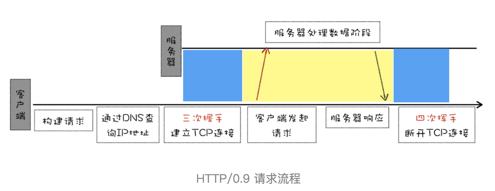

# HTTP1：HTTP性能优化

谈及浏览器中的网络，就避不开 HTTP。我们知道 HTTP 是浏览器中最重要且使用最多的协议，是浏览器和服务器之间的通信语言，也是互联网的基石。而随着浏览器的发展，HTTP 为了能适应新的形式也在持续进化，我们认为学习 HTTP 的最佳途径就是了解其发展史，所以接下来的三篇文章中，我会从浏览器发展的视角来和你聊聊 HTTP 演进。这三篇分别是即将完成使命的 HTTP / 1，正向我们走来的 HTTP / 2，以及未来的 HTTP / 3。

本文主要介绍的是 HTTP / 1.1，我们先讲解 HTTP / 1.1 的进化史，然后再介绍在进化过程中所遇到的各种瓶颈，以及对应的解决方法。

## 超文本传输协议 HTTP / 0.9

首先我们来看看诞生最早的 HTTP / 0.9。HTTP / 0.9 是于 1991 年提出的，主要用于学术交流，需求很简单——用来在网络之间传递 HTML 超文本的内容，所以被称为超文本传输协议。整体来看，它的实现也很简单，采用了基于请求响应的模式，从客户端发出请求，服务器返回数据。

下面我们就来看看 HTTP / 0.9 的一个完整的请求流程（可参考下图）：

- 因为 HTTP 都是基于 TCP 协议的，所以客户端要根据 IP 地址、端口和服务器建立 TCP 连接，而建立连接的过程就是 TCP 协议三次握手的过程。

- 建立好连接之后，会发送一个 GET 请求行的信息，如 GET /index.html 用来获取 index.html。

- 服务器接收请求信息之后，读取对应的 HTML 文件，并将数据以 ASCII 字符流返回给客户端。

- HTML 文档传输完成后，断开连接。

总的来说，当时的需求很简单，就是用来传输体积很小的 HTML 文件，所以 HTTP / 0.9 的实现有以下三个特点。

- 第一个是只有一个请求行，并没有 HTTP 请求头和请求体，因为只需要一个请求行就可以完整表达客户端的需求了。

- 第二个是服务器也没有返回头信息，这是因为服务器端并不需要告诉客户端太多信息，只需要返回数据就可以了。

- 第三个是返回的文件内容是以 ASCII 字符流来传输的，因为都是 HTML 格式的文件，所以使用 ASCII 字节码来传输是最合适的。

## 被浏览器推动的 HTTP / 1.0

HTTP / 0.9 虽然简单，但是已经可以满足当时的需求了。不过变化是这个世界永恒不变的主旋律，1994 年底出现了拨号上网服务，同年网景又推出一款浏览器，从此万维网就不局限于学术交流了，而是进入了高速的发展阶段。随之而来的是万维网联盟（W3C）和 HTTP 工作组（HTTP-WG）的创建，它们致力于 HTML 的发展和 HTTP 的改进。

万维网的高速发展带来了很多新的需求，而 HTTP / 0.9 已经不能适用新兴网络的发展，所以这时就需要一个新的协议来支撑新兴网络，这就是 HTTP / 1.0 诞生的原因。不过在详细分析 HTTP / 1.0 之前，我们先来分析下新兴网络都带来了哪些新需求。

首先在浏览器中展示的不单是 HTML 文件了，还包括了 JavaScript、CSS、图片、音频、视频等不同类型的文件。因此支持多种类型的文件下载是 HTTP / 1.0 的一个核心诉求，而且文件格式不仅仅局限于 ASCII 编码，还有很多其他类型编码的文件。
