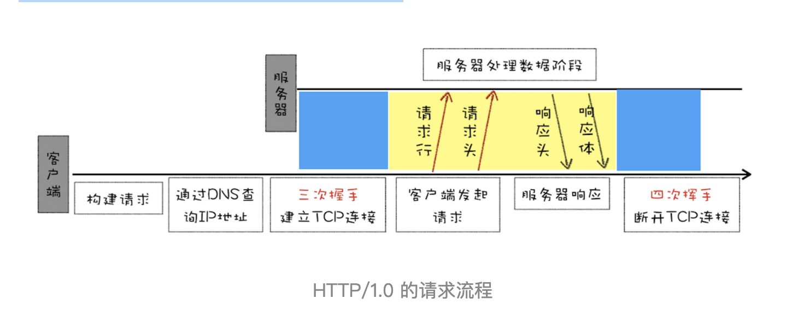

# HTTP1：HTTP性能优化

谈及浏览器中的网络，就避不开 HTTP。我们知道 HTTP 是浏览器中最重要且使用最多的协议，是浏览器和服务器之间的通信语言，也是互联网的基石。而随着浏览器的发展，HTTP 为了能适应新的形式也在持续进化，我们认为学习 HTTP 的最佳途径就是了解其发展史，所以接下来的三篇文章中，我会从浏览器发展的视角来和你聊聊 HTTP 演进。这三篇分别是即将完成使命的 HTTP / 1，正向我们走来的 HTTP / 2，以及未来的 HTTP / 3。

本文主要介绍的是 HTTP / 1.1，我们先讲解 HTTP / 1.1 的进化史，然后再介绍在进化过程中所遇到的各种瓶颈，以及对应的解决方法。

## 超文本传输协议 HTTP / 0.9

首先我们来看看诞生最早的 HTTP / 0.9。HTTP / 0.9 是于 1991 年提出的，主要用于学术交流，需求很简单——用来在网络之间传递 HTML 超文本的内容，所以被称为超文本传输协议。整体来看，它的实现也很简单，采用了基于请求响应的模式，从客户端发出请求，服务器返回数据。

下面我们就来看看 HTTP / 0.9 的一个完整的请求流程（可参考下图）：

- 因为 HTTP 都是基于 TCP 协议的，所以客户端要根据 IP 地址、端口和服务器建立 TCP 连接，而建立连接的过程就是 TCP 协议三次握手的过程。

- 建立好连接之后，会发送一个 GET 请求行的信息，如 GET /index.html 用来获取 index.html。

- 服务器接收请求信息之后，读取对应的 HTML 文件，并将数据以 ASCII 字符流返回给客户端。

- HTML 文档传输完成后，断开连接。


总的来说，当时的需求很简单，就是用来传输体积很小的 HTML 文件，所以 HTTP / 0.9 的实现有以下三个特点。

- 第一个是只有一个请求行，并没有 HTTP 请求头和请求体，因为只需要一个请求行就可以完整表达客户端的需求了。

- 第二个是服务器也没有返回头信息，这是因为服务器端并不需要告诉客户端太多信息，只需要返回数据就可以了。

- 第三个是返回的文件内容是以 ASCII 字符流来传输的，因为都是 HTML 格式的文件，所以使用 ASCII 字节码来传输是最合适的。

## 被浏览器推动的 HTTP / 1.0

HTTP / 0.9 虽然简单，但是已经可以满足当时的需求了。不过变化是这个世界永恒不变的主旋律，1994 年底出现了拨号上网服务，同年网景又推出一款浏览器，从此万维网就不局限于学术交流了，而是进入了高速的发展阶段。随之而来的是万维网联盟（W3C）和 HTTP 工作组（HTTP-WG）的创建，它们致力于 HTML 的发展和 HTTP 的改进。

万维网的高速发展带来了很多新的需求，而 HTTP / 0.9 已经不能适用新兴网络的发展，所以这时就需要一个新的协议来支撑新兴网络，这就是 HTTP / 1.0 诞生的原因。不过在详细分析 HTTP / 1.0 之前，我们先来分析下新兴网络都带来了哪些新需求。

首先在浏览器中展示的不单是 HTML 文件了，还包括了 JavaScript、CSS、图片、音频、视频等不同类型的文件。因此支持多种类型的文件下载是 HTTP / 1.0 的一个核心诉求，而且文件格式不仅仅局限于 ASCII 编码，还有很多其他类型编码的文件。

## 那么该如何实现多种类型文件的下载呢？

文章开头我们说过，HTTP 是浏览器和服务器之间的通信语言，不过 HTTP / 0.9 在建立好连接之后，只会发送类似 GET /index.html 的简单请求命令，并没有其他途径告诉服务器更多的信息，如文件编码、文件类型等。同样，服务器是直接返回数据给浏览器的，也没有其他途径告诉浏览器更多的关于服务器返回的文件信息。

这种简单的交流型形式无疑不能满足传输多种类型文件的需求，那为了让客户端和服务器能更深入地交流，HTTP / 1.0 引入了请求头和响应头，它们都是以 Key-Value 形式保存的，在 HTTP 发送请求时，会带上请求头信息，服务器返回数据时，会先返回响应头信息。至于 HTTP / 1.0 具体的请求流程，你可以参考下图。



有了请求头和响应头，浏览器和服务器就能进行更加深入的交流了。

那 HTTP / 1.0 是怎么通过请求头和响应头来支持多种不同类型的数据呢？

要支持多种类型的文件，我们就需要解决以下几个问题：

- 首先，浏览器需要知道服务器返回的数据是什么类型的，然后浏览器才能根据不同的数据类型做针对性的处理。

- 其次，由于万维网所支持的应用变得越来越广，所以单个文件的数据量也变得越来越大。为了减轻传输性能，服务器会对数据进行压缩后再传输，所以浏览器需要知道服务器压缩的方法。

- 再次，由于万维网是支持全球范围的，所以需要提供国际化的支持，服务器需要对不同的地区提供不同的语言版本，这就需要浏览器告诉服务器它想要什么语言版本的页面。

- 最后，由于增加了各种不同类型的文件，而每种文件的编码方式又可能不一样，为了能够准确地读取文件，浏览器需要知道文件的编码类型。

基于以上问题，HTTP / 1.0 的方案是通过请求头和响应头来进行协商，在发起请求时会通过 HTTP 请求头告诉服务器它期待服务器返回什么类型的文件、采取什么形式的压缩、提供什么语言的文件以及文件的具体编码。最终发送出来的请求头内容如下：

```
accept: text/html
accept-encoding: gzip, deflate, br
accept-Charset: ISO-8859-1,utf-8
accept-language: zh-CN,zh
```

其中第一行表示期望服务器返回 html 类型的文件，第二行表示期望服务器可以采用 gzip、deflate 或者 br 其中的一种压缩方式，第三行表示期望返回的文件编码是 UTF-8 或者 IOS-8859-1，第四行是表示期望页面的优先语言是中文。

服务器接收到浏览器发送过来的请求头信息之后，会根据请求头的信息来准备响应数据。不过有些时候会有一些意味情况发生，比如浏览器请求的压缩类型是 gzip，但是服务器不支持 gzip，只支持 br 压缩，那么它会通过响应头中的 content-encoding 字段告诉浏览器最终的压缩类型，也就是说最终浏览器需要根据响应头的信息来处理数据。下面是一段响应头的数据信息：

```
content-encoding: br
content-type: text/html; charset=UTF-8
```

其中第一行表示服务器采用了 br 的压缩方法，第二行表示服务器返回的是 html 文件，并且该文件的编码类型是 UTF-8。

有了响应头的信息，浏览器会使用 br 方法来解压文件，再按照 UTF-8 的编码格式来处理原始文件，最后按照 HTML 的方式来解析该文件。这就是 HTTP / 1.0 支持多文件的一个基本的处理流程。

HTTP / 1.0 除了对多文件提供良好的支持外，还依据当时实际的需求引入了很多其他的特性，这些特性都是通过请求头和响应头来实现的。下面我们来看看新增的几个典型的特性：

- 有的请求服务器可能无法处理，或者处理出错，这时候就需要告诉浏览器最终处理该请求的情况，这就引入了状态码。状态码是通过响应行的方式来通知浏览器的。

- 为了减轻服务器的压力，在 HTTP / 1.0 中提供了 Cache 机制，用来缓存已经下载过的数据。

- 服务器需要统计客户端的基础信息，比如 Windows 和 macOS 的用户量分别是多少，所以 HTTP / 1.0 的请求头中还加入了用户代理的字段。
