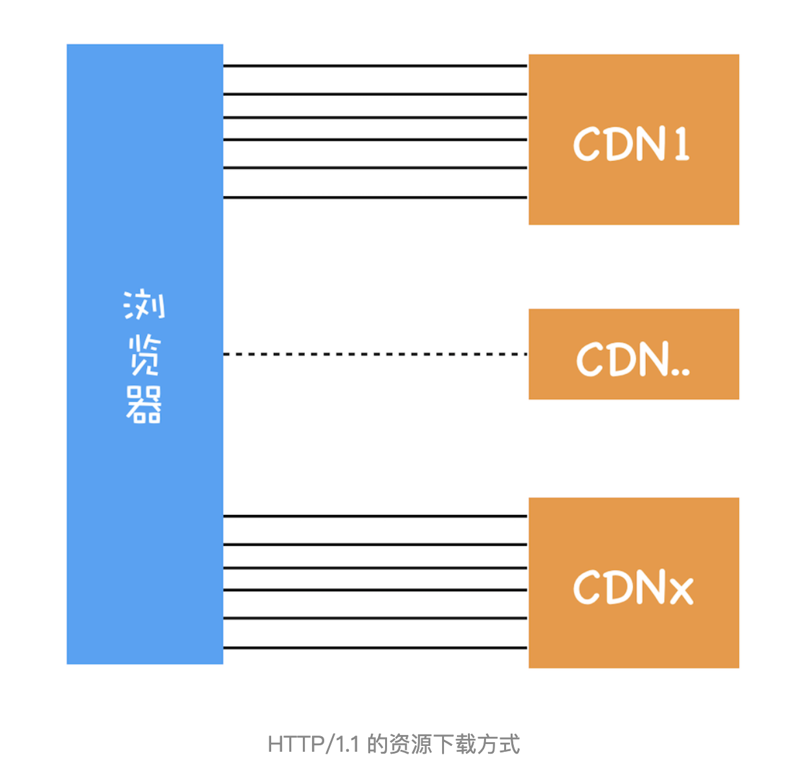

# HTTP2：如何提升网络速度

上一篇文章我们聊了 HTTP / 1.1 的发展史，虽然 HTTP / 1.1 已经做了大量的优化，但是依然存在很多性能瓶颈，依然不能满足我们日益变化的新需求，所以就有了我们今天要聊的 HTTP / 2。

本文我们依然从需求的层面来谈，先分析 HTTP / 1.1 存在哪些问题，然后再来分析 HTTP / 2 是如何解决这些问题的。

我们知道 HTTP / 1.1 为网络效率做了大量的优化，最核心的有如下三种方式：

- 增加持久连接。

- 浏览器为每个域名最多同时维护 6 个 TCP 持久连接。

- 使用 CDN 实现域名分片机制。

通过这些方式就大大提高了页面的下载速度，你可以通过下图来直观感受下：

在该图中，引入了 CDN，并同时为每个域名维护 6 个连接，这样就大大减轻了整个资源的下载时间。这里我们可以简单计算下：如果使用单个 TCP 的持久连接，下载 100 个资源所花费的时间为 100 * n * RTT；若通过上面的技术，就可以把整个时间缩短为 100 * n * RTT / (6 * CDN 个数)。从这个计算结果来看，我们的页面加载速度变快了不少。

## HTTP / 1.1 的主要问题

虽然 HTTP / 1.1 采取了很多优化资源加载速度的策略，也取得了一定的效果，但是 HTTP / 1.1 对宽带的利用率并不理想，这也是 HTTP / 1.1 的一个核心问题。

带宽是指每秒最大能发送或者接收的字节数。我们把每秒能发送的最大字节数称为上行带宽，每秒能够接收的最大字节数称为下行带宽。

之所以说 HTTP / 1.1 对带宽的利用率不理想，是因为 HTTP / 1.1 很难将带宽用满。比如我们常说的 100M 带宽，实际的下载速度能达到 12.5M / S，而采用 HTTP / 1.1 时，也许在加载页面资源时最大只能使用到 2.5M / S，很难将 12.5M 全部用满。

之所以会出现这个问题，主要由以下三个原因导致的。

**第一个原因，TCP 的慢启动**。

一旦一个 TCP 连接建立之后，就进入了发送数据状态，刚开始 TCP 协议会采用一个非常慢的速度去发送数据，然后慢慢加快发送数据的速度，直到发送数据的速度达到一个理想状态，我们把这个过程称为慢启动。

你可以把每个 TCP 发送数据的过程看成是一辆车的启动过程，当刚进入公路时，会有从 0 到一个稳定速度的提速过程，TCP 的慢启动就类似于该过程。

慢启动是 TCP 为了减少网络拥塞的一种策略，我们是没有办法改变的。

而之所以说慢启动会带来性能问题。是因为页面中常用的一些关键资源文件本来就不大，如 HTML 文件、CSS 文件和 JavaScript 文件，通常这些文件在 TCP 连接建立好之后就要发起请求的，但这个过程是慢启动，所以耗费的时间比正常的时间要多很多，这样就推迟了宝贵的首次渲染页面的时长了。

**第二个原因，同时开启了多条 TCP 连接，那么这些连接会竞争固定的带宽**。

你可以想象一下，系统同时建立了多条 TCP 连接，当带宽充足时，每条连接发送或者接收速度会慢慢向上增加；而一旦带宽不足时，这些 TCP 连接又会减慢发送或者接收的速度。比如一个页面有 200 个文件，使用了 3 个 CDN，那么加载该网页的时候就需要建立 6 * 3，也就是 18 个 TCP 连接来下载资源；在下载过程中，当发现带宽不足的时候，各个 TCP 连接就需要动态减慢接收数据的速度。

这样就会出现一个问题，因为有的 TCP 连接下载的是一些关键资源，如 CSS 文件、JavaScript 文件等，而有的 TCP 连接下载的是图片、视频等普通的资源文件，但是多条 TCP 连接之间又不能协商让哪些关键资源优先下载，这样就有可能影响那些关键资源的下载速度了。

**第三个原因，HTTP / 1.1 队头阻塞的问题**。

通过上一篇文章，我们知道在 HTTP / 1.1 中使用持久连接时，虽然能公用一个 TCP 管道，但是在一个管道中同一时刻只能处理一个请求，在当前的请求没有结束之前，其他的请求只能处于阻塞状态。这意味着我们不能随意在一个管道中发送请求和接收内容。

这是一个很严重的问题，因为队头阻塞的因素有很多，并且都是一些不确定的因素，假如有的请求被阻塞了 5 秒，那么后续排队的请求都要延迟等待 5 秒，在这个等待的过程中，带宽、CPU 都被白白浪费了。

在浏览器处理生成页面的过程中，是非常希望能提前接收到数据的，这样就可以对这些数据做预处理操作，比如提前接收到的图片，那么就可以提前进行编解码操作，等到需要使用该图片的时候，就可以直接给出处理后的数据了，这样能让用户感受到整体速度的提升。

但队头阻塞使得这些数据不能并行请求，所以队头阻塞是很不利于浏览器优化的。
