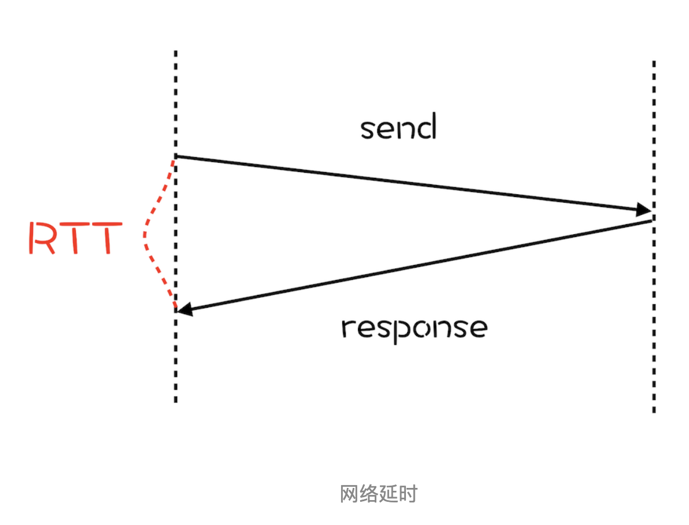

# HTTP3：甩掉TCP、TCL包袱，构建高效网络

前面两篇文章我们分析了 HTTP / 1 和 HTTP / 2，在 HTTP / 2 出现之前，开发者需要采用很多变通的方式来解决 HTTP / 1 所存在的问题，不过 HTTP / 2 在 2018 年就开始得到了大规模的应用，HTTP / 1 中存在的一大堆缺陷都得到了解决。

HTTP / 2 的一个核心特性是使用了多路复用技术，因此它可以通过一个 TCP 连接来发送多个 URL 请求。多路复用技术能充分利用带宽，最大限度规避了 TCP 的慢启动所带来的问题，同时还实现了头部压缩、服务器推送等功能，使得页面资源的传输速度得到了大幅提升。在 HTTP / 1.1 时代，为了提升并行下载效率，浏览器为每个域名维护了 6 个 TCP 连接；而采用 HTTP / 2 之后，浏览器只需要为每个域名维护 1 个 TCP 持久连接，同时还解决了 HTTP / 1.1 队头阻塞的问题。

从目前的情况来看，HTTP / 2 似乎可以完美取代 HTTP / 1 了，不过 HTTP / 2 依然存在一些缺陷，于是就有了 HTTP / 3。和通常一样，介绍 HTTP / 3 之前，我们先来看看 HTTP / 2 到底有什么缺陷。

## TCP 的队头阻塞

虽然 HTTP / 2 解决了应用层面的队头阻塞问题，不过和 HTTP / 1.1 一样，HTTP / 2 依然是基于 TCP 协议的，而 TCP 最初就是为了单连接而设计的。你可以把 TCP 连接看成是两台计算机之前的一个虚拟管道，计算机的一端将要传输的数据按照顺序放入管道，最终数据会以相同的顺序出现在管道的另外一头。

接下来我们就来分析下，HTTP / 1.1 协议栈中 TCP 是如何传输数据的。为了直观理解，你可以参考下图：

通过上图你会发现，从一端发送给另外一端的数据会被拆分为一个个按照顺序排列的数据包，这些数据包通过网络传输到了接收端，接收端再按照顺序将这些数据包组合成原始数据，这样就完成了数据传输。

不过，如果在数据传输的过程中，有一个数据因为网络故障或者其他原因而丢包了，那么整个 TCP 的连接就会处于暂停状态，需要等待丢失的数据包被重新传输过来。你可以把 TCP 连接看成是一个按照顺序传输数据的管道，管道中的任意一个数据丢失了，那之后的数据都需要等待该数据的重新传输。为了直观理解，你可以参考下图：

我们就把在 TCP 传输过程中，由于单个数据包的丢失而造成的阻塞称为 TCP 上的队头阻塞。

那队头阻塞是怎么影响 HTTP / 2 传输的呢？首先我们来看正常情况下 HTTP / 2 是怎么传输多路请求的，为了直观理解，你可以参考下图：

通过该图，我们知道在 HTTP / 2 中，多个请求是跑在一个 TCP 管道中的，如果任意一路数据流中出现了丢包的情况，那么就会阻塞该 TCP 连接中的所有请求。这不同于 HTTP / 1.1，使用 HTTP / 1.1 时，浏览器为每个域名开启了 6 个 TCP 连接，如果其中的 1 个 TCP 连接发生了队头阻塞，那么其他的 5 个连接依然可以继续传输数据。

所以随着丢包率的增加，HTTP / 2 的传输率也会越来越差。有测试数据表明，当系统达到了 2% 的丢包率时，HTTP / 1.1 的传输效率反而比 HTTP / 2 表现得更好。

## TCP 建立连接的延时

除了 TCP 队头阻塞之外，TCP 的握手过程也是影响传输效率的一个重要因素。

为了搞清楚 TCP 协议建立连接的延迟问题，我们还是先来回顾下网络延迟的概念，这会有助于你对后面内容的理解。网络延迟又称为 RTT（Round Trip Time）。我们把从浏览器发送一个数据包到服务器，再从服务器返回数据包到浏览器的整个往返时间称为 RTT（如下图）。RTT 是反映网络性能的一个重要指标。

那建立 TCP 连接时，需要花费多少个 RTT 呢？下面我们来计算下。

我们知道 HTTP / 1 和 HTTP / 2 都是使用 TCP 协议来传输的，而如果使用 HTTPS 的话，还需要使用 TLS 协议进行安全传输，而使用 TLS 也需要一个握手过程，这样就需要有两个握手延迟过程。

- 在建立 TCP 连接的时候，需要和服务器进行三次握手来确认连接成功，也就是说需要在消耗 1.5 个 RTT 之后才能进行数据传输。

- 进行 TLS 连接，TLS 有两个版本——TLS1.2 和 TLS1.3，每个版本建立连接所花的时间不同，大致是需要 1 ~ 2 个 RTT，关于 HTTPS 我们到后面的安全模块再做详细介绍。

总之，在传输数据之前，我们需要花掉 3 ~ 4 个 RTT。如果浏览器和服务器的物理距离较近，那么 1 个 RTT 的时间可能在 10 毫秒以内，也就是说总共要消耗掉 30 ~ 40 毫秒。这个时间也许用户还可以接受，但如果服务器相隔较远，那么 1 个 RTT 就可能需要 100 毫秒以上了，这种情况下整个握手过程需要 300 ~ 400 毫秒，这时用户就能明显地感受到“慢”了。
