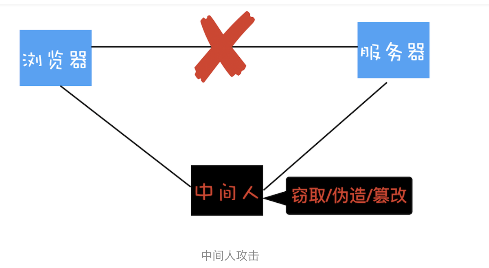

# HTTPS：让数据传输更安全

浏览器安全主要划分为三大块内容：页面安全、系统安全和网络安全。前面我们用四篇文章介绍了页面安全和系统安全，也聊了浏览器和 Web 开发者是如何应对各种类型的攻击，本文是我们专栏的最后一张，我们就接着聊聊网络安全协议 HTTPS。

我们先从 HTTP 的明文传输的特性讲起，在上一个模块的三篇文章中我们分析过，起初设计 HTTP 协议的目的很单纯，就是为了传输超文本文件，那时候也没有太强的加密传输的数据需求，所以 HTTP 一直保持着明文传输数据的特征。但这样的话，在传输过程中的每一个环节，数据都有可能被窃取或者篡改，这也意味着你和服务器之间还可能有个中间人，你们在通信过程中的一切内容都在中间人的掌握中，如下图：

从上图可以看出，我们使用 HTTP 传输的内容很容易被中间人窃取、伪造和篡改，通常我们把这种攻击方式称为**中间人攻击**。

具体来讲，在将 HTTP 数据提交给 TCP 层之后，数据会经过用户电脑、WiFi 路由器、运营商和目标服务器，在这中间的每个环节中，数据都有可能被窃取或篡改。比如用户电脑被黑客安装了恶意软件，那么恶意软件就能抓取和篡改所发出的 HTTP 请求的内容。或者用户一不小心连接上了 WiFi 钓鱼路由器，那么数据也都能被黑客抓取或篡改。
