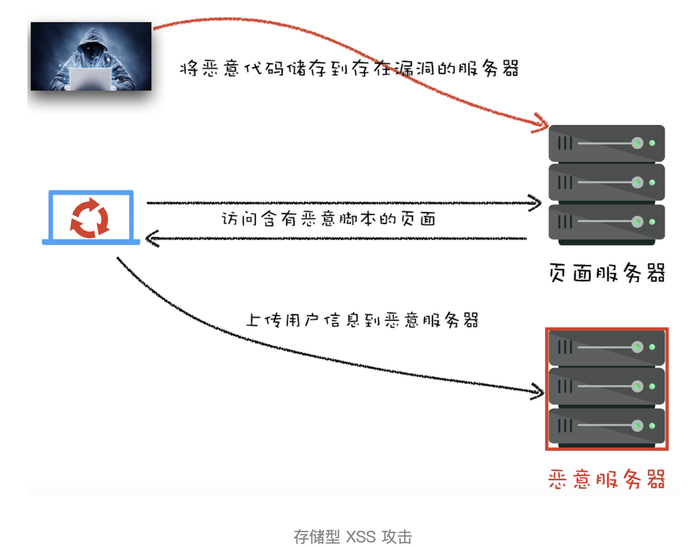
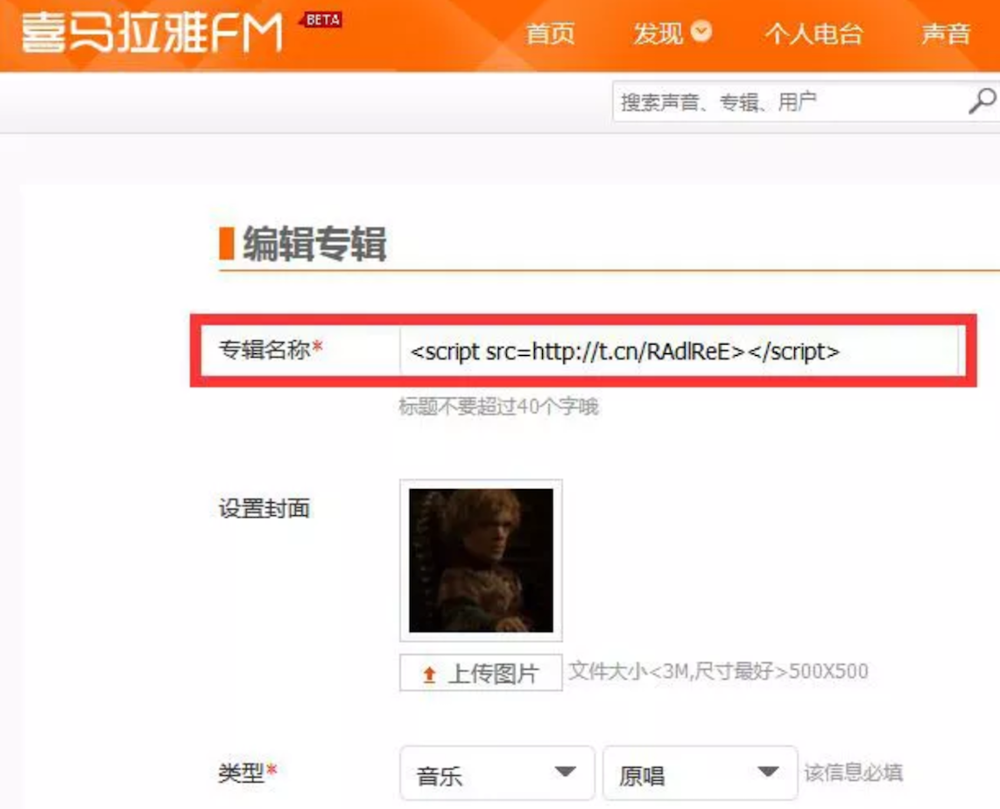
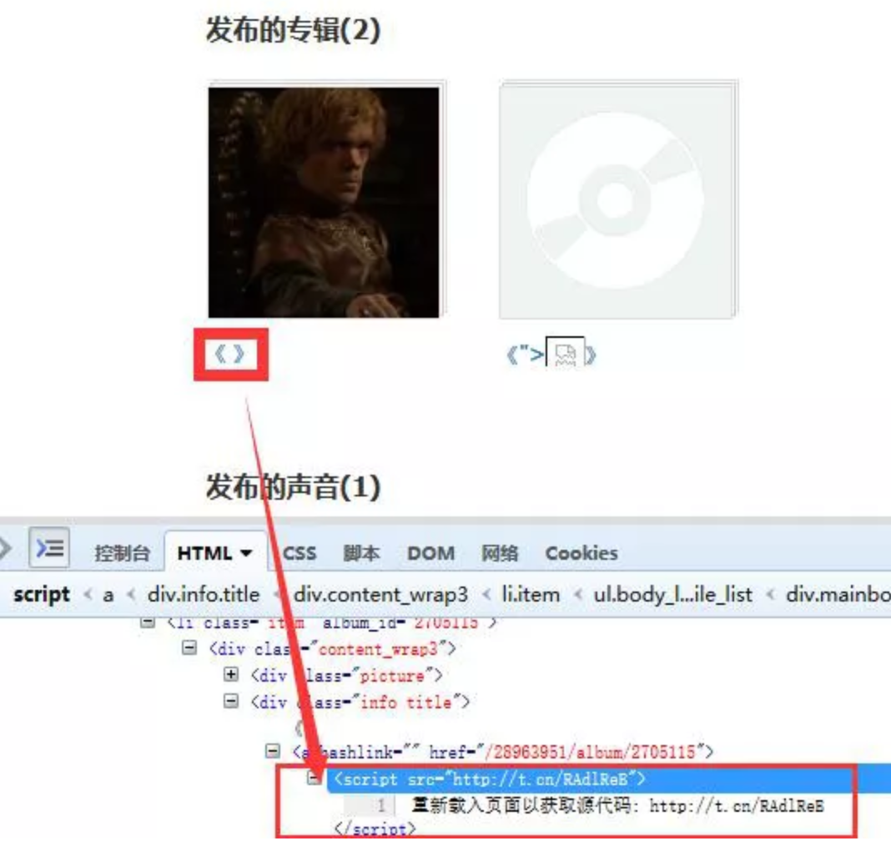
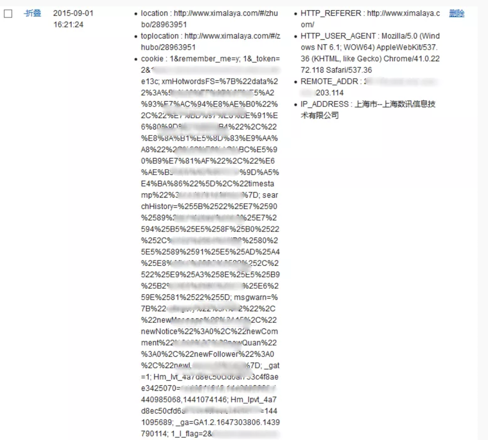
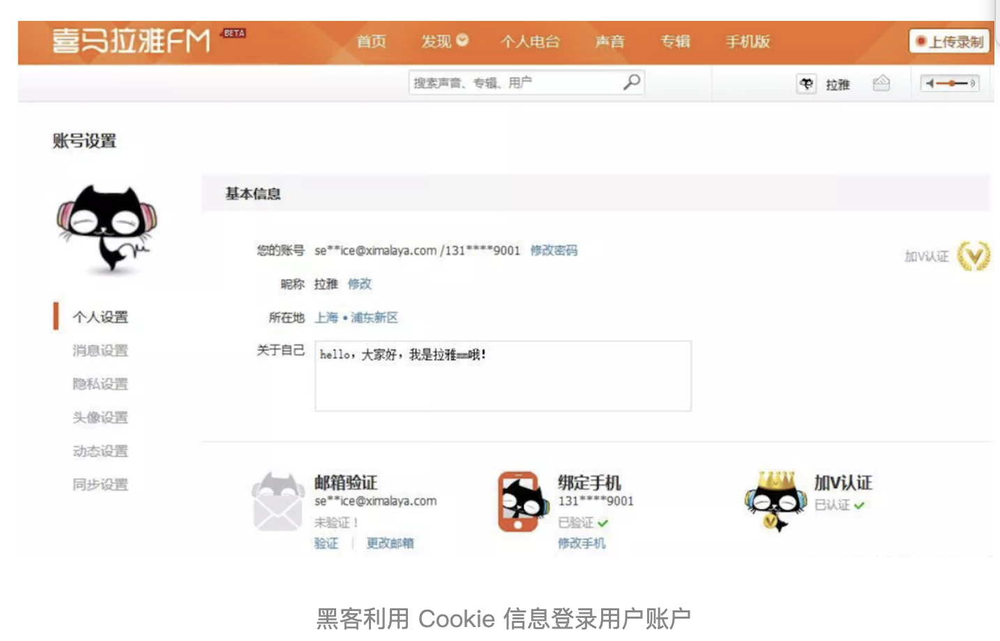
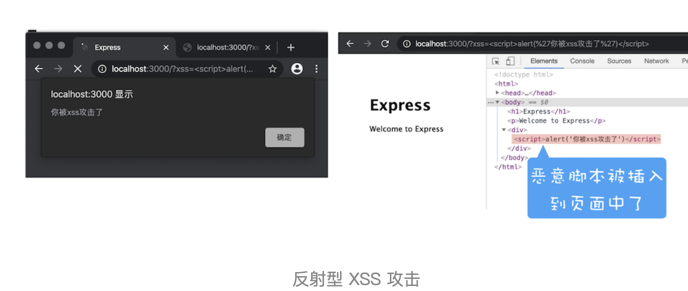

# 跨站脚本攻击XSS：为什么cookie中有httpOnly属性

通过上篇文章的介绍，我们知道了同源策略可以隔离各个站点之间的 DOM 交互、页面数据和网络通信，虽然严格的同源策略会带来更多的安全，但是也束缚了 Web。这就需要在安全和自由之间找到一个平衡点，所以我们默认页面中可以引用任意第三方资源，然后又引入 CSP 策略来加以限制；默认 XMLHttpRequest 和 Fetch 不能跨站请求资源，然后又通过 CORS 策略来支持其跨域。

不过支持页面中的第三方资源引用和 CORS 也带来了很多安全问题，其中最典型的就是 XSS 攻击。

## 什么是 XSS 攻击

XSS 全称 Cross Site Scripting，为了与“CSS”区分开来，故简称 XSS，翻译过来就是“跨站脚本”。XSS 攻击是指黑客往 HTML 文件中或者 DOM 中注入恶意脚本，从而在用户浏览页面时利用注入的恶意脚本对用户实施攻击的一种手段。

最开始的时候，这种攻击是通过跨域来实现的，所以叫“跨域脚本”。但是发展到现在，往 HTML 文件中注入恶意代码的方式越来越多了，所以是否跨域注入脚本已经不是唯一的注入手段了，但是 XSS 这个名字却一直保留至今。

当页面被注入恶意 JavaScript 脚本时，浏览器无法区分这些脚本是被恶意注入的还是正常的页面内容，所以恶意注入 JavaScript 脚本也拥有所有的脚本权限。下面我们就来看看，如果页面被注入了恶意 JavaScript 脚本，恶意脚本都能做哪些事情：

- 可以窃取 Cookie 信息。恶意 JavaScript 可以通过 `document.cookie` 获取 Cookie 信息，然后通过 XMLHttpRequest 或者 Fetch 加上 CORS 功能将数据发送给恶意服务器；恶意服务器拿到用户的 Cookie 信息之后，就可以在其他电脑上模拟用户的登录，然后进行转账等操作。

- 可以监听用户行为。恶意 JavaScript 可以使用 `addEventListener` 接口来监听键盘事件，比如可以获取用户输入的信用卡等信息，将其发送到恶意服务器。黑客掌握了这些信息之后，又可以做很多违法的事情。

- 可以通过修改 DOM 伪造假的登录窗口，用来欺骗用户输入用户名和密码等信息。

- 还可以在页面内生成浮窗广告，这些广告会严重地影响用户体验。

除了以上几种情况外，恶意脚本还能做很多其他的事情，这里就不一一介绍了。总之，如果让页面插入了恶意脚本，那么就相当于把我们页面的隐私数据和行为完全暴露给黑客了。

## 恶意脚本是怎么注入的

现在我们知道了页面中被注入恶意的 JavaScript 脚本是一件非常危险的事情，所以网站开发者会尽可能地避免页面中被注入恶意脚本。要想避免站点被注入恶意脚本，就要知道有哪些常见的注入方式。通常情况下，主要有存储型 XSS 攻击、反射型 XSS 攻击和基于 DOM 的 XSS 攻击三种方式来注入恶意脚本。

### 1.存储型 XSS 攻击

我们先来看看存储型 XSS 攻击是怎么向 HTML 文件中注入恶意脚本的，你可以参考下图：



通过上图，我们可以看出存储型 XSS 攻击大致需要经过如下步骤：

- 首先黑客利用站点漏洞将一段恶意 JavaScript 代码提交到网站的数据库中。

- 然后用户向网站请求包含了恶意 JavaScript 脚本的页面。

- 当用户浏览该页面的时候，恶意脚本就会将用户的 Cookie 信息等数据上传到服务器。

下面我们来看个例子，2015 年喜马拉雅就被曝出了存储型 XSS 漏洞。起因是在用户设置专辑名称时，服务器对关键字过滤不严格，比如可以将专辑名称设置为一段 JavaScript，如下图所示：



当黑客将专辑名称设置为一段 JavaScript 代码并提交时，喜马拉雅的服务器会保存该段 JavaScript 代码到数据库中。然后当用户打开黑客设置的专辑时，这段代码就会在用户的页面里执行（如下图），这样就可以获取用户的 Cookie 等数据信息。



当用户打开黑客设置的专辑页面时，服务器也会将这段恶意 JavaScript 代码返回给用户，因此这段恶意脚本就在用户的页面中执行了。

恶意脚本可以通过 XMLHttpRequest 或者 Fetch 将用户的 Cookie 数据上传到黑客的服务器，如下图所示：



黑客拿到了用户 Cookie 信息之后，就可以利用 Cookie 信息在其他机器上登录该用户的账号（如下图），并利用用户账号进行一些恶意操作。



以上就是存储型 XSS 攻击的一个典型案例，这是乌云网在 2015 年曝出来的，虽然乌云网由于某些原因被关停了，但是你依然可以通过这个站点来查看乌云网的一些备份信息。

### 2.反射型 XSS 攻击

在一个反射型 XSS 攻击过程中，恶意 JavaScript 脚本属于用户发送给网站请求中的一部分，随后网站又把恶意 JavaScript 脚本返回给用户。当恶意 JavaScript 脚本在用户页面中被执行时，黑客就可以利用该脚本做一些恶意操作。

这样讲有点抽象，下面我们结合一个简单的 Node 服务程序来看看什么是反射型 XSS。首先我们使用 Node 来搭建一个简单的页面环境，搭建好的服务代码如下所示：

```js
var express = require('express')
var router = express.Router()

/* GET home page. */
router.get('/', function(req, res, next) {
  res.render('index', { title: 'Express', xss: req.query.xss })
})

module.exports = router
```

```html
<!DOCTYPE html>
<html>
  <head>
    <title><%= title %></title>
    <link rel='stylesheet' href='/stylesheets/style.css' />
  </head>
  <body>
    <h1><%= title %></h1>
    <p>Welcome to <%= title %></p>
    <div>
      <%- xss %>
    </div>
  </body>
</html>
```

上面这两段代码，第一段是路由，第二段是视图，作用是将 URL 中 xss 参数的内容显示在页面。我们可以在本地演示下，比如打开 http://localhost:3000/?xss=123 这个链接，这样在页面中展示就是“123”了（如下图），是正常的，没有问题的。


但当打开 `http://localhost:3000/?xss=<script>alert('你被xss攻击了')</script>` 这段 URL 时，其结果如下图所示：



通过这个操作，我们会发现用户将一段含有恶意代码的请求提交给 Web 服务器，Web 服务器接收到请求时，又将恶意代码反射给了浏览器端，这就是反射型 XSS 攻击。在现实生活中，黑客经常会通过 QQ 群或者邮件等渠道诱导用户去点击这些恶意链接，所以对于一些链接我们一定要慎之又慎。

另外需要注意的是，Web 服务器不会存储反射型 XSS 攻击的恶意脚本，这是和存储型 XSS 攻击不同的地方。

### 3.基于 DOM 的 XSS 攻击

基于 DOM 的 XSS 攻击是不牵涉到页面 Web 服务器的。具体来讲，黑客通过各种手段将恶意脚本注入用户的页面中，比如通过网络劫持在页面传输过程中修改 HTML 页面的内容，这种劫持类型很多，有通过 WiFi 路由器劫持的，有通过本地恶意软件来劫持的，它们的共同点是在 Web 资源传输过程或者在用户使用页面的过程中修改 Web 页面的数据。
