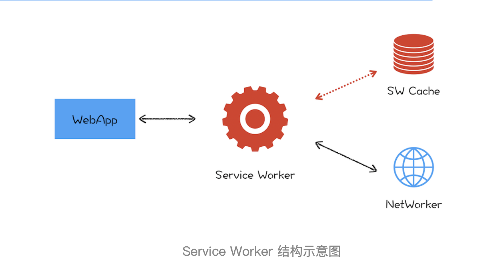

# PWA：解决了web应用哪些问题

PWA，全称 Progressive Web App，翻译过来就是渐进式网页应用。根据字面意思，它就是“渐进式 + Web 应用”。对于 Web 应用很好理解了，就是目前我们普通的 Web 页面，所以 PWA 所支持的首先是一个 Web 页面。至于“渐进式”，就需要从下面两个方面来理解。

- 站在 Web 应用开发者来说，PWA 提供了一个渐进式的过渡方案，让普通站点逐步过渡到 Web 应用。采用渐进式可以降低站点改造的代价，使得站点逐步支持各项新技术，而不是一步到位。

- 站在技术角度来说，PWA 技术也是一个渐进式的演化过程，在技术层面会一点点演进，比如逐渐提供更好的设备特性支持，不断优化更加流畅的动画效果，不断让页面的加载速度变得更快，不断实现本地应用的特性。

从这两点可以看出来，PWA 采取的是非常一个缓和的渐进式策略，不再像以前那样激进，动不动就是取代本地 App、取代小程序。与之相反，而是要充分发挥 Web 的优势，渐进式地缩短和本地应用或者小程序的距离。

那么 Web 最大的优势是什么呢？我认为是自由开放，也正是因为自由和开放，所以大家就很容易对同一件事情达成共识，达成共识之后，一套代码就可以运行在各种设备之上了，这就是跨平台，这也恰恰是本地应用所不具备的。而对于小程序，倒是可以实现跨平台，但要让各家达成共识，目前来看，似乎还是非常不切实际的。

所以我给 PWA 的定义就是：它是一套理念，渐进式增强 Web 的优势，并通过技术手段渐进式缩短和本地应用或者小程序的距离。基于这套理念之下的技术都可以归类到 PWA。

那今天我们就来聊聊 PWA 主要采用了哪些技术手段来缩短它和本地应用或者小程序的距离。

## Web 应用 VS 本地应用

那相对于本地应用，Web 页面到底缺少了什么？

- 首先，Web 应用缺少离线使用能力，在离线或者弱环境下基本上是无法使用的。而用户需要的是沉浸式的体验，在离线或者弱环境下能够流程地使用是用户对一个应用的基本要求。

- 其次，Web 应用还缺少了消息推送的能力，因为作为一个 App 厂商，需要有将消息送达到应用的能力。

- 最后，Web 应用缺少一级入口，也就是将 Web 应用安装到桌面，在需要的时候直接从桌面打开 Web 应用，而不是每次都需要通过浏览器来打开。

针对以上 Web 缺陷，PWA 提出了两种解决方案：通过引入 Service Worker 来试着解决离线存储和消息推送的问题，通过引入 manifest.json 来解决一级入口的问题。下面我们就来详细分析下 Service Worker 是如何工作的。

## 什么是 Service Worker

我们先来看看 Service Worker 是怎么解决离线存储和消息推送的问题。

其实在 Service Worker 之前，WHATWG 小组就推出过用 App Cache 标准来缓存页面，不过在使用过程中 App Cache 所暴露的问题比较多，遭到了多方吐槽，所以这个标准最终也只能被废弃了，可见一个成功的标准是需要经历实践考量的。

所以在 2014 年的时候，标准委员会提出了 Service Worker 的概念，它的主要思想是在页面和网络之间增加一个拦截器，用来缓存和拦截请求。整体结构如下图所示：

在没有安装 Service Worker 之前，WebApp 都是直接通过网络模块来请求资源的。安装了 Service Worker 模块之后，WebApp 请求资源时，会先通过 Service Worker，让它判断是返回 Service Worker 缓存的资源还是重新去网络请求资源。一切的控制权都交由 Service Worker 来处理。
