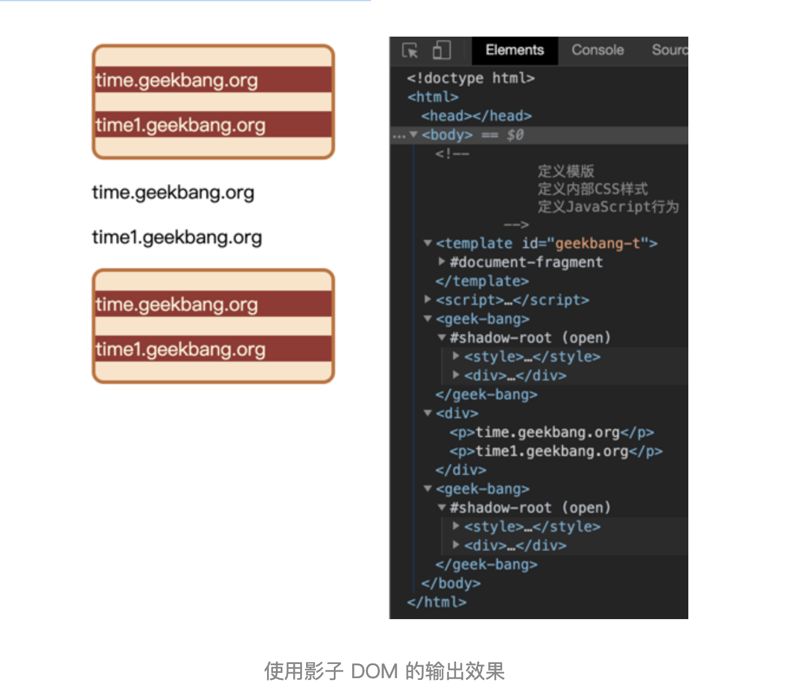

# webComponent：像搭积木一样构建web应用

什么是组件化呢？

其实组件化并没有一个明确的定义，不过这里我们可以使用 10 个字来形容什么是组件化，那就是：对内高内聚，对外低耦合。对内各个元素彼此紧密结合、相互依赖，对外和其他组件的联系最少且接口简单。

可以说，程序员对组件化开发有着天生的需求，因为一个稍微复杂点的项目，就涉及到多人协作开发的问题，每个人负责的组件需要尽可能独立完成自己的功能，其组件的内部状态不能影响到别人的组件，在需要和其他组件交互的地方得提前协商好接口。通过组件化可以降低整个系统的耦合度，同时也降低程序员之间的沟通复杂度，让系统变得更加易于维护。

使用组件化能带来很多优势，所以很多语言天生就对组件化提供了很好的支持，比如 C / C++ 就可以很好地将功能封装成模块，无论是业务逻辑，还是基础功能，抑或是 UI，都能很好地将其组合在一起，实现组件内部的高度内聚、组件之间的低耦合。

大部分语言都能实现组件化，归根结底在于编程语言特性，大多数语言都有自己的函数级作用域、块级作用域和类，可以将内部的状态数据隐藏在作用域之下或者对象的内部，这样外部就无法访问了，然后通过约定好的接口和外部进行通信。

JavaScript 虽然有不少缺点，但是作为一门编程语言，它也能很好地实现组件化，毕竟有自己的函数级作用域和块级作用域，所以封装内部状态数据并提供接口给外部都是没有问题的。

既然 JavaScript 可以很好地实现组件化，那么我们所谈论的 WebComponent 到底又是什么呢？

## 阻碍前端组件化的因素

在前端虽然 HTML、CSS 和 JavaScript 是强大的开发语言，但是在大型项目中维护起来会比较困难，如果在页面中嵌入第三方内容时，还需要确保第三方的内容样式不会影响到当前内容，同样也要确保当前的 DOM 不会影响到第三方的内容。

所以要聊 WebComponent，得先看看 HTML 和 CSS 是如何阻碍前端组件化的，这里我们就通过下面这样一个简单的例子来分析下：

```html
<style>
p {
  background-color: brown;
  color: cornsilk;
}
</style>
<p>time.geekbang.org</p>
```

```html
<style>
p {
  background-color: red;
  color: blue;
}
</style>
<p>time.geekbang</p>
```

上面这两段代码分别实现了自己 p 标签的属性，如果两个人分别负责开发这两段代码的话，那么在测试阶段可能没有什么问题，不过当最终项目整合的时候，其中内部的 CSS 属性会影响到其他外部的 p 标签的，之所以会这样，是因为 CSS 是影响全局的。

我们在《23 | 渲染流水线：CSS 如何影响首次加载时的白屏时间？》这篇文章中分析过，渲染引擎会将所有的 CSS 内容解析为 CSSOM，在生成布局树的时候，会在 CSSOM 中为布局树中的元素查找样式，所以有两个相同标签最终所显示出来的效果是一样的，渲染引擎是不能为它们分别单独设置样式的。

除了 CSS 的全局属性会阻碍组件化，DOM 也是阻碍组件化的一个因素，因为在页面中只有一个 DOM，任何地方都可以直接读取和修改 DOM。所以使用 JavaScript 来实现组件化是没有问题的，但是 JavaScript 一旦遇上 CSS 和 DOM，那么就相当难办了。

## WebComponent 组件化开发

现在我们了解了 CSS 和 DOM 是阻碍组件化的两个因素，那要怎么解决呢？

WebComponent 给出了解决思路，它提供了对局部视图封装能力，可以让 DOM、CSSOM 和 JavaScript 运行在局部环境中，这样就使得局部的 CSS 和 DOM 不会影响到全局。

了解了这些，下面我们就结合具体代码来看看 WebComponent 是怎么实现组件化的。

前面我们说了，WebComponent 是一套技术的组合，具体涉及到了 Custom elements（自定义元素）、Shadow DOM（影子 DOM）和 HTML templates（HTML 模板），详细内容你可以参考 MDN 上的 [相关链接](https://developer.mozilla.org/zh-CN/docs/Web/Web_Components)。

下面我们就来演示下这 3 个技术是怎么实现数据封装的，如下面代码所示：

```html
<!DOCTYPE html>
<html>
  <body>
    <!--
      一：定义模板
      二：定义内部 CSS 样式
      三：定义 JavaScript 行为
    -->
    <template id="geekbang-t">
      <style>
        p {
          background-color: brown;
          color: cornsilk;
        }
        div {
          width: 200px;
          background-color: bisque;
          border: 3px solid chocolate;
          border-radius: 10px;
        }
      </style>
      <div>
        <p>time.geekbang.org</p>
        <p>time1.geekbang.org</p>
      </div>
      <script>
        function foo() {
          console.log('inner log')
        }
      </script>
    </template>
    <script>
      class GeekBang extends HTMLElement {
        constructor() {
          super()
          // 获取组件模板
          const content = document.querySelector('#geekbang-t').content
          // 创建影子 DOM 节点
          const shadowDOM = this.attachShadow({ mode: 'open' })
          // 将模板添加到影子 DOM 上
          shadowDOM.appendChild(content.cloneNode(true))
        }
      }
      customElements.define('geek-bang', GeekBang)
    </script>
    <geek-bang></geek-bang>
    <div>
      <p>time.geekbang.org</p>
      <p>time1.geekbang.org</p>
    </div>
    <geek-bang></geek-bang>
  </body>
</html>
```

详细观察上面这段代码，我们可以得出：要使用 WebComponent，通常要实现下面三个步骤。

**首先，使用 template 属性来创建模板**。利用 DOM 可以查找到模板的内容，但是模板元素是不会被渲染到页面上的，也就是说 DOM 树中的 template 节点不会出现在布局树中，所以可以使用 template 来自定义一些基础的元素结构，这些基础的元素结构是可以被重复使用的。一般模板定义好之后，我们还需要在模板的内部定义样式信息。

**其次，我们需要创建一个 GeekBang 的类**。在该类的构造函数中要完成三件事：

- 查找模板内容。

- 创建影子 DOM。

- 再将模板添加到影子 DOM 上。

上面最难理解的是影子 DOM，其实影子 DOM 的作用是将模板中的内容与全局 DOM 和 CSS 进行隔离，这样我们就可以实现元素和样式的私有化了。你可以把影子 DOM 看成是一个作用域，其内部的样式和元素是不会影响到全局的样式和元素的，而在全局环境下，要访问影子 DOM 内部的样式或者元素也是需要通过约定好的接口的。

总之，通过影子 DOM，我们就实现了 CSS 和元素的封装，在创建好封装影子 DOM 的类之后，我们就可以使用 `customElements.define` 来自定义元素了（可以参考上述代码定义元素的方式）。

> 最后，就很简单了，可以像正常使用 HTML 元素一样使用该元素，如上述代码中的 `<geek-bang></geek-bang>`。

上述代码最终渲染出来的页面，如下图所示：



从图中我们可以看出，影子 DOM 内部的样式是不会影响到全局 CSSOM 的。另外，使用 DOM 接口也是无法直接查询到影子 DOM 内部元素的，比如你可以使用 document.getElementsByTagName('div') 来查找所有 div 元素，这时候你会发现影子 DOM 内部的元素都是无法查找的，因为要想查找影子 DOM 内部的元素需要专门的接口，所以通过这种方式又将影子内部的 DOM 和外部的 DOM 进行了隔离。

通过影子 DOM 可以隔离 CSS 和 DOM，不过需要注意一点，影子 DOM 的 JavaScript 脚本是不会被隔离的，比如在影子 DOM 定义的 JavaScript 函数依然可以被外部访问，这是因为 JavaScript 语言本身已经可以很好地实现组件化了。
