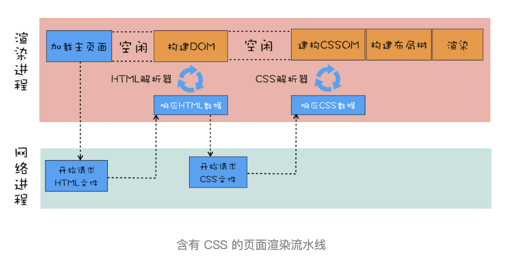
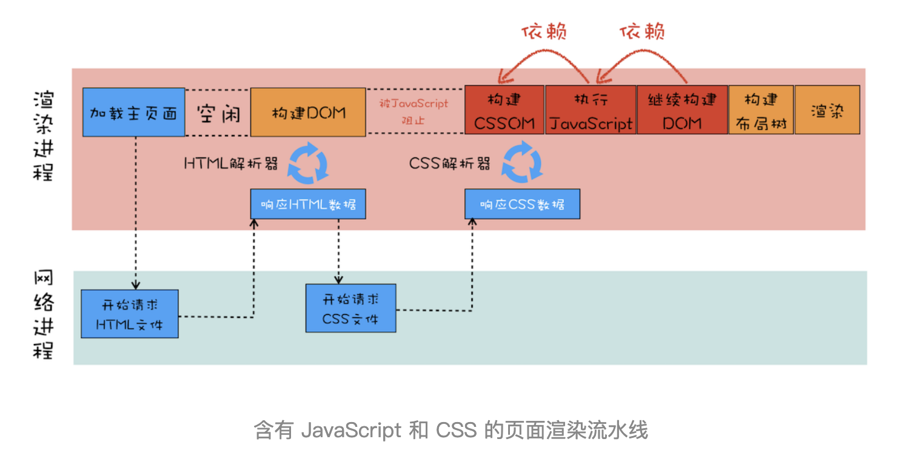
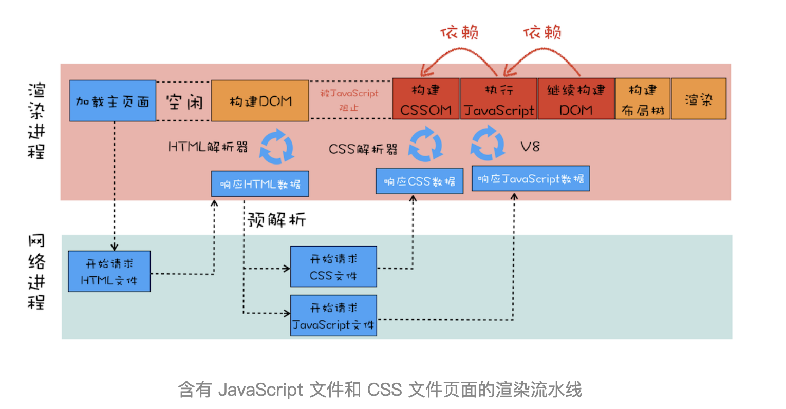

# 渲染流水线：CSS如何影响首次加载时的白屏时间

在上一篇文章中我们详细介绍了 DOM 的生成过程，并结合具体例子分析了 JavaScript 是如何阻塞 DOM 生成的。那本文我们就继续深入聊聊渲染流水线中的 CSS。因为 CSS 是页面中非常重要的资源，它决定了页面最终显示出来的效果，并影响着用户对整个网站的第一体验。所以，搞清楚浏览器中的 CSS 是怎么工作的很有必要，只有理解了 CSS 是如何工作的，你才能更加深刻地理解如何去优化页面。

本文我们先站在渲染流水线的视角来介绍 CSS 是如何工作的，然后通过 CSS 的工作流程来分析性能瓶颈，最后再来讨论如何减少首次加载时的白屏时间。

渲染流水线视角下的 CSS 我们先结合下面代码来看看最简单的渲染流程：

```css
/* theme.css */
div{ 
  color: coral;
  background-color: black;
}
```

```html
<html>
  <head>
    <link href="theme.css" rel="stylesheet">
  </head>
  <body>
    <div>geekbang com</div>
  </body>
</html>
```

这两段代码分别由 CSS 文件和 HTML 文件构成，我们来分析下打开这段 HTML 文件时的渲染流水线，你可以先参考下面这张渲染流水线示意图：



下面我们结合上图来分析这个页面文件的渲染流水线。

首先是发起主页面的请求，这个发起请求方可能是渲染进程，也有可能是浏览器进程，发起的请求被送到网络进程中去执行。网络进程接收到返回的 HTML 数据之后，将其发送给渲染进程，渲染进程会解析 HTML 数据并构建 DOM。这里你需要特别注意下，请求 HTML 数据和构建 DOM 中间有一段空闲时间，这个空闲时间有可能成为页面渲染的瓶颈。

上一篇文章中我们提到过，当渲染进程接收 HTML 文件字节流时，会先开启一个预解析线程，如果遇到 JavaScript 文件或者 CSS 文件，那么预解析线程会提前下载这些数据。对于上面的代码，预解析线程会解析出来一个外部的 theme.css 文件，并发起 theme.css 的下载。这里也有一个空闲时间需要你注意一下，就是在 DOM 构建结束之后、theme.css 文件还未下载完成的这段时间内，渲染流水线无事可做，因为下一步是合成布局树，而合成布局树需要 CSSOM 和 DOM，所以这里需要等待 CSS 加载结束并解析成 CSSOM。

## 那渲染流水线为什么需要 CSSOM 呢？

和 HTML 一样，渲染引擎也是无法直接理解 CSS 文件内容的，所以需要将其解析成渲染引擎能够理解的结构，这个结构就是 CSSOM。和 DOM 一样，CSSOM 也具有两个作用，第一个是提供给 JavaScript 操作样式表的能力，第二个是为布局树的合成提供基础的样式信息。这个 CSSOM 体现在 DOM 中就是 document.styleSheets。具体结构你可以去查阅相关资料，这里我就不过多介绍了，你知道 CSSOM 的两个作用是怎样的就行了。

有了 DOM 和 CSSOM，接下来就可以合成布局树了，我们在前面《05 | 渲染流程（上）：HTML、CSS 和 JavaScript 文件，是如何变成页面的？》这篇文章中讲解过布局树的构造过程，这里咱们再简单回顾下。等 DOM 和 CSSOM 都构建好之后，渲染引擎就会构造布局树。布局树的结构基本上就是复制 DOM 树的结构，不同之处在于 DOM 树中那些不需要显示的元素会被过滤掉，如 display: none 属性的元素、head 标签、script 标签等。复制好基本的布局树结构之后，渲染引擎会为对应的 DOM 元素选择对应的样式信息，这个过程就是样式计算。样式计算完成之后，渲染引擎还需要计算布局树中每个元素对应的几何位置，这个过程就是计算布局。通过样式计算和计算布局就完成了最终布局树的构建。再之后，就该进行后续的绘制操作了。

这就是在渲染过程中涉及到 CSS 的一些主要流程。

了解了这些之后，我们再来看看稍微复杂一点的场景，还是看下面这段 HTML 代码：

```css
/* theme.css */
div{ 
  color: coral;
  background-color: black;
}
```

```html
<html>
  <head>
    <link href="theme.css" rel="stylesheet">
  </head>
  <body>
    <div>geekbang com</div>
    <script>
      console.log('time.geekbang.org')
    </script>
    <div>geekbang com</div>
  </body>
</html>
```

这段代码是我在开头代码的基础之上做了一点小修改，在 body 标签内部加了一个简单的 JavaScript。有了 JavaScript，渲染流水线就有点不一样了，可以参考下面这张渲染流水线图：



那我们就结合这张图来分析含有外部 CSS 文件和 JavaScript 代码的页面渲染流水线，上一篇文章中我们提到过在解析 DOM 的过程中，如果遇到了 JavaScript 脚本，那么需要先暂停 DOM 解析去执行 JavaScript，因为 JavaScript 有可能会修改当前状态下的 DOM。

不过在执行 JavaScript 脚本之前，如果页面中包含了外部 CSS 文件的引用，或者通过 style 标签内置了 CSS 内容，那么渲染引擎还需要将这些内容转换为 CSSOM，因为 JavaScript 有修改 CSSOM 的能力，所以在执行 JavaScript 之前，还需要依赖 CSSOM。也就是说 CSS 在部分情况下也会阻塞 DOM 的生成。

我们再来看看更加复杂一点的情况，如果在 body 中被包含的是 JavaScript 外部引用文件，Demo 代码如下所示：

```css
/* theme.css */
div{ 
  color: coral;
  background-color: black;
}
```

```js
//foo.js
console.log('time.geekbang.org')
```

```html
<html>
  <head>
    <link href="theme.css" rel="stylesheet">
  </head>
  <body>
    <div>geekbang com</div>
    <script src='foo.js'></script>
    <div>geekbang com</div>
  </body>
</html>
```

从上面代码可以看出来，HTML 文件中包含了 CSS 的外部引用和 JavaScript 外部文件，那它们的渲染流水线是怎样的呢？可参考下图：



从图中可以看出来，在接收到 HTML 数据之后的预解析过程中，HTML 预解析器识别出来了有 CSS 文件和 JavaScript 文件需要下载，然后就同时发起这两个文件的下载请求，需要注意的是，这两个文件的下载过程是重叠的，所以下载时间按照最久的那个文件来算。

后面的流水线就和前面是一样的了，不管 CSS 文件和 JavaScript 文件谁先到达，都要先等到 CSS 文件下载完成并生成 CSSOM，然后再执行 JavaScript 脚本，最后再继续构建 DOM，构建布局树，绘制页面。
