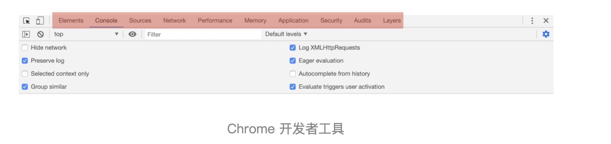
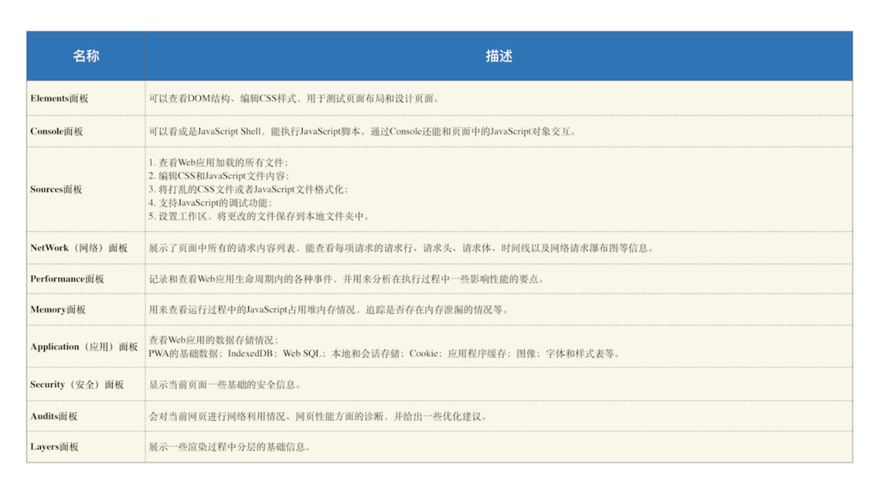

# 页面性能分析：利用chrome做web性能分析

“浏览器中的页面循环系统”模块我们已经介绍完了，循环系统是页面的基础，理解了循环系统能让我们从本质上更好地理解页面的工作方式，加深我们对一些前端概念的理解。

接下来我们就要进入新的模块了，也就是“浏览器中的页面”模块，正如专栏简介中所言，页面是浏览器的核心，浏览器中的所有功能点都是服务于页面的，而 Chrome 开发者工具又是工程师调试页面的核心工具，所以在这个模块的开篇，我想先带你来深入了解下 Chrome 开发者工具。

Chrome 开发者工具（简称 DevTools）是一组网页制作和调试的工具，内嵌于 Google Chrome 浏览器中。Chrome 开发者工具非常重要，所蕴含的内容也是非常多的，熟练使用它能让你更加深入地了解浏览器内部工作原理。（Chrome 开发者工具也在不停地迭代改进，如果你想使用最新版本，可以使用 Chrome Canary）。

作为这一模块的第一篇文章，我们主要聚焦页面的源头和网络数据的接收，这些发送和接收的数据都能体现在开发者工具的网络面板上。不过为了你能更好地理解和掌握，我们会先对 Chrome 开发者工具做一个大致的介绍，然后再深入剖析网络面板。

## Chrome 开发者工具

Chrome 开发者工具有很多重要的面板，比如与性能相关的有网络面板、Performance 面板、内存面板等，与调试页面相关的有 Elements 面板、Sources 面板、Console 面板等。

你可以在浏览器窗口的右上方选择 Chrome 菜单，然后选择“更多工具 --> 开发者工具”来打开 Chrome 开发者工具。打开的页面如下图所示：

从图中可以看出，它一共包含了 10 个功能面板，包括了 Elements、Console、Sources、NetWork、Performance、Memory、Application、Security、Audits 和 Layers。

关于这 10 个面板的大致功能，我做了一个表格，感兴趣的话，你可以详细看下：

简单来说，Chrome 开发者工具为我们提供了通过界面访问或者编辑 DOM 和 CSSOM 的能力，还提供了强大的调试功能和查看指标的能力。

OK，接下来我们就要重点看下其中重要的 Network 面板，即网络面板。
