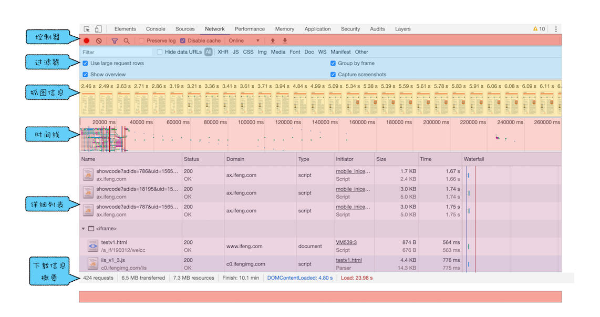
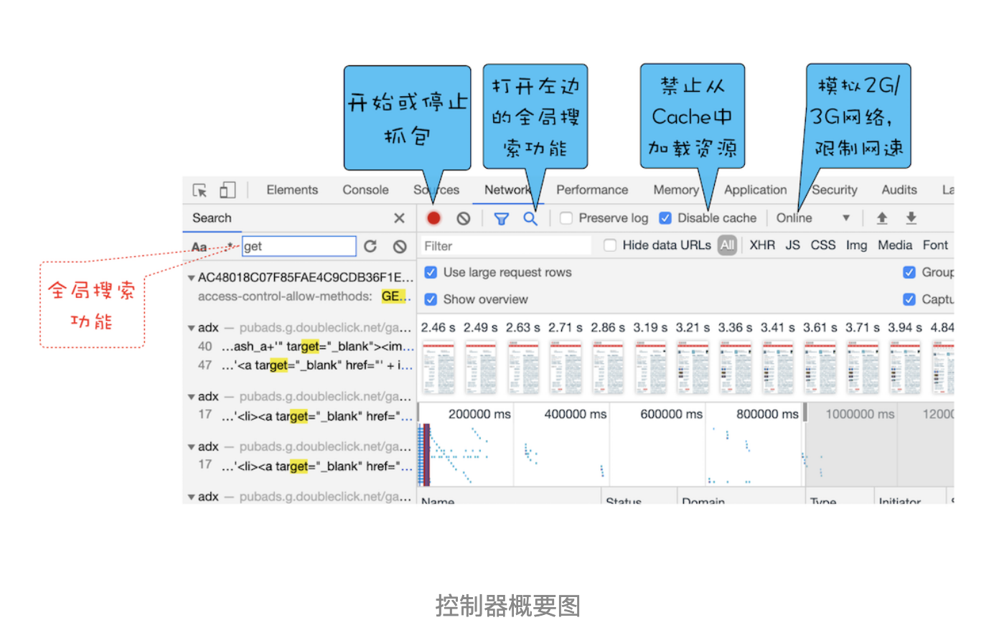

# 页面性能分析：利用chrome做web性能分析

“浏览器中的页面循环系统”模块我们已经介绍完了，循环系统是页面的基础，理解了循环系统能让我们从本质上更好地理解页面的工作方式，加深我们对一些前端概念的理解。

接下来我们就要进入新的模块了，也就是“浏览器中的页面”模块，正如专栏简介中所言，页面是浏览器的核心，浏览器中的所有功能点都是服务于页面的，而 Chrome 开发者工具又是工程师调试页面的核心工具，所以在这个模块的开篇，我想先带你来深入了解下 Chrome 开发者工具。

Chrome 开发者工具（简称 DevTools）是一组网页制作和调试的工具，内嵌于 Google Chrome 浏览器中。Chrome 开发者工具非常重要，所蕴含的内容也是非常多的，熟练使用它能让你更加深入地了解浏览器内部工作原理。（Chrome 开发者工具也在不停地迭代改进，如果你想使用最新版本，可以使用 Chrome Canary）。

作为这一模块的第一篇文章，我们主要聚焦页面的源头和网络数据的接收，这些发送和接收的数据都能体现在开发者工具的网络面板上。不过为了你能更好地理解和掌握，我们会先对 Chrome 开发者工具做一个大致的介绍，然后再深入剖析网络面板。

## Chrome 开发者工具

Chrome 开发者工具有很多重要的面板，比如与性能相关的有网络面板、Performance 面板、内存面板等，与调试页面相关的有 Elements 面板、Sources 面板、Console 面板等。

你可以在浏览器窗口的右上方选择 Chrome 菜单，然后选择“更多工具 --> 开发者工具”来打开 Chrome 开发者工具。打开的页面如下图所示：

从图中可以看出，它一共包含了 10 个功能面板，包括了 Elements、Console、Sources、NetWork、Performance、Memory、Application、Security、Audits 和 Layers。

关于这 10 个面板的大致功能，我做了一个表格，感兴趣的话，你可以详细看下：

简单来说，Chrome 开发者工具为我们提供了通过界面访问或者编辑 DOM 和 CSSOM 的能力，还提供了强大的调试功能和查看指标的能力。

OK，接下来我们就要重点看下其中重要的 Network 面板，即网络面板。

## 网络面板

网络面板由控制器、过滤器、抓图信息、时间线、详细列表和下载信息概要这 6 个区域构成，如下图所示：

### 1.控制器

其中，控制器有 4 个比较重要的功能，我们按照下文中的这张图来简单介绍下。

- 红色圆点的按钮，表示“开始 / 暂停抓包”，这个功能很常见，很容易理解。

- “全局搜索”按钮，这个功能就非常重要了，可以在所有下载资源中搜索相关内容，还可以快速定位到某几个你想要的文件上。

- Disable cache，即“禁止从 Cache 中加载资源”的功能，它在调试 Web 应用的时候非常有用，因为开启了 Cache 会影响到网络性能测试的结果。

- Online 按钮，是“模拟 2G / 3G”功能，它可以限制带宽，模拟弱网情况下页面的展现情况，然后你就可以根据实际展示情况来动态调整策略，以便让 Web 应用更加适用于这些弱网。

### 2.过滤器

网络面板中的过滤器，主要就是起过滤功能。因为有时候一个页面有太多内容在详细列表区域中展示了，而你可能只想查看 JavaScript 文件或者 CSS 文件，这时候就可以通过过滤器模块来筛选你想要的文件类型。

### 3.抓图信息

抓图信息区域，可以用来分析用户等待页面加载时间内所看到的内容，分析用户实际的体验情况。比如，如果页面加载 1 秒多之后屏幕截图还是白屏状态，这时候就需要分析是网络还是代码的问题了（勾选面板上的“Capture screenshots”即可启用屏幕截图）。

### 4.时间线

时间线，主要用来展示 HTTP、HTTPS、WebSocket 加载的状态和时间的一个关系，用于直观感受页面的加载过程。如果是多条竖线堆叠在一起，那说明这些资源同时被加载。至于具体到每个文件的加载信息，还需要用到下面要讲的详细列表。

### 5.详细列表

这个区域是最重要的，它详细记录了每个资源从发起请求到完成请求这中间所有过程的状态，以及最终请求完成的数据信息。通过该列表，你就能很容易地去诊断一些网络问题。

详细列表是我们本篇文章介绍的重点，不过内容比较多，所以放到最后去专门介绍了。

### 6.下载信息概要

下载信息概要中，你要重点关注下 DOMContentLoaded 和 Load 两个事件，以及这两个事件的完成时间。

- DOMContentLoaded，这个事件发生后，说明页面已经构建好 DOM 了，这意味着构建 DOM 所需要的 HTML 文件、JavaScript 文件、CSS 文件都已经下载完成了。

- Load，说明浏览器已经加载了所以的资源（图像、样式表等）。

通过下载信息概要面板，你可以查看触发这两个事件所花费的时间。
