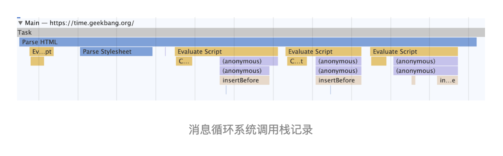

# Webapi：XMLHttpRequest 是怎么实现的

在上一篇文章中我们介绍了 setTimeout 是如何结合渲染进程的循环系统工作的，那本篇文章我们就继续介绍另外一种类型的 WebAPI——XMLHttpRequest。

自从网页中引入了 JavaScript，我们就可以操作 DOM 树中任意一个节点，例如隐藏 / 显示节点、改变颜色、获得或改变文本内容、为元素添加事件响应函数等等，几乎可以“为所欲为”了。

不过在 XMLHttpRequest 出现之前，如果服务器数据有更新，依然需要重新刷新整个页面。而 XMLHttpRequest 提供了从 Web 服务器获取数据的能力，如果你想要更新某条数据，只需要通过 XMLHttpRequest 请求服务器提供的接口，就可以获取到服务器的数据，然后再操作 DOM 来更新页面内容，整个过程只需要更新网页的一部分就可以了，而不用像之前那样还得刷新整个页面，这样既有效率又不会打扰到用户。

关于 XMLHttpRequest，本来我是想一带而过的，后来发现这个 WebAPI 用于教学非常好。首先前面讲了那么多网络内容，现在可以通过它把 HTTP 协议实践一遍；其次，XMLHttpRequest 是一个非常典型的 WebAPI，通过它来讲解浏览器是如何实现 WebAPI 的很合适，这对于你理解其他 WebAPI 也有非常大的帮助，同时在这个过程中我们还可以把一些安全问题给串起来。

但在深入讲解 XMLHttpRequest 之前，我们得先介绍下同步回调和异步回调这两个概念，这会帮助你更加深刻地理解 WebAPI 是怎么工作的。

## 回调函数 VS 系统调用栈

那什么是回调函数呢（Callback Function）？

将一个函数作为参数传递给另外一个函数，那作为参数的这个函数就是回调函数。简化的代码如下所示：

```js
let callback = function() {
  console.log('i am do homework')
}
function doWork(cb) {
  console.log('start do work')
  cb()
  console.log('end do work')
}
doWork(callback)
```

在上面示例代码中，我们将一个匿名函数赋值给变量 callback，同时将 callback 作为参数传递给了 doWork() 函数，这时在函数 doWork() 中 callback 就是回调函数。

上面的回调方法有个特点，就是回调函数 callback 是在主函数 doWork 返回之前执行的，我们把这个回调过程称为同步回调。

既然有同步回调，那肯定也有异步回调。下面我们再来看看异步回调的例子：

```js
let callback = function() {
  console.log('i am do homework')
}
function doWork(cb) {
  console.log('start do work')
  setTimeout(cb, 1000)   
  console.log('end do work')
}
doWork(callback)
```

在这个例子中，我们使用了 setTimeout 函数让 callback 在 doWork 函数执行结束后，又延时了 1 秒再执行，这次 callback 并没有在主函数 doWork 内部被调用，我们把这种回调函数在主函数外部执行的过程称为异步回调。

现在你应该知道什么是同步回调和异步回调了，那下面我们再深入点，站在消息循环的视角来看看同步回调和异步回调的区别。理解了这些，可以让你从本质上理解什么是回调。

我们还是先来回顾下页面的事件循环系统，通过《15 | 消息队列和事件循环：页面是怎么“活”起来的？》的学习，你应该知道浏览器页面是通过事件循环机制来驱动的，每个渲染进程都有一个消息队列，页面主线程按照顺序来执行消息队列中的事件，如执行 JavaScript 事件、解析 DOM 事件、计算布局事件、用户输入事件等等，如果页面有新的事件产生，那新的事件将会追加到事件队列的尾部。所以可以说是消息队列和主线程循环机制保证了页面有条不絮地运行。

这里还需要补充一点，那就是当循环系统在执行一个任务的时候，都要为这个任务维护一个系统调用栈。这个系统调用栈类似于 JavaScript 的调用栈，只不过系统调用栈是 Chromium 的开发语言 C++ 来维护的，其完整的调用栈信息你可以通过 chrome://tracing/ 来抓取。当然，你也可以通过 Performance 来抓取它核心的调用信息，如下图所示：



这幅图记录了一个 Parse HTML 的任务执行过程，其中黄色的条目表示执行 JavaScript 的过程，其他颜色的条目表示浏览器内部系统的执行过程。

通过该图你可以看出来，Parse HTML 任务在执行过程中会遇到一系列的子过程，比如在解析页面的过程中遇到了 JavaScript 脚本，那么就暂停解析过程去执行该脚本，等执行完成之后，再恢复解析过程。然后又遇到了样式表，这时候又开始解析样式表......直到整个任务执行完成。

需要说明的是，整个 Parse HTML 是一个完整的任务，在执行过程中的脚本解析、样式表解析都是该任务的子过程，其下拉的长条就是执行过程中调用栈的信息。

每个任务在执行过程中都有自己的调用栈，那么同步回调就是在当前主函数的上下文中执行回调函数，这个没有太多可讲的。下面我们主要来看看异步回调过程，异步回调是指回调函数在主函数之外执行，一般有两种方式：

- 第一种是把异步函数做成一个任务，添加到信息队列尾部。

- 第二种是把异步函数添加到微任务队列中，这样就可以在当前任务的末尾执行微任务了。
