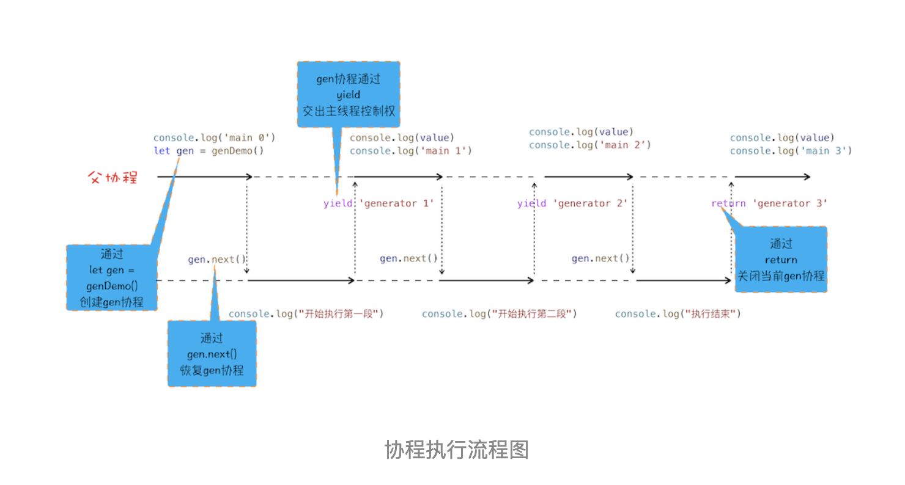

# async await使用同步方式写异步代码

在上篇文章中，我们介绍了怎么使用 Promise 来实现回调操作，使用 Promise 能很好地解决回调地狱的问题，但是这种方式充满了 Promise 的 then() 方法，如果处理流程比较复杂的话，那么整段代码将充斥着 then，语义化不明显，代码不能很好地表示执行流程。

比如下面这样一个实际的使用场景：我先请求极客邦的内容，等返回信息之后，我再请求极客邦的另外一个资源。下面代码展示的是使用 fetch 来实现这样的需求，fetch 被定义在 window 对象中，可以用它来发起远程资源的请求，该方法返回的是一个 Promise 对象，这和我们上篇文章中讲的 XFetch 很像，只不过 fetch 是浏览器原生支持的，并没有利用 XMLHttpRequest 来封装。

```js
fetch('https://www.geekbang.org')
.then((response) => {
  console.log(response)
  return fetch('https://www.geekbang.org/test')
}).then((response) => {
  console.log(response)
}).catch((error) => {
  console.log(error)
})
```

从这段 Promise 代码可以看出来，使用 promise.then 也是相当复杂的，虽然整个请求流程已经线性化了，但是代码里面包含了大量的 then 函数，使得代码依然不是太容易阅读。基于这个原因，ES7 引入了 async / await，这是 JavaScript 异步编程的一个重大改进，提供了在不阻塞主线程的情况下使用同步代码实现异步访问资源的能力，并且使得代码逻辑更加清晰。你可以参考下面这段代码：

```js
async function foo() {
  try {
    let response1 = await fetch('https://www.geekbang.org')
    console.log('response1')
    console.log(response1)
    let response2 = await fetch('https://www.geekbang.org/test')
    console.log('response2')
    console.log(response2)
  } catch(err) {
    console.error(err)
  }
}
foo()
```

通过上面代码，你会发现整个异步处理的逻辑都是使用同步代码的方式来实现的，而且还支持 try catch 来捕获异常，这就是完全在写同步代码，所以非常符合人的线性思维的。但是很多人都习惯了异步回调的编程思维，对于这种采用同步代码实现异步逻辑的方式，还需要一个转换的过程，因为这中间隐藏了一些容易让人迷惑的细节。

那么本篇文章我们继续深入，看看 JavaScript 引擎是如何实现 async / await 的。如果上来直接介绍 async / await 的使用方式的话，那么你可能会有点懵，所以我们就从其最底层的技术点一步步往上讲解，从而带你彻底弄清楚 async 和 await 到底是怎么工作的。

本文我们首先介绍生成器（Generator）是如何工作的，接着讲解 Generator 的底层实现机制——协程（Coroutine）；又因为 async / await 使用了 Generator 和 Promise 两种技术，所以紧接着我们就通过 Generator 和 Promise 来分析 async / await 到底是如何以同步的方式来编写异步代码的。

## 生成器 VS 协程

我们先来看看什么是生成器函数？

生成器函数是一个带星号函数，而且是可以暂停执行和恢复执行的。我们可以看下面这段代码：

```js
function* genDemo() {
  console.log('开始执行第一段')
  yield 'generator 0'

  console.log('开始执行第二段')
  yield 'generator 1'

  console.log('开始执行第三段')
  yield 'generator 2'

  console.log('执行结束')
  return 'generator 3'
}
 
console.log('main 0')
let gen = genDemo()
console.log(gen.next().value)
console.log('main 1')
console.log(gen.next().value)
console.log('main 2')
console.log(gen.next().value)
console.log('main 3')
console.log(gen.next().value)
console.log('main 4')
```

执行上面这段代码，观察输出结果，你会发现函数 genDemo 并不是一次执行完的，全局代码和 genDemo 函数交替执行。其实这就是生成器函数的特性，可以暂停执行，也可以恢复执行。下面我们就来看看生成器函数的具体使用方式：

- 在生成器函数内部执行一段代码，如果遇到 yield 关键字，那么 JavaScript 引擎将返回关键字后面的内容给外部，并暂停该函数的执行。

- 外部函数可以通过 next 方法恢复函数的执行。

关于函数的暂停和恢复，相信你一定很好奇这其中的原理，那么接下来我们就来简单介绍下 JavaScript 引擎 V8 是如何实现一个函数的暂停和恢复的，这也会有助于你理解后面要介绍的 async / await。

要搞懂函数为何能暂停和恢复，那你首先要了解协程的概念。协程是一种比线程更加轻量级的存在。你可以把协程看成是跑在线程上的任务，一个线程上可以存在多个协程，但是在线程上同时只能执行一个协程，比如当前执行的是 A 协程，要启动 B 协程，那么 A 协程就需要将主线程的控制权交给 B 协程，这就体现在 A 协程暂停执行，B 协程恢复执行；同样，也可以从 B 协程中启动 A 协程。通常，如果从 A 协程启动 B 协程，我们就把 A 协程称为 B 协程的父协程。

正如一个进程可以拥有多个线程一样，一个线程也可以拥有多个协程。最重要的是，协程不是被操作系统内核所管理，而完全是由程序所控制（也就是在用户态执行）。这样带来的好处就是性能得到了很大的提升，不会像线程切换那样消耗资源。

为了让你更好地理解协程是怎么执行的，我结合上面那段代码的执行过程，画出了下面的“协程执行流程图”，你可以对照着代码来分析：



**从图中可以看出来协程的四点规则：**

- 通过调用生成器函数 genDemo 来创建一个协程 gen，创建之后，gen 协程并没有立即执行。

- 要让 gen 协程执行，需要通过调用 gen.next。

- 当协程正在执行的时候，可以通过 yield 关键字来暂停 gen 协程的执行，并返回主要信息给父协程。

- 如果协程在执行期间，遇到了 return 关键字，那么 JavaScript 引擎会结束当前协程，并将 return 后面的内容返回给父协程。

不过，对于上面这段代码，你可能又有这样的疑问：父协程有自己的调用栈，gen 协程也有自己的调用栈，当 gen 协程通过 yield 把控制权交给父协程时，V8 是如何切换到父协程的调用栈？当父协程通过 gen.next 恢复 gen 协程时，又是如何切换 gen 协程的调用栈？

要搞清楚上面的问题，你需要关注以下两点内容。

- 第一点：gen 协程和父协程是在主线程上交互执行的，并不是并发执行的，它们之前的切换是通过 yield 和 gen.next 来配合完成的。

- 第二点：当在 gen 协程中调用了 yield 方法时，JavaScript 引擎会保存 gen 协程当前的调用栈信息，并恢复父协程的调用栈信息。同样，当在父协程中执行 gen.next 时，JavaScript 引擎会保存父协程的调用栈信息，并恢复 gen 协程的调用栈信息。

为了直观理解父协程和 gen 协程是如何切换调用栈的，你可以参考下图：


到这里相信你已经弄清楚了协程是怎么工作的，其实在 JavaScript 中，生成器就是协程的一种实现方式，这样相信你也就理解什么是生成器了。那么接下来，我们使用生成器和 Promise 来改造开头的那段 Promise 代码。改造后的代码如下所示：

```js
//foo 函数
function* foo() {
  let response1 = yield fetch('https://www.geekbang.org')
  console.log('response1')
  console.log(response1)
  let response2 = yield fetch('https://www.geekbang.org/test')
  console.log('response2')
  console.log(response2)
}
 
// 执行 foo 函数的代码
let gen = foo()
function getGenPromise(gen) {
  return gen.next().value
}
getGenPromise(gen).then((response) => {
  console.log('response1')
  console.log(response)
  return getGenPromise(gen)
}).then((response) => {
  console.log('response2')
  console.log(response)
})
```

从图中可以看到，foo 函数是一个生成器函数，在 foo 函数里面实现了用同步代码形式来实现异步操作；但是在 foo 函数外部，我们还需要写一段执行 foo 函数的代码，如上述代码的后半部分所示，那下面我们就来分析下这段代码是如何工作的。

- 首先执行的是 let gen = foo()，创建了 gen 协程。

- 然后在父协程中通过执行 gen.next 把主线程的控制权交给 gen 协程。

- gen 协程获取到主线程的控制权后，就调用 fetch 函数创建了一个 Promise 对象 response1，然后通过 yield 暂停 gen 协程的执行，并将 response1 返回给父协程。

- 父协程恢复执行后，调用 response1.then 方法等待请求结果。

- 等通过 fetch 发起的请求完成之后，会调用 then 中的回调函数，then 中的回调函数拿到结果之后，通过调用 gen.next 放弃主线程的控制权，将控制权交 gen 协程继续执行下个请求。

以上就是协程和 Promise 相互配合执行的一个大致流程。不过通常，我们把执行生成器的代码封装成一个函数，并把这个执行生成器的函数称为执行器（可参考著名的 co 框架），如下面这种方式：

```js
function* foo() {
  let response1 = yield fetch('https://www.geekbang.org')
  console.log('response1')
  console.log(response1)
  let response2 = yield fetch('https://www.geekbang.org/test')
  console.log('response2')
  console.log(response2)
}
co(foo())
```

通过使用生成器配合执行器，就能实现使用同步的方式写出异步代码了，这样也大大加强了代码的可读性。
