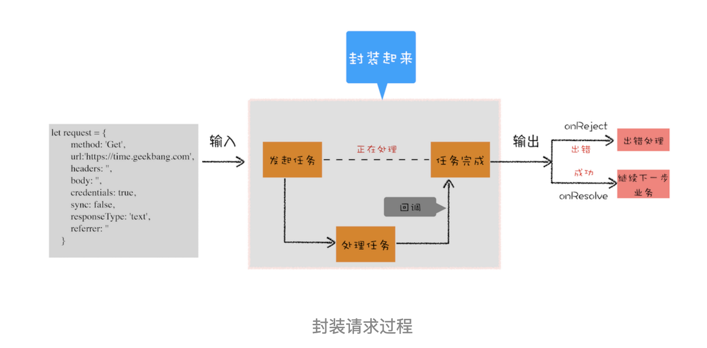

# 使用Promise告别回调函数

在上一篇文章中我们聊到微任务是如何工作的，并介绍了 MutationObserver 是如何利用微任务来权衡性能和效率的。今天我们就接着来聊聊任务的另外一个应用 Promise，DOM / BOM API 中新加入的 API 大多数都是建立在 Promise 上的，而且新的前端框架也使用了大量的 Promise。可以这么说，Promise 已经成为现代前端的“水”和“电”，很是关键，所以深入学习 Promise 势在必行。

不过，Promise 的知识点有那么多，而且我们只有一篇文章来介绍，那应该怎么讲解呢？具体讲解思路是怎样的呢？

如果你想要学习一门新技术，最好的方式是先了解这门技术是如何诞生的，以及它所解决的问题是什么。了解了这些后，你才能抓住这门技术的本质。所以本文我们就来重点聊聊 JavaScript 引入 Promise 的动机，以及解决问题的几个核心关键点。

要谈动机，我们一般都是先从问题切入，那么 Promise 到底解决了什么问题呢？在正式开始介绍之前，我想有必要明确下，Promise 解决的是异步编码风格的问题，而不是一些其他的问题，所以接下来我们聊的话题都是围绕着编码风格展开的。

## 异步编程的问题：代码逻辑不连续

首先我们来回顾下 JavaScript 的异步编程模型，你应该已经非常熟悉页面的事件循环系统了，也知道页面中任务都是执行在主线程之上的，相对于页面来说，主线程就是它整个的世界，所以在执行一项耗时的任务时，比如下载网络文件任务、获取摄像头等设备信息任务，这些任务都会放到页面主线程之外的进程或者线程中去执行，这样就避免了耗时任务“霸占”页面主线程的情况。你可以结合下图来看看这个处理过程：


上图展示的是一个标准的异步编程模型，页面主线程发起了一个耗时的任务，并将任务交给另外一个进程去处理，这时页面主线程会继续执行消息队列中的任务。等该进程处理完这个任务后，会将该任务添加到渲染进程的消息队列中，并排队等待循环系统的处理。排队结束之后，循环系统会取出消息队列中的任务进行处理，并触发相关的回调操作。

这就是页面编程的一大特点：异步回调。

Web 页面的单线程架构决定了异步回调，而异步回调影响到了我们的编码方式，到底是如何影响的呢？

假设有一个下载的需求，使用 XMLHttpRequest 来实现，具体的实现方式你可以参考下面这段代码：

```js
// 执行状态
function onResolve(response) { console.log(response) }
function onReject(error) { console.log(error) }
 
let xhr = new XMLHttpRequest()
xhr.ontimeout = function(e) { onReject(e) }
xhr.onerror = function(e) { onReject(e) }
xhr.onreadystatechange = function() { onResolve(xhr.response) }
 
// 设置请求类型，请求 URL，是否同步信息
let URL = 'https://time.geekbang.com'
xhr.open('Get', URL, true)
 
// 设置参数
xhr.timeout = 3000 // 设置 xhr 请求的超时时间
xhr.responseType = 'text' // 设置响应返回的数据格式
xhr.setRequestHeader('X_TEST', 'time.geekbang')
 
// 发出请求
xhr.send()
```

我们执行上面这段代码，可以正常输出结果的。但是，这短短的一段代码里面竟然出现了五次回调，这么多的回调会导致代码的逻辑不连贯、不线性，非常不符合人的直觉，这就是异步回调影响到我们的编码方式。

那有什么方法可以解决这个问题呢？当然有，我们可以封装这堆凌乱的代码，降低处理异步回调的次数。

## 封装异步代码，让处理流程变得线性

由于我们重点关注的是输入内容（请求信息）和输出内容（回复信息），至于中间的异步请求过程，我们不想在代码里面体现太多，因为这会干扰核心的代码逻辑。整体思路如下图所示：



从图中你可以看到，我们将 XMLHttpRequest 请求过程的代码封装起来了，重点关注输入数据和输出结果。

那我们就按照这个思路来改造代码。首先，我们把输入的 HTTP 请求信息全部保存到一个 request 的结构中，包括请求地址、请求头、请求方式、引用地址、同步请求还是异步请求、安全设置等信息。request 结构如下所示：

```js
// makeRequest 用来构造 request 对象
function makeRequest(request_url) {
  let request = {
    method: 'Get',
    url: request_url,
    headers: '',
    body: '',
    credentials: false,
    sync: true,
    responseType: 'text',
    referrer: ''
  }
  return request
}
```

然后就可以封装请求过程了，这么我们将所有的请求细节封装进 XFetch 函数，XFetch 代码如下所示：

```js
// [in] request，请求信息，请求头，延时值，返回类型等
// [out] resolve, 执行成功，回调该函数
// [out] reject  执行失败，回调该函数
function XFetch(request, resolve, reject) {
  let xhr = new XMLHttpRequest()
  xhr.ontimeout = function(e) { reject(e) }
  xhr.onerror = function(e) { reject(e) }
  xhr.onreadystatechange = function() {
    if(xhr.status = 200) resolve(xhr.response)
  }
  xhr.open(request.method, URL, request.sync)
  xhr.timeout = request.timeout
  xhr.responseType = request.responseType
  // 补充其他请求信息
  // ...
  xhr.send()
}
```

这个 XFetch 函数需要一个 request 作为输入，然后还需要两个回调函数 resolve 和 reject，当请求成功时回调 resolve 函数，当请求出现问题时回调 reject 函数。

有了这些后，我们就可以来实现业务代码了，具体地实现方式如下所示：

```js
XFetch(makeRequest('https://time.geekbang.org'),
  function resolve(data) {
    console.log(data)
  }, function reject(e) {
    console.log(e)
  })
```
