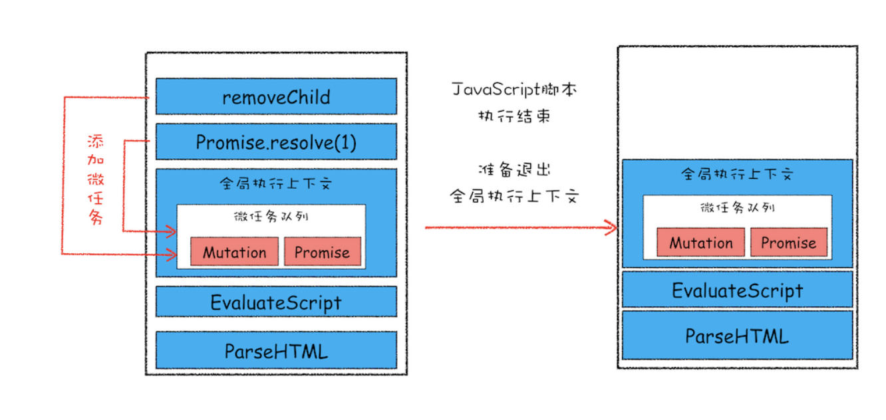
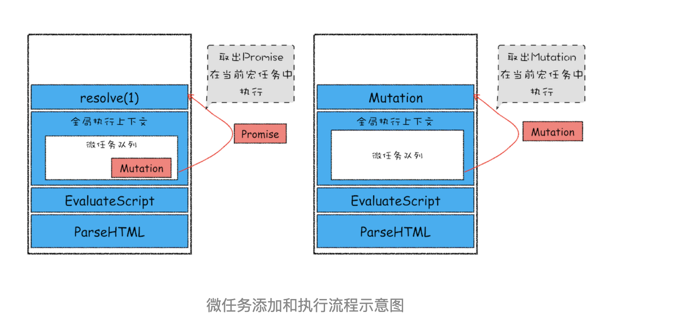

# 宏任务和微任务：不是所有的任务都是一个待遇

在前面几篇文章中，我们介绍了消息队列，并结合消息队列介绍了两种典型的 WebAPI——setTimeout 和 XMLHttpRequest，通过这两个 WebAPI 我们搞清楚了浏览器的消息循环系统是怎么工作的。不过随着浏览器的应用领域越来越广泛，消息队列中这种粗时间颗粒度的任务已经不能胜任部分领域的需求，所以又出现了一种新的技术——微任务。微任务可以在实时性和效率之间做一个有效的权衡。

从目前的情况来看，微任务已经被广泛地应用，基于微任务的技术有 MutationObserver、Promise 以及以 Promise 为基础开发出来的很多其他的技术。所以微任务的重要性也与日俱增，了解其底层的工作原理对于你读懂别人的代码，以及写出更高效、更具现代的代码有着决定性的作用。

有微任务，也就有宏任务，那这二者到底有什么区别？它们又是如何相互取长补短的？

## 宏任务

前面我们已经介绍过了，页面中的大部分任务都是在主线程上执行的，这些任务包括了：

- 渲染事件（如解析 DOM、计算布局、绘制）。

- 用户交互事件（如鼠标点击、滚动页面、放大缩小等）。

- JavaScript 脚本执行事件。

- 网络请求完成、文件读写完成事件。

为了协调这些任务有条不絮地在主线程上执行，页面进程引入了消息队列和事件循环机制，渲染进程内部会维护多个消息队列，比如延迟执行队列和普通的消息队列。然后主线程采用一个 for 循环，不断地从这些任务队列中取出任务并执行任务。我们把这些消息队列中的任务称为宏任务。

消息队列中的任务是通过事件循环系统来执行的，这里我们可以看看在 WHATWG 规范中是怎么定义事件循环机制的。

由于规范需要支持语义上的完备性，所以通常写得都会比较啰嗦，这里我就大致总结了下 WHATWG 规范定义的大致流程：

- 先从多个消息队列中选出一个最老的任务，这个任务称为 oldestTask。

- 然后循环系统记录任务开始执行的时间，并把这个 oldestTask 设置为当前正在执行的任务。

- 当任务执行完成之后，删除当前正在执行的任务，并从对应的消息队列中删除这个 oldestTask。

- 最后统计执行完成的时长等信息。

以上就是消息队列中宏任务的执行过程，通过前面的学习，相信你也很熟悉这套执行流程了。

宏任务可以满足我们大部分的日常需求，不过如果有对时间精度要求较高的需求，宏任务就难以胜任了，下面我们就来分析下为什么宏任务难以满足对时间精度要求较高的任务。

前面我们说过，页面的渲染事件、各种 IO 的完成事件、执行 JavaScript 脚本的事件、用户交互的事件等都随时有可能被添加到消息队列中，而且添加事件是由系统操作的，JavaScript 代码不能准确掌握任务要添加到队列中的位置，控制不了任务在消息队列中的位置，所以很难控制开始执行任务的时间。为了直观理解，你可以看下面这段代码：

```html
<!DOCTYPE html>
<html>
  <body>
    <div id="demo">
      <ol>
        <li>test</li>
      </ol>
    </div>
  </body>
  <script type="text/javascript">
    function timerCallback2() {
      console.log(2)
    }
    function timerCallback() {
      console.log(1)
      setTimeout(timerCallback2, 0)
    }
    setTimeout(timerCallback, 0)
  </script>
</html>
```

在这段代码中，我的目的是想通过 setTimeout 来设置两个回调任务，并让它们按照前后顺序来执行，中间也不要再插入其他的任务，因为如果这两个任务的中间插入了其他的任务，就很有可能会影响到第二个定时器的执行时间了。

但实际情况是我们不能控制的，比如在你调用 setTimeout 来设置回调任务的间隙，消息队列中就有可能被插入很多系统级的任务。你可以打开 Performance 工具，来记录下这段任务的执行过程，也可参考文中我记录的图片：


setTimeout 函数触发的回调函数都是宏任务，如图中，左右两个黄色块就是 setTimeout 触发的两个定时器任务。

现在你可以重点观察上图中间浅红色区域，这里有很多一段一段的任务，这些是被渲染引擎插在两个定时器任务中间的任务。试想一下，如果中间被插入的任务执行时间过久的话，那么就会影响到后面任务的执行了。

所以说宏任务的时间粒度比较大，执行的时间间隔是不能精确控制的，对一些高实时性的需求就不太符合了，比如后面要介绍的监听 DOM 变化的需求。

## 微任务

在理解了宏任务之后，下面我们就可以来看看什么是微任务了。在上一篇文章中，我们介绍过异步回调的概念，其主要有两种方式。

**第一种是把异步回调函数封装成一个宏任务，添加到消息队列尾部，当循环系统执行到该任务的时候执行回调函数**。这种比较好理解，我们前面介绍的 setTimeout 和 XMLHttpRequest 的回调函数都是通过这种方式来实现的。

**第二种方式的执行时机是在主函数执行结束之后、当前宏任务结束之前执行回调函数，这通常都是以微任务形式体现的**。

那这里说的微任务到底是什么呢？

微任务就是一个需要异步执行的函数，执行时机是在主函数执行结束之后、当前宏任务结束之前。

不过要搞清楚微任务系统是怎么运转起来的，就得站在 V8 引擎的层面来分析下。

我们知道当 JavaScript 执行一段脚本的时候，V8 会为其创建一个全局执行上下文，在创建全局执行上下文的同时，V8 引擎也会在内部创建一个微任务队列。顾名思义，这个微任务队列就是用来存放微任务的，因为在当前宏任务执行的过程中，又时候会产生多个微任务，这时候就需要使用这个微任务队列来保存这些微任务了。不过这个微任务队列是给 V8 引擎内部使用的，所以你是无法通过 JavaScript 直接访问的。

也就是说每个宏任务都关联了一个微任务队列。那么接下来，我们就需要分析两个重要的时间点——微任务产生的时机和执行微任务队列的时机。

我们先来看看微任务是怎么产生的？在现代浏览器里面，产生微任务有两种方式。

第一种方式是使用 MutationObserver 监控某个 DOM 节点，然后再通过 JavaScript 来修改这个节点，或者为这个节点添加、删除部分子节点，当 DOM 节点发生变化时，就会产生 DOM 变化记录的微任务。

第二种方式是使用 Promise，当调用 Promise.resolve() 或者 Promise.reject() 的时候，也会产生微任务。

通过 DOM 节点变化产生的微任务或者使用 Promise 产生的微任务都会被 JavaScript 引擎按照顺序保存到微任务队列中。

好了，现在微任务队列中有了微任务了，那接下来就要看看微任务队列是何时被执行的。

通常情况下，在当前宏任务中的 JavaScript 快执行完成时，也就在 JavaScript 引擎准备退出全局执行上下文并清空调用栈的时候，JavaScript 引擎会检查全局执行上下文中的微任务队列，然后按照顺序执行队列中的微任务。WHATWG 把执行微任务的时间点称为检查点。当然除了在退出全局执行上下文式这个检查点之外，还有其他的检查点，不过不是太重要，这里就不做介绍了。

如果在执行微任务的过程中，产生了新的微任务，同样会将该微任务添加到微任务队列中，V8 引擎一直循环执行微任务队列中的任务，直到队列为空才算执行结束。也就是说在执行微任务过程中产生的微任务并不会推迟到下一个宏任务中执行，而是在当前的宏任务中继续执行。

为了直观地理解什么是微任务，你可以参考下面我画的示意图（由于内容比较多，我将其分为了两张）：





该示意图是在执行一个 ParseHTML 的宏任务，在执行过程中，遇到了 JavaScript 脚本，那么就暂停解析流程，进入到 JavaScript 的执行环境。从图中可以看到，全局上下文中包含了微任务列表。

在 JavaScript 脚本的后续执行过程中，分别通过 Promise 和 removeChild 创建了两个微任务，并被添加到微任务列表中。接着 JavaScript 执行结束，准备退出全局执行上下文，这时候就到了检查点了，JavaScript 引擎会检查微任务列表，发现微任务列表中有微任务，那么接下来，依次执行这两个微任务。等微任务队列清空之后，就退出全局执行上下文。

以上就是微任务的工作流程，从上面分析我们可以得出如下几个结论：

- 微任务和宏任务是绑定的，每个宏任务在执行时，会创建自己的微任务队列。

- 微任务的执行时长会影响到当前宏任务的时长。比如一个宏任务在执行过程中，产生了 100 个微任务，执行每个微任务的时间是 10 毫秒，那么执行这 100 个微任务的时间就是 1000 毫秒，也可以说这 100 个微任务让宏任务的执行时间延长了 1000 毫秒。所以，你在写代码的时候一定要注意控制微任务的执行时长。

- 在一个宏任务中，分别创建一个用于回调的宏任务和微任务，无论什么情况下，微任务都早于宏任务执行。
