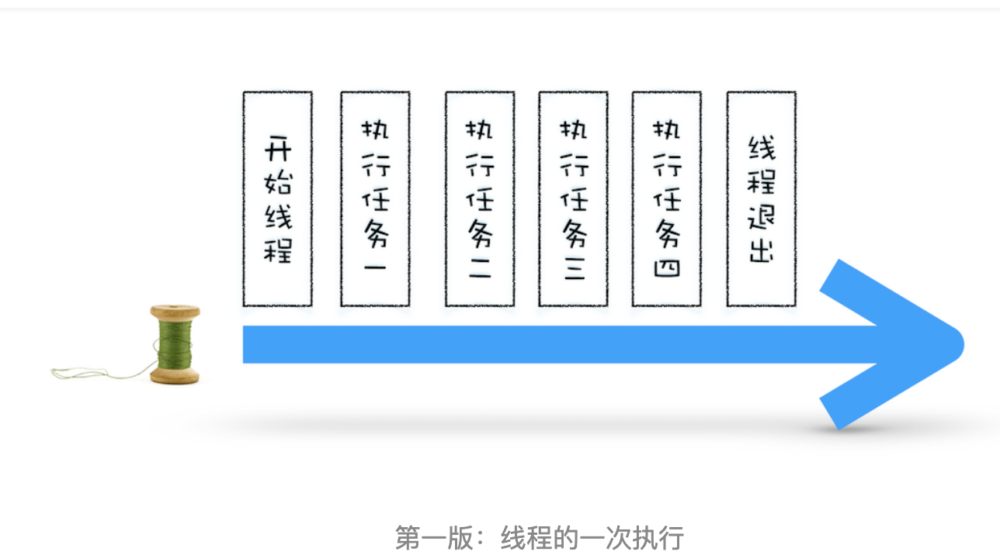
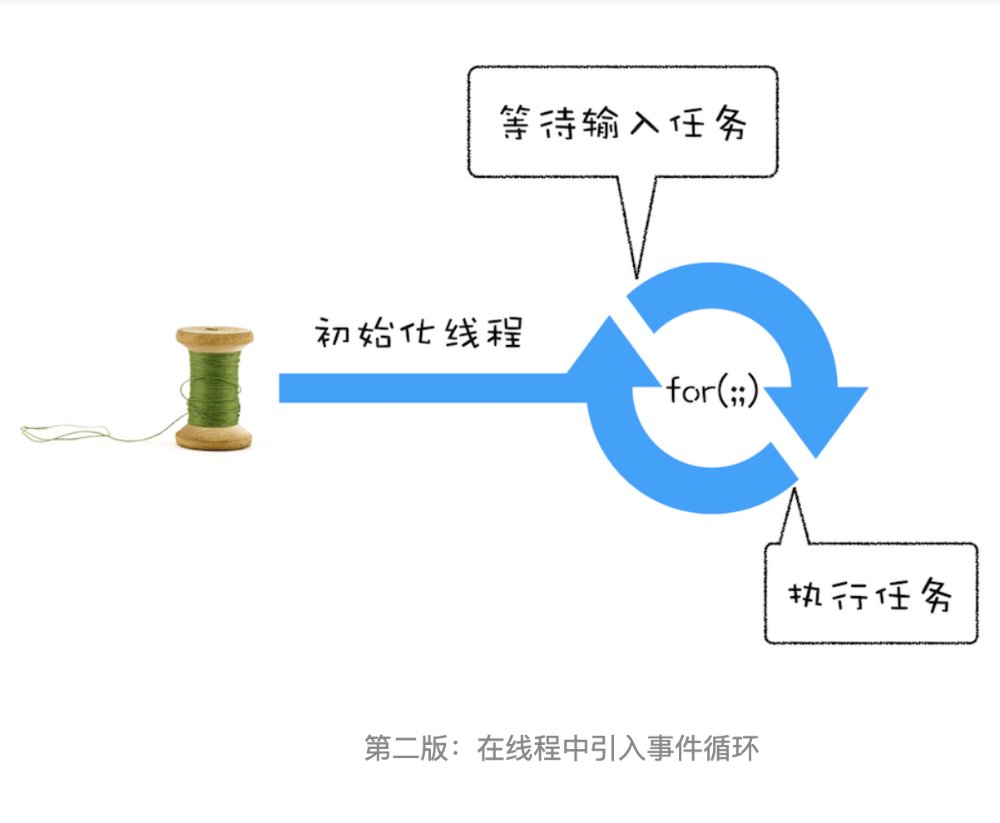
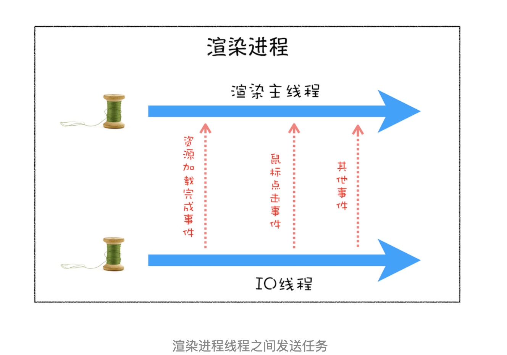
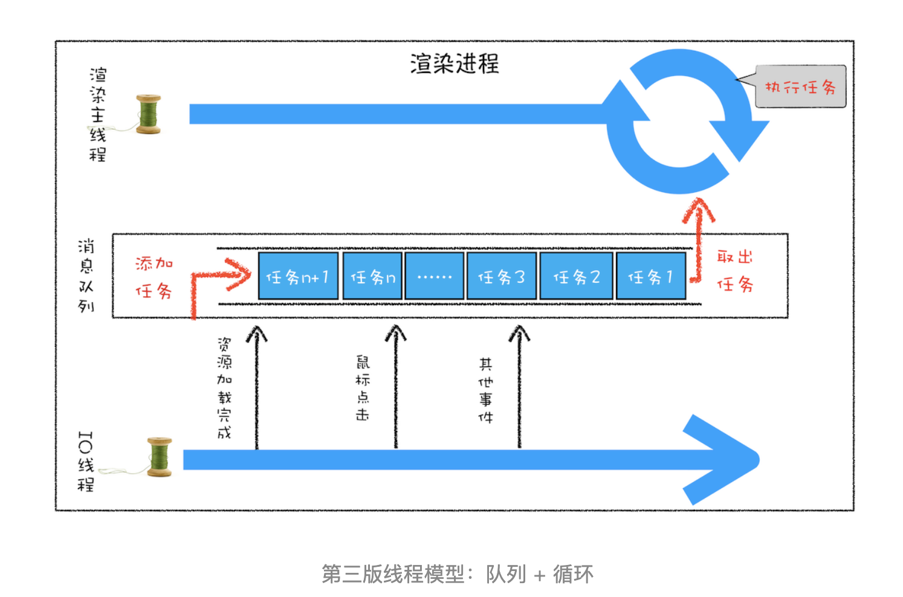
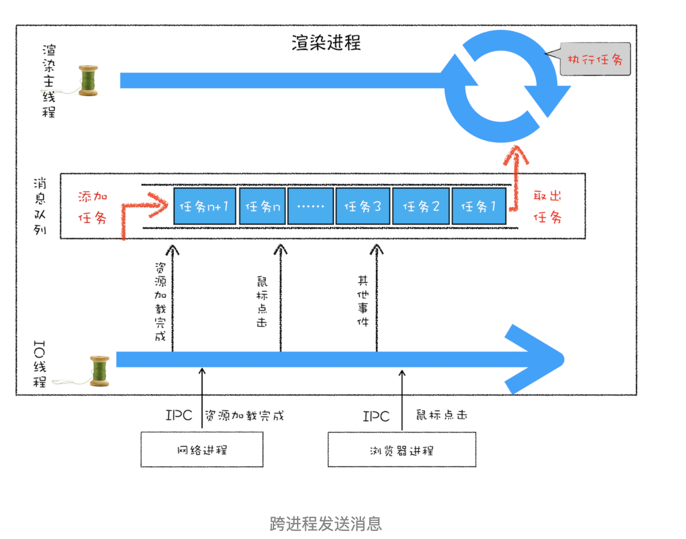

# 消息队列和事件循环：页面是怎么活起来的

前面我们讲到了每个渲染进程都有一个主线程，并且主线程非常繁忙，既要处理 DOM，又要计算样式，还要处理布局，同时还需要处理 JavaScript 任务以及各种输入事件。要让这么多不同类型的任务在主线程中有条不絮地执行，这就需要一个系统来统筹调度这些任务，这个统筹调度系统就是我们今天要讲的消息队列和事件循环系统。

在写这篇文章之前，我翻阅了大量的资料，却发现没有一篇文章能把消息循环系统给讲清楚的，所以我决定用一篇文章来专门介绍页面的事件循环系统。事件循环非常底层且非常重要，学会它能让你理解页面到底是如何运行的，所以在本篇文章中，我们会将页面的事件循环给梳理清楚、讲透彻。

为了能让你更加深刻地理解事件循环机制，我们就从最简单的场景来分析，然后带你一步步了解浏览器页面主线程是如何运作的。

需要说明的是，文章中的代码我会采用 C++ 来示范。如果你不熟悉 C++，也没有关系，这里并没有涉及到任何复杂的知识点，只要你了解 JavaScript 或 Python，你就会看懂。

## 使用单线程处理安排好的任务

我们先从最简单的场景讲起，比如有如下一系列的任务：

- 任务 1：1 + 2。

- 任务 2：20 / 5。

- 任务 3：7 * 8。

- 任务 4：打印出任务 1、任务 2、任务 3 的运算结果。

现在要在一个线程中去执行这些任务，通常我们会这样编写代码：

```c++
void MainThread() {
  int num1 = 1 + 2; // 任务 1
  int num2 = 20 / 5; // 任务 2
  int num3 = 7 * 8; // 任务 3
  print('最终计算的值为:%d,%d,%d', num, num2, num3); // 任务 4
}
```

在上面的执行代码中，我们把所有任务代码按照顺序写进主线程里，等线程执行时，这些任务会按照顺序在线程中依次被执行；等所有任务执行完成之后，线程会自动退出。可以参考下图来直观地理解下其执行过程：



## 在线程运行过程中处理新任务

但并不是所有的任务都是在执行之前统一安排好的，大部分情况下，新的任务是在线程运行过程中产生的。比如在线程执行过程中，又接收到了一个新的任务要求计算“10 + 2”，那上面那种方式就无法处理这种情况了。

**要想在线程运行过程中，能接收并执行新的任务，就需要采用事件循环机制**。我们可以通过一个 for 循环语句来监听是否有新的任务，如下面的示例代码：

```c++
// GetInput
// 等待用户从键盘输入一个数字，并返回该输入的数字
int GetInput() {
  int input_number = 0;
  cout<<'请输入一个数:';
  cin>>input_number;
  return input_number;
}
 
// 主线程 (Main Thread)
void MainThread() {
  for(;;){
    int first_num = GetInput();
    int second_num = GetInput();
    result_num = first_num + second_num;
    print('最终计算的值为:%d', result_num);
  }
}
```

相较于第一版的线程，这一版的线程做了两点改进。

- 第一点引入了循环机制，具体实现方式是在线程语句最后添加了一个 for 循环语句，线程会一直循环执行。

- 第二点是引入了事件，可以在线程运行过程中，等待用户输入的数字，等待过程中线程处于暂停状态，一旦接收到用户输入的信息，那么线程会被激活，然后执行相加运算，最后输出结果。

通过引入事件循环机制，就可以让该线程“活”起来了，我们每次输入两个数字，都会打印出两数字相加的结果，你可以结合下图来参考下这个改进版的线程：



## 处理其他线程发送过来的任务

上面我们改进了线程的执行方式，引入了事件循环机制，可以让其在执行过程中接受新的任务。不过在第二版的线程模型中，所有的任务都是来自于线程内部的，如果另外一个线程想让主线程执行一个任务，利用第二版的线程模型是无法做到的。

那下面我们就来看看其他线程是如何发送信息给渲染主线程的，具体形式你可以参考下图：



从上图可以看出，渲染主线程会频繁接收到来自于 IO 线程的一些任务，接收到这些任务之后，渲染进程就需要着手处理，比如接收到资源加载完成的消息后，渲染进程就要着手进行 DOM 解析了；接收到鼠标点击的消息后，渲染主线程就要开始执行相应的 JavaScript 脚本来处理该点击事件。

那么如何设计好一个线程模型，能让其能够接收其他线程发送的消息呢？

一个通用模式是使用消息队列。在解释如何实现之前，我们先说说什么是消息队列，可以参考下图：


从图中可以看出，消息队列是一种数据结构，可以存放要执行的任务。它符合队列“先进先出”的特点，也就是说要添加任务的话，添加到队列的尾部；要取出任务的话，从队列头部去取。

有了队列之后，我们就可以继续改造线程模型了，改造方案如下图所示：



从上图可以看出，我们的改造可以分为下面三个步骤：

- 添加一个消息队列。

- IO 线程中产生的新任务添加进消息队列尾部。

- 渲染主线程会循环地从消息队列头部中读取任务，执行任务。

有了这些步骤之后，那么接下来我们就可以按步骤使用代码来实现第三版的线程模型。

首先，构造一个队列。当然，在本篇文章中我们不需要考虑队列实现的细节，只是构造队列的接口：

```c++
class TaskQueue {
  public:
  Task takeTask(); // 取出队列头部的一个任务
  void pushTask(Task task); // 添加一个任务到队列尾部
};
```

接下来，改造主线程，让主线程从队列中读取任务：

```c++
TaskQueue task_queue;
void ProcessTask();
void MainThread() {
  for(;;){
    Task task = task_queue.takeTask();
    ProcessTask(task);
  }
}
```

在上面的代码中，我们添加了一个消息队列的对象，然后在主线程的 for 循环代码块中，从消息队列中读取一个任务，然后执行该任务，主线程就这样一直循环往下执行，因此只要消息队列中有任务，主线程就会去执行。

主线程的代码就这样改造完成了。这样改造后，主线程执行的任务都全部从消息队列中获取。所以如果有其他线程想要发送任务让主线程去执行，只需要将任务添加到该消息队列中就可以了，添加任务的代码如下：

```c++
Task clickTask;
task_queue.pushTask(clickTask)
```

由于是多个线程操作同一个消息队列，所以在添加任务和取出任务时还会加上一个同步锁，这块内容你也要注意下。

## 处理其他进程发送过来的任务

通过使用消息队列，我们实现了线程之间的消息通信。在 Chrome 中，跨进程之间的任务也是频繁发生的，那么如何处理其他进程发送过来的任务？你可以参考下图：



从图中可以看出，渲染进程专门有一个 IO 线程用来接收其他进程传进来的消息，接收到消息之后，会将这些消息组装成任务发送给渲染主线程，后续的步骤就和前面讲解的“处理其他线程发送的任务”一样，这里就不再重复了。

## 消息队列中的任务类型

现在你知道页面主线程是如何接收外部任务的了，那接下来我们再来看看消息队列中的任务类型有哪些。你可以参考下[Chromium 的官方源码](https://cs.chromium.org/chromium/src/third_party/blink/public/platform/task_type.h)，这里面包含了很多内部消息类型，如输入事件（鼠标滚动、点击、移动）、微任务、文件读写、WebSocket、JavaScript 定时器等等。

除此之外，消息队列中还包含了很多与页面相关的事件，如 JavaScript 执行、解析 DOM、样式计算、布局计算、CSS 动画等。

以上这些事件都是在主线程中执行的，所以在编写 Web 应用时，你还需要衡量这些事件所占用的时长，并想办法解决单个任务占用主线程过久的问题。
